# Apunte Teórico - Compiladores

## Índice

- [0. Visión general del compilador COMPI](#0-visión-general-del-compilador-compi)
- [1. Semana 1 - Repaso de autómatas y jerarquía de Chomsky](#1-semana-1---repaso-de-autómatas-y-jerarquía-de-chomsky)
- [2. Semana 2 - Introducción a compiladores](#2-semana-2---introducción-a-compiladores)
- [3. Semana 3 - Scanner (análisis léxico)](#3-semana-3---scanner-análisis-léxico)
- [4. Semana 4 - Parser (análisis sintáctico)](#4-semana-4---parser-análisis-sintáctico)
- [5. Semana 5 - Procesamiento semántico](#5-semana-5---procesamiento-semántico)
- [6. Semana 6 - Tabla de símbolos](#6-semana-6---tabla-de-símbolos)
- [7. Semana 7 - Generación de código (CIL)](#7-semana-7---generación-de-código-cil)
- [8. Glosario general](#8-glosario-general)
- [9. Checklist de reglas clave para el parcial](#9-checklist-de-reglas-clave-para-el-parcial)

---

## 0. Visión general del compilador COMPI

COMPI es el compilador didáctico de la cátedra "Compiladores" (UNSJ), escrito en C#/.NET, que compila un lenguaje fuente propio llamado indistintamente **Z#** o **COMPI**. Su arquitectura reproduce, con fidelidad casi literal, el esquema clásico de compilador de una sola pasada de la tradición Mössenböck/Wirth (Johannes Kepler Universität Linz, Software Science), y genera código ejecutable real en **CIL** (*Common Intermediate Language*, el lenguaje intermedio de .NET) usando la biblioteca **`System.Reflection.Emit`** para emitir ensamblados dinámicos en tiempo de ejecución.

### Pipeline completo (diagrama)

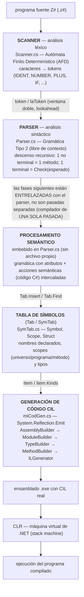

### Puntos clave de la arquitectura

- **Compilador de una sola pasada (*single-pass*)**: no hay fases separadas que corran secuencialmente sobre archivos intermedios. Todo comienza en `Parser.Parse()`, que a su vez inicializa el `Scanner`; a medida que el parser reconoce cada producción de la gramática, dispara en el mismo instante las acciones semánticas, las operaciones sobre la tabla de símbolos y la emisión de instrucciones CIL. Escaneo, parseo, chequeo semántico y generación de código están **entrelazados token a token**.
- **El procesamiento semántico no tiene archivo `.cs` propio**: sus acciones viven intercaladas dentro de las mismas funciones de `Parser.cs` que implementan cada no terminal.
- **Generación de código dinámica en tiempo de ejecución**: COMPI no usa un ensamblador estático (`ilasm.exe`); usa `System.Reflection.Emit` para construir el ensamblado, módulo, clase, método e instrucciones CIL mientras el propio COMPI se ejecuta — "un programa dentro de otro programa".
- **La gramática mostrada en clase no está 100% implementada** en el compilador real: hay que tener cuidado de no asumir equivalencia 1:1 entre la teoría de las slides y lo que el código de COMPI efectivamente acepta (advertencia remarcada por el profesor en varias semanas).
- **Correspondencia teoría ↔ archivo real**, tal como se repite en las tablas de cada semana del material de cátedra:

| # | Etapa (teoría) | Herramienta / concepto | Archivo real |
|---|---|---|---|
| 1 | Introducción | — | (proyecto completo) |
| 2 | Scanner | Autómatas Finitos (AFD) | `Scanner.cs` |
| 3 | Parser | Gramática Tipo 2 | `Parser.cs` |
| 4 | Procesamiento semántico | Gramática con atributos + acciones semánticas en C# | *(sin archivo propio, dentro de `Parser.cs`)* |
| 5 | Generación de código 1 | Lenguaje intermedio: CIL | `miCodGen.cs` |
| 6 | Tabla de símbolos | Estructura de datos (`Symbol`/`Scope`/`Struct`) | `SymTab.cs` |
| 7 | Generación de código 2 | Metadatos (`System.Reflection.Emit`) | `miCodGen.cs` |

Cada una de estas etapas se desarrolla en detalle, con ejemplos textuales, tablas y fragmentos de código real, en las secciones 3 a 7 de este apunte (correspondientes a las semanas 3 a 7 de la cátedra).

---

## 1. Semana 1 - Repaso de autómatas y jerarquía de Chomsky

> **Nota de fidelidad a la fuente.** El material original de esta semana (`Guia para la clase practica nro1 - cohorte 2026.pdf`) es extremadamente breve: solo indica que la clase práctica nro. 1 consiste en ver cuatro videos externos ("Gramáticas Tipo 3 y Autómata Finito Determinístico", "Gramáticas Tipo 2 y Autómata a Pila — Parte 1", "Gramáticas Tipo 2 y Autómata a Pila — Parte 2", "Gramáticas Tipo 1"), sin desarrollar el contenido teórico en ningún documento de la cátedra. Como esos videos no están disponibles en la biblioteca de la materia, **toda la sección que sigue es una síntesis estándar de teoría de la computación, elaborada con conocimiento general del área (no transcripta ni tomada literalmente de material de cátedra)**. Se incluye para completar el repaso de base que la guía de la práctica da por sabido antes de entrar al scanner (semana 3) y al parser (semana 4).

### 1.1 La Jerarquía de Chomsky

Noam Chomsky clasificó las gramáticas formales en cuatro tipos, según las restricciones que imponen sobre la forma de sus producciones. Cada tipo de gramática genera una clase de lenguaje, y cada clase de lenguaje es reconocida exactamente por un tipo de autómata (correspondencia gramática ↔ autómata, resultado central de la teoría de lenguajes formales):

| Tipo (Chomsky) | Nombre | Restricción sobre las producciones | Autómata equivalente | Fase del compilador |
|---|---|---|---|---|
| **Tipo 0** | Irrestrictas (recursivamente enumerables) | `α → β`, con `α` conteniendo al menos un no terminal (sin restricción de longitud) | Máquina de Turing | (ninguna — poder expresivo máximo, no computable en general) |
| **Tipo 1** | Sensibles al contexto (*context-sensitive*) | `αAβ → αγβ`, con `γ ≠ ε` (no acortan la cadena, salvo el caso especial de `S → ε` si `S` no aparece a la derecha de ninguna producción) | Autómata Linealmente Acotado (*Linear Bounded Automaton*, LBA) | (raramente usada en la práctica de compiladores; algunas reglas de chequeo de tipos podrían modelarse así, pero no se implementan como autómata) |
| **Tipo 2** | Libres de contexto (*context-free*, CFG) | `A → γ`, con `A` un único no terminal (el lado izquierdo no tiene contexto) | Autómata a Pila (*Pushdown Automaton*, PDA) | **Parser / análisis sintáctico** |
| **Tipo 3** | Regulares (*regular*) | `A → aB` o `A → a` (lineales por la derecha), o simétricamente por la izquierda | Autómata Finito (Determinístico o No Determinístico, AFD/AFND) | **Scanner / análisis léxico** |

Cada tipo es un caso particular del anterior: toda gramática regular es libre de contexto, toda libre de contexto es sensible al contexto, y toda sensible al contexto es irrestricta (inclusión estricta de clases de lenguajes: `L3 ⊂ L2 ⊂ L1 ⊂ L0`).

La razón por la que un compilador divide su análisis en **léxico** (scanner) y **sintáctico** (parser) en vez de usar una única gramática para todo, es precisamente esta jerarquía: reconocer tokens (identificadores, números, operadores) es una tarea que un autómata finito resuelve de forma extremadamente eficiente (lineal en el tamaño de la entrada, sin necesidad de memoria auxiliar), mientras que reconocer la estructura anidada de un programa (paréntesis balanceados, bloques anidados, expresiones con precedencia) excede el poder de un autómata finito y requiere el poder adicional de una pila — exactamente lo que aporta un autómata a pila / gramática tipo 2.

---

### 1.2 Gramáticas Tipo 3 (regulares) y Autómatas Finitos

#### 1.2.1 Definición formal de gramática regular

Una gramática `G = (V, Σ, P, S)` es de **Tipo 3 (regular)** si todas sus producciones en `P` tienen una de estas formas (regular por la derecha, la convención más común en compiladores):

```
A → a         (A no terminal, a terminal)
A → aB        (A, B no terminales, a terminal)
A → ε         (solo si A = S y S no aparece a la derecha de ninguna producción)
```

donde `V` es el conjunto de no terminales, `Σ` el alfabeto de terminales, `P` el conjunto de producciones y `S ∈ V` el símbolo inicial.

Ejemplo de gramática regular para identificadores simplificados (letra seguida de letras o dígitos):

```
Ident   → letra Resto
Resto   → letra Resto | digito Resto | ε
```

El lenguaje generado es `L(Ident) = { letra (letra|digito)* }` — exactamente el patrón que reconoce `ReadName` en el scanner de COMPI (semana 3).

#### 1.2.2 Autómata Finito Determinístico (AFD) — definición formal

Un **AFD** se define formalmente como una **quíntupla**:

```
M = (Q, Σ, δ, q0, F)
```

donde:
- **`Q`**: conjunto finito de estados.
- **`Σ`**: alfabeto de entrada (símbolos/caracteres).
- **`δ`**: función de transición, `δ: Q × Σ → Q` (para cada estado y cada símbolo, exactamente **un** estado destino — de ahí "determinístico").
- **`q0 ∈ Q`**: estado inicial.
- **`F ⊆ Q`**: conjunto de estados finales (de aceptación).

Una cadena `w` es **aceptada** por `M` si, partiendo de `q0` y aplicando `δ` símbolo a símbolo sobre `w`, se termina en un estado perteneciente a `F`.

#### 1.2.3 Autómata Finito No Determinístico (AFND)

Un **AFND** relaja la función de transición: `δ: Q × (Σ ∪ {ε}) → 2^Q` (para cada estado y símbolo, un **conjunto** de posibles estados destino, incluyendo transiciones espontáneas por `ε`). Es más fácil de construir directamente a partir de una gramática regular o una expresión regular (cada producción/operador se traduce en una transición o unión de transiciones), pero es computacionalmente menos directo de simular.

**Equivalencia AFD ↔ AFND (teorema de Rabin-Scott):** todo AFND puede convertirse en un AFD equivalente (que reconoce exactamente el mismo lenguaje) mediante el algoritmo de **construcción de subconjuntos** (*subset construction*): cada estado del AFD resultante representa un **conjunto** de estados del AFND original que podrían estar "simultáneamente activos". Este resultado es el que garantiza que, aunque sea más cómodo pensar el reconocimiento de tokens como un AFND (por ejemplo, al combinar los autómatas de todos los tokens en uno solo), siempre existe un AFD equivalente — y es precisamente ese AFD combinado el que implementa el scanner real.

**Equivalencia gramática regular ↔ autómata finito:** para toda gramática de Tipo 3 existe un autómata finito (determinístico o no determinístico) que reconoce exactamente `L(G)`, y viceversa, para todo autómata finito existe una gramática regular equivalente. La construcción es directa: cada no terminal de la gramática se convierte en un estado, y cada producción `A → aB` se convierte en una transición `δ(A, a) = B`; una producción `A → a` se convierte en una transición hacia un estado final.

#### 1.2.4 Por qué el scanner de COMPI es un AFD

Como se desarrolla en detalle en la sección 3 de este apunte (Semana 3 — Scanner), el analizador léxico de COMPI se implementa exactamente según este modelo: el método `Next()` de `Scanner.cs` es la codificación directa, en C#, de un AFD combinado que reconoce **todos** los tokens del lenguaje a la vez (identificadores, números, operadores simples y compuestos, comentarios). El estado inicial `s0` corresponde a `q0`; cada `case` del `switch(ch)` dentro de `Next()` corresponde a una transición `δ(s0, ch)`; los bucles internos de `ReadName`/`ReadNumber` corresponden al autoloop de un estado sobre sí mismo (`δ(s1, letra) = s1`); y el hecho de que, "después de cada token reconocido, el escáner vuelve a arrancar en `s0`" (frase remarcada explícitamente en el material de la semana 3) es exactamente la semántica de un AFD que, al alcanzar un estado final, reinicia el reconocimiento desde `q0` para la siguiente subcadena de la entrada. Que la función de transición esté implementada como un `switch`/`if` en C# en lugar de una tabla `δ` explícita no cambia su naturaleza formal: sigue siendo, matemáticamente, un AFD.

---

### 1.3 Gramáticas Tipo 2 (libres de contexto) y Autómatas a Pila

#### 1.3.1 Definición formal de gramática libre de contexto

Una gramática `G = (V, Σ, P, S)` es de **Tipo 2 (libre de contexto)** si todas sus producciones tienen la forma:

```
A → γ
```

donde `A ∈ V` es un **único** no terminal (sin contexto a su alrededor) y `γ ∈ (V ∪ Σ)*` es una cadena arbitraria de terminales y no terminales (incluyendo la cadena vacía `ε`). A diferencia de las gramáticas regulares, `γ` puede contener no terminales en cualquier posición y en cualquier cantidad, lo que permite expresar **anidamiento y recursión estructural** (paréntesis balanceados, bloques `{ }` anidados, expresiones aritméticas con precedencia).

Ejemplo (el mismo usado en la semana 4 de este apunte, notación EBNF de la cátedra):

```
Expr = Term { "+" Term }.
Term = Factor { "*" Factor }.
Factor = number | "(" Expr ")".
```

Esta gramática **no es regular**: la producción `Factor = "(" Expr ")"` es recursiva de forma anidada (`Expr` puede volver a contener un `Factor` con otro paréntesis dentro), lo cual requiere "recordar" cuántos paréntesis se abrieron para saber cuántos deben cerrarse — una capacidad que un autómata finito (con memoria constante, sin pila) no tiene.

#### 1.3.2 Autómata a Pila (Pushdown Automaton, PDA) — definición formal

Un **autómata a pila** se define formalmente como una **séptupla**:

```
M = (Q, Σ, Γ, δ, q0, Z0, F)
```

donde, adicionalmente a los componentes de un AFD:
- **`Γ`**: alfabeto de la pila (símbolos que se pueden apilar/desapilar).
- **`δ`**: función de transición, `δ: Q × (Σ ∪ {ε}) × Γ → 2^(Q × Γ*)` — en cada paso, la transición depende no solo del estado actual y el símbolo de entrada, sino también de **qué símbolo hay en el tope de la pila**, y el resultado puede reemplazar ese símbolo del tope por una cadena de símbolos (incluyendo la cadena vacía, es decir, desapilar).
- **`Z0 ∈ Γ`**: símbolo inicial de la pila.
- **`F ⊆ Q`**: estados finales (la aceptación puede definirse por estado final, por pila vacía, o por ambos, según la variante).

La diferencia esencial respecto de un autómata finito es exactamente esa **memoria auxiliar en forma de pila**, de tamaño potencialmente ilimitado: es lo que le permite "contar" anidamientos (por ejemplo, apilar un símbolo por cada `(` abierto y desapilarlo por cada `)` cerrado, aceptando solo si la pila queda vacía al terminar) — algo que ningún AFD con un número finito de estados puede hacer para una profundidad de anidamiento arbitraria.

**Equivalencia gramática Tipo 2 ↔ autómata a pila:** para toda gramática libre de contexto existe un autómata a pila equivalente que reconoce exactamente el mismo lenguaje, y viceversa. La construcción estándar (usada conceptualmente por los generadores de parsers) simula la **derivación** de la gramática empujando a la pila los símbolos que "todavía faltan reconocer": el símbolo inicial se apila al comienzo, y en cada paso se reemplaza el no terminal del tope por el lado derecho de alguna de sus producciones (o, si el tope es un terminal, se lo compara contra el siguiente símbolo de entrada y se desapila si coincide). La cadena es aceptada cuando se vacía la pila exactamente al mismo tiempo que se agota la entrada.

#### 1.3.3 Por qué el parser de COMPI es equivalente a un autómata a pila

Como se explica en detalle en la sección 4 de este apunte (Semana 4 — Parser), el parser de COMPI está implementado como un **parser descendente recursivo** (*recursive descent*): cada no terminal de la gramática se traduce en un método de C# con ese mismo nombre, y el reconocimiento de una producción consiste en llamar, en orden, a los métodos/`Check` de cada símbolo del lado derecho. El propio material de cátedra remarca explícitamente (semana 4, sección 6 de este apunte) que "el compilador no trabaja con un árbol, trabaja con una pila": aunque la implementación en C# no manipula una estructura `Pila` explícita para el reconocimiento sintáctico en sí, la **pila de llamadas de función** del propio lenguaje de programación (*call stack*, la que administra el runtime de .NET al invocar y retornar de cada método) cumple exactamente el rol formal de la pila `Γ` de un autómata a pila: cada llamada a un método-no-terminal equivale a apilar un símbolo (ese no terminal "pendiente de terminar de reconocer"), y cada retorno de ese método equivale a desapilarlo. Esta es la razón formal, y no solo una metáfora, por la cual un **parser descendente recursivo es una implementación concreta de un autómata a pila** para el subconjunto de gramáticas libres de contexto que admiten este método de parsing (gramáticas *LL(k)*, sin recursividad a izquierda, con conjuntos FIRST disjuntos entre alternativas).

---

### 1.4 Gramáticas Tipo 1 (sensibles al contexto)

Una gramática es de **Tipo 1 (sensible al contexto)** si sus producciones tienen la forma `αAβ → αγβ`, con `γ ≠ ε` (la cadena nunca se acorta, salvo el caso límite de una producción `S → ε` para el símbolo inicial, si este no vuelve a aparecer en ningún lado derecho). Intuitivamente: se permite reemplazar el no terminal `A` por `γ`, pero **solo si `A` aparece rodeado exactamente por el contexto `α ... β`** — de ahí el nombre.

El autómata equivalente es el **Autómata Linealmente Acotado** (*Linear Bounded Automaton*, LBA): una máquina de Turing cuya cinta está acotada al tamaño de la entrada (no puede usar memoria adicional ilimitada, a diferencia de una máquina de Turing general).

En la práctica de construcción de compiladores, las gramáticas sensibles al contexto **no se usan directamente** para especificar ningún lenguaje de programación real, porque son computacionalmente costosas de analizar (el problema de pertenencia es PSPACE-completo en el caso general) y porque casi todos los lenguajes de programación de interés práctico son, en su núcleo sintáctico, libres de contexto (Tipo 2). Sin embargo, muchas reglas que **parecen** "sensibles al contexto" en un lenguaje real (por ejemplo, "una variable debe estar declarada antes de usarse", o "los tipos de los operandos de una suma deben ser compatibles") se resuelven en la práctica **fuera de la gramática**, mediante el **análisis semántico** apoyado en la **tabla de símbolos** (ver semanas 5 y 6 de este apunte) — es decir, el compilador separa el análisis en una fase libre de contexto (parser) más una fase semántica con memoria auxiliar (tabla de símbolos), en vez de intentar expresar todas esas reglas dentro de una única gramática sensible al contexto.

### 1.5 Gramáticas Tipo 0 (irrestrictas)

Una gramática es de **Tipo 0 (irrestricta o recursivamente enumerable)** si sus producciones no tienen ninguna restricción de forma más allá de `α → β` con `α` conteniendo al menos un no terminal. Es el nivel más general de la jerarquía, equivalente en poder computacional a una **máquina de Turing** sin restricciones: cualquier problema computable puede expresarse como el reconocimiento del lenguaje generado por alguna gramática de Tipo 0. No tiene aplicación directa en el diseño de la sintaxis de un lenguaje de programación (sería computacionalmente indecidible en el caso general si una cadena arbitraria pertenece al lenguaje), pero cierra la jerarquía como límite superior teórico: todo lenguaje formal definible por una gramática, de cualquier tipo, es reconocible por alguna máquina de Turing.

### 1.6 Resumen ejecutivo (para repaso rápido)

| | Tipo 3 (Regular) | Tipo 2 (Libre de contexto) | Tipo 1 (Sensible al contexto) | Tipo 0 (Irrestricta) |
|---|---|---|---|---|
| Forma de producción | `A → a` \| `A → aB` | `A → γ` | `αAβ → αγβ` (`γ≠ε`) | `α → β` (sin restricción) |
| Autómata equivalente | AFD / AFND (quíntupla `(Q,Σ,δ,q0,F)`) | Autómata a Pila (séptupla `(Q,Σ,Γ,δ,q0,Z0,F)`) | Autómata Linealmente Acotado (LBA) | Máquina de Turing |
| Memoria auxiliar | Ninguna (número finito de estados) | Pila (ilimitada, LIFO) | Cinta acotada al tamaño de la entrada | Cinta ilimitada |
| Fase del compilador | **Scanner** (análisis léxico) | **Parser** (análisis sintáctico) | *(no se usa directamente; ver análisis semántico)* | *(sin uso práctico en compiladores)* |
| En COMPI | `Scanner.cs` / `Next()`, AFD combinado de todos los tokens | `Parser.cs`, descenso recursivo ≡ autómata a pila vía pila de llamadas | reglas semánticas resueltas vía tabla de símbolos (`SymTab.cs`), no como gramática aparte | — |

---

## 2. Semana 2 - Introducción a compiladores

> **Nota de fidelidad a la fuente.** La carpeta de material de cátedra de esta semana está vacía (el `README.md` original lo indica explícitamente: "no hay material ni video"). Por lo tanto, **esta sección es una síntesis general elaborada con conocimiento estándar de construcción de compiladores, no material literal de la cátedra**, escrita para dar contexto introductorio antes de entrar en el detalle semana a semana (secciones 3 a 7).

### 2.1 Qué es un compilador

Un **compilador** es un programa que traduce un programa fuente, escrito en un **lenguaje fuente** (por ejemplo, Z#/COMPI, C#, Java), a un programa equivalente en un **lenguaje objeto** o **lenguaje destino** (por ejemplo, CIL, código máquina nativo), preservando el significado (la semántica) del programa original. La traducción se hace **antes** de ejecutar el programa: el compilador produce un artefacto (un ejecutable, un ensamblado, un archivo objeto) que luego se ejecuta de forma independiente, generalmente de manera mucho más veloz que si se interpretara el código fuente directamente.

### 2.2 Compilador vs. intérprete

Un **intérprete**, a diferencia de un compilador, **ejecuta directamente** las instrucciones del programa fuente (o una representación intermedia de él, como un árbol de derivación o un bytecode) sin producir primero un programa objeto separado y persistente: analiza y ejecuta "sobre la marcha".

Esta distinción es exactamente la que se remarca, de forma insistente y explícita, en el material de la semana 5 de este apunte (Procesamiento Semántico): un intérprete, al recorrer una expresión, **calcula** su valor en el momento (por ejemplo, sumar 2+4 y obtener 6 durante el propio análisis); un compilador **no calcula nada en tiempo de compilación** — en cada punto donde un intérprete "haría" la cuenta, el compilador simplemente **emite una instrucción** (en COMPI, CIL: `add`, `mul`, etc.) que recién se ejecutará, y por lo tanto recién calculará algo, cuando la máquina virtual (el CLR) corra ese código generado. COMPI es, en este sentido, un compilador genuino (no un intérprete): produce un ensamblado con instrucciones CIL reales, que luego ejecuta el CLR de .NET.

### 2.3 Fases clásicas de un compilador

La estructura interna de un compilador se organiza clásicamente en las siguientes fases, cada una recibiendo la salida de la anterior:

1. **Análisis léxico (scanning)**: transforma el stream de caracteres del programa fuente en un stream de **tokens** (unidades léxicas: identificadores, números, palabras clave, operadores), descartando espacios en blanco, tabulaciones, fin de línea y comentarios. Se implementa típicamente como un **Autómata Finito Determinístico** (ver sección 1 de este apunte).
2. **Análisis sintáctico (parsing)**: verifica que la secuencia de tokens respete la **gramática** (típicamente libre de contexto, Tipo 2) del lenguaje, y construye —explícita o implícitamente— un **árbol de derivación** (*parse tree* / *syntax tree*) que representa la estructura gramatical del programa. Se implementa típicamente mediante un parser descendente recursivo (equivalente a un autómata a pila, ver sección 1).
3. **Análisis semántico**: verifica reglas de significado que la gramática libre de contexto no puede expresar por sí sola (que toda variable usada esté declarada, que los tipos sean compatibles, que no haya redeclaraciones), apoyándose en la **tabla de símbolos**. Frecuentemente incluye el **chequeo de tipos** (*type checking*).
4. **Generación de código (intermedio y/o final)**: traduce el árbol de derivación (con su información semántica ya verificada) a instrucciones de un lenguaje de más bajo nivel — un código intermedio independiente de la máquina (como CIL) y/o código máquina específico de una arquitectura concreta.
5. **Optimización** (opcional, puede ocurrir sobre el código intermedio, sobre el código final, o en ambos): transforma el código generado para que sea más eficiente (más rápido, más chico) sin cambiar su significado observable. Es una fase que muchos compiladores didácticos, incluido COMPI, omiten o simplifican al mínimo, priorizando la corrección y la claridad pedagógica sobre el rendimiento.

Estas fases pueden organizarse en **múltiples pasadas** (cada fase es un programa separado que procesa secuencialmente el archivo completo antes de pasar a la siguiente) o en **una sola pasada** (*single-pass*), donde todas las fases están entrelazadas y se ejecutan token a token, a medida que se lee el programa fuente — el enfoque que usa COMPI (ver también la sección 0 de este apunte y la sección 3.1.3, dentro de la Semana 3).

### 2.4 Cómo COMPI mapea estas fases a las semanas de la cátedra

| Fase clásica | Semana de la cátedra | Archivo real de COMPI |
|---|---|---|
| Análisis léxico (scanning) | Semana 3 | `Scanner.cs` |
| Análisis sintáctico (parsing) | Semana 4 | `Parser.cs` |
| Análisis semántico | Semana 5 | *(embebido en `Parser.cs`, sin archivo propio)* |
| Tabla de símbolos (soporte del análisis semántico y de la generación de código) | Semana 6 | `SymTab.cs` |
| Generación de código intermedio (CIL) | Semana 7 | `miCodGen.cs` |

Nótese que, a diferencia de un compilador didáctico multi-pasada clásico, en COMPI la tabla de símbolos y la generación de código **no son fases posteriores separadas**, sino estructuras y rutinas que el parser invoca directamente, en el mismo recorrido, exactamente en el punto de la gramática donde corresponde (por ejemplo, `Tab.Insert` al reconocer una declaración de variable, o `Code.il.Emit(ADD)` al terminar de reconocer una suma). Este mapeo se desarrolla con todo detalle, semana por semana, en las secciones 3 a 7 de este apunte.

---

## 3. Semana 3 - Scanner (análisis léxico)

**Materia:** Compiladores — UNSJ, cohorte 2026
**Clase:** 24 de agosto de 2026 (video `clase scanner.mp4`, 41:16 min)
**Fuentes usadas para este apunte:**
- `README.md` de la carpeta de la semana
- `texto/_Guia para la clase practica nro2 - cohorte 2026.docx.md` (guía de la práctica nro. 3, pese al nombre del archivo)
- `texto/clase 3 .pptx.md` (texto extraído de las slides)
- `transcripciones/clase scanner - transcripcion completa.md` (transcripción íntegra + índice temático + glosario)
- Código real: `Scanner.cs` y `Token.cs` del compilador COMPI (namespace `at.jku.ssw.cc`, herramienta basada en el material de la Johannes Kepler Universität Linz)

> Nota sobre el origen del código: el namespace `at.jku.ssw.cc` y la estructura de `Token`/`Scanner` (con `Next()`, `NextCh()`, `ReadName`, `ReadNumber`, arreglo `names[]`, etc.) corresponden al lenguaje de juguete usado clásicamente en el curso de "Compiler Construction" de la JKU Linz (Software Science). COMPI es la adaptación de la cátedra de ese material a C#/.NET, generando CIL en vez de código de otra máquina virtual.

---

### 1. Ubicación del scanner en la arquitectura de un compilador

#### 1.1 Etapas de compilación vs. ejecución (slides 1–5)

El proceso completo tiene dos grandes etapas:

- **Etapa de COMPILACIÓN** → se usa **EL COMPILADOR**. Produce **Lenguaje Intermedio** (en COMPI: CIL, similar al IL de .NET).
- **Etapa de EJECUCIÓN** → se usa **LA MÁQUINA VIRTUAL**, que interpreta/ejecuta ese lenguaje intermedio.

En la transcripción `[10:53]`–`[13:56]` el profesor lo explica así: el programa fuente está escrito en un lenguaje (en COMPI, un C# reducido / "Z#" / "Sharp reducido"), se compila y se genera un **conjunto de instrucciones** (lenguaje intermedio). Esto es general a cualquier compilador que apunte a .NET (C#, F#, C++/CLI, otrora VB.NET): todos terminan generando el mismo lenguaje intermedio, que luego corre sobre la máquina virtual de .NET.

**Aclaración importante marcada por el profesor** `[13:12]`–`[13:56]`: a fines pedagógicos, la herramienta COMPI genera **dos tipos de salida**:
1. Una salida **simulada**: un "CIL" muy parecido al CIL real, interpretado por una especie de mini máquina virtual propia de la cátedra.
2. La salida de **CIL real**, que se ejecuta sobre la máquina virtual de .NET.

#### 1.2 Estructura dinámica de un compilador (slides 11–12: "Dynamic Structure of a Compiler")

Este es el diagrama central de la materia. Redibujado como texto:

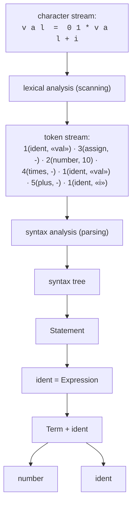

Notación de cada elemento del token stream tal como aparece en la slide 11: primero el **número de clase de token** (`token number`), y luego el **valor del token** (`token value`), p. ej. `1 (ident) "val"` significa: clase de token 1 (identificador), valor "val".

Continuando en la slide 12, después del árbol sintáctico viene:

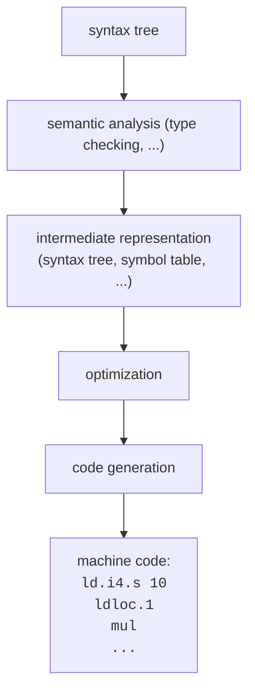

Esto conecta directamente con lo explicado en la transcripción `[14:17]`–`[19:32]`: el programa fuente (stream de caracteres) pasa por **scanning** (análisis léxico) → stream de tokens → **parser** (mediante la gramática decide si la cadena de tokens está bien formada, construye el árbol sintáctico) → **análisis semántico** (qué significa la sentencia, con chequeo de tipos incluido) → (opcionalmente) optimización → **generación de código**.

Ejemplo textual dado por el profesor para el análisis semántico `[17:41]`–`[18:20]`:
> "x igual a y más 2" → hay que sumar la variable `y` y el número `2`, y guardar el resultado en `x`. Ese es un análisis semántico, pero tiene inmerso un chequeo de tipos: tanto `x` como `y` deberían haber sido declaradas antes como variables enteras.

#### 1.3 Compiladores de una sola pasada vs. de varias pasadas (slides 13–14)

**Single-Pass Compilers** (el enfoque que usa COMPI):

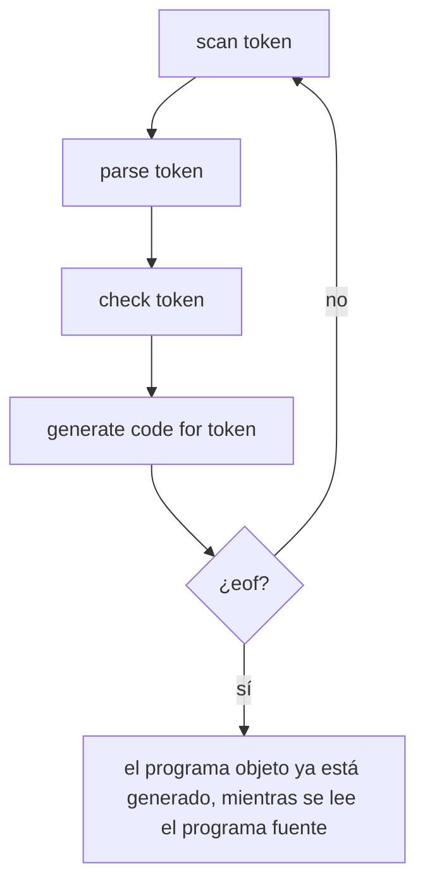

Las fases trabajan **entrelazadas** ("interleaved"): a medida que se escanea un token, ya se parsea, se chequea semánticamente y se genera código para él, sin esperar a tener todo el archivo.

**Multi-Pass Compilers** (no se implementa en la materia, se menciona como contraste):

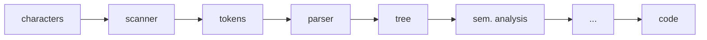

Cada fase es un "programa" separado que corre secuencialmente: lee de un archivo y escribe en uno nuevo. Motivos por los que convendría un compilador multi-pasada (slide 14): si la memoria es escasa (hoy irrelevante), o si el lenguaje es complejo, o si la portabilidad es importante.

En la transcripción `[19:22]`–`[19:32]` el profesor lo resume: "esto es normalmente lo que se denomina compilador de una sola pasada [...] compilador de varias pasadas [...] vendría a ser algo que puede trabajar en paralelo: hace todo el escaneo, hace todo el parseo y hace todo el análisis" (por separado).

#### 1.4 Estructura concreta de COMPI (slide 7, transcripción `[19:37]`–`[21:36]`)

Tabla de correspondencia entre teoría y archivos reales del compilador (tal como se muestra en el "diagrama de flujo" de la slide 7):

| Paso | Concepto (teoría) | Herramienta que usa | Archivo real |
|---|---|---|---|
| 1 | Introducción | PPT | — |
| 2 | Scanner | Autómatas Finitos | `Scanner.cs` |
| 3 | Parser | Gramática Tipo 2 | `Parser.cs` |
| 4 | Semantic Processing | + semantic actions (código C#, no un lenguaje aparte) | — |
| 5 | Code Generation 1 | Lenguaje Intermedio: CIL | `miCodGen.cs` |
| 6 | Tabla de Símbolos | Estructura de datos | `SymTab.cs` |
| 7 | Code Generation 2 | Metadatos | `miCodGen.cs` |

En la clase, mirando el proyecto real (`[19:37]`–`[21:36]`), el profesor recorre físicamente los archivos: `Scanner.cs`, la tabla de símbolos, `Parser.cs`, la parte de la **pila** (`Pila.cs`, donde se implementa el "pequeño CIL"/CIL simulado), y la clase `Token`. Aclara que **todo comienza en la clase `Parser`**, porque es un compilador de una sola pasada: el parser arranca, y a su vez llama al escáner (`Scanner.Init`) para que tome todo el programa fuente y comience a escanear; a medida que va escaneando, el parser va parseando en simultáneo.

**Aclaración clave del profesor** `[11:11]`–`[11:33]` y `[22:46]`–`[23:23]` (esto suele tomarse en el parcial): *no está toda la gramática implementada*. La gramática que se muestra puede generar cadenas que el compilador real todavía no reconoce; si se intenta compilar algo de esa parte no implementada, va a saltar error. Es importante tenerlo en cuenta al usar COMPI: la teoría (gramática completa) no es 1:1 con la implementación actual.

#### 1.5 Gramáticas y lenguaje — repaso rápido de contexto (slide 16, transcripción `[21:36]`–`[25:46]`)

Antes de entrar de lleno al escáner, se repasa la relación gramática ↔ lenguaje, apoyándose en Matemática Discreta:

- Gramática: `A = a A | a`
- Lenguaje generado: `L(G) = {a, aa, aaa, …} = {aⁿ / n ≥ 1}`
- Árbol de derivación de `aaa`: raíz `A → a A → a (a A) → a (a (a))`, es decir la cadena se arma concatenando las hojas del árbol.

Aplicado a un lenguaje de programación (Java, C++, C#), un fragmento de gramática (BNF/EBNF) tal como aparece en la slide:

```
Program        = "class" ident PosDeclars "{" MethodDeclsOpc "}" .
PosDeclars     = . | Declaration PosDeclars .
Declaration    = ConstDecl | VarDecl | ClassDecl .
MethodDeclsOpc = . | MethodDecl MethodDeclsOpc .
TypeOrVoid     = Type | "void" .
ConstDecl      = "const" Type ident "=" NumberOrCharConst ";" .
NumberOrCharConst = number | charConst .
Block          = "{" StatementsOpc "}" .
StatementsOpc  = . | Statement StatementsOpc .
Statement      = Designator RestOfStatement | "if" | "while" .
...
```

Programa de ejemplo usado para ilustrar (aparece repetidas veces en las slides 16, 17, 24, 25):

```
class Cl {
  void Main()
  int x;
  {
    x = 7 + 3 * 2;
    write(x,3);
  }
}
```

Idea remarcada por el profesor `[23:37]`–`[24:00]`: en este curso el alumno **escribe** el programa y lo que hace la gramática/el compilador es **verificar** si ese programa es válido (y si no, debe arrojar error); no se usa la gramática para *generar* programas al azar, sino al revés: para *reconocer* si la cadena que el usuario escribió pertenece al lenguaje.

**La metáfora del "rollo de papel higiénico"** `[24:00]`–`[24:39]` (anécdota remarcada, posible pregunta de parcial sobre "qué ve realmente el compilador"): el programa tal como el humano lo ve —con indentación, saltos de línea, espacios para su comprensión visual— **no es lo que "entiende" el compilador**. Lo que realmente le llega al compilador es una secuencia lineal de caracteres, "como si fuera un rollo de papel higiénico que viene escrito" (una tira continua de caracteres, sin la estructura visual). A partir de ese rollo, la primera etapa (léxica) tiene que identificar tokens y formar un string/secuencia de tokens.

En el código real, esto entra en escena en la línea de `Parser.cs` (mencionada por el profesor, número de línea aproximado 2347 en su código) donde se carga el archivo de texto fuente en una variable y se inicializa el escáner (`Scanner.Init`).

---

### 2. Qué es un Scanner / Analizador Léxico

#### 2.1 Definición y tareas del scanner (slide 20: "Tasks of a Scanner")

El **scanner** (analizador léxico) es el módulo del compilador que transforma el **stream de caracteres** de entrada en un **stream de tokens** de salida. Sus dos tareas fundamentales son:

1. **Entrega símbolos terminales (tokens)** ("Delivers terminal symbols (tokens)"). Ejemplo dado en la slide con la entrada `if ( x = 3 )`:
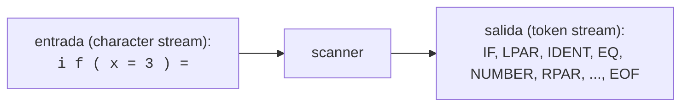

   El stream de tokens **debe terminar siempre con EOF** ("must end with EOF").

2. **Saltea caracteres sin significado** ("Skips meaningless characters"):
   - blancos (blanks)
   - caracteres de tabulación (tabulator characters)
   - caracteres de fin de línea (CR, LF — carriage return / line feed)
   - comentarios

En la transcripción, esto se explica con el mismo ejemplo `[27:17]`–`[30:25]`: dada la sentencia `if ( x = 3 )`, el scanner identifica en orden: el token `if`, el token paréntesis izquierdo, un identificador (`x`), el símbolo igual (doble, `==`, remarcado por el profesor), después un número (`3`) y después paréntesis derecho; y así sigue hasta encontrar el fin de archivo. El profesor aclara `[29:40]`–`[30:16]`: "es simple la tarea del scanner, no es muy compleja […] voy a saltar algunos caracteres que no me interesan: los blancos que existen entre caracteres, los símbolos de tabulación, los fines de línea y los comentarios. Eso no le interesa al escáner, lo va a saltar."

#### 2.2 Qué es un token (definición y origen histórico — slide 19)

Un **token** es, conceptualmente, una unidad léxica mínima con significado propio dentro del lenguaje: puede ser una palabra (identificador, palabra reservada) o un símbolo gráfico (operador, signo de puntuación).

La slide 19 trae una referencia histórica curiosa (citada por el profesor como anécdota, no material estrictamente técnico pero mencionada en clase): la palabra "token" deriva del vocablo anglosajón *"tacen"* = símbolo o signo, sinónimo del francés *"jetón"* o del español *"ficha"*. Los primeros "tokens" habrían sido fabricados por el hombre para conservar información de sus posesiones (aceite, grano, ganado), hacia el 8000 a.C. en la civilización sumeria; cada token tenía un significado concreto. Fuente citada en la slide: `http://numisarchives.blogspot.com/2015/12/los-primeros-tokens-y-el-origen-de-la.html`.

En la transcripción `[25:46]`–`[27:17]` el profesor comenta que "hoy en día tenemos token para todo: vamos al banco, necesitamos un token; voy a acceder a GitHub, necesito un token…", ilustrando que el concepto de "ficha con significado" trasciende la informática, pero remarca que no hace falta profundizar más porque "todos tienen una idea de lo que es un token".

**Definiciones formales (estándar de la materia, complementarias a las slides):**
- **Lexema:** la secuencia concreta de caracteres en el código fuente que forma una instancia de un token (p. ej. el texto `max`, el texto `30`, el texto `>=`).
- **Patrón:** la regla (expresión regular / descripción del autómata) que describe qué lexemas puede aceptar cierta clase de token (p. ej. "una letra seguida de letras o dígitos" para identificadores).
- **Token:** el par (clase de token, atributos) que el scanner devuelve al parser; representa la categoría a la que pertenece el lexema, junto con información adicional (línea, columna, valor, string).

#### 2.3 Distintos tipos de token (transcripción `[33:07]`–`[36:06]`, resumen que hace el profesor de lo que hace `Next()`)

El profesor enumera explícitamente los **distintos tipos de token** que puede identificar el escáner:
- **name / keyword** (nombre o palabra clave): "los keywords son la palabra reservada del lenguaje".
- **numbers**: "los tokens que identifican números".
- **simple tokens**: tokens de un solo carácter, p. ej. punto y coma, punto.
- **composite tokens** (tokens compuestos): los que necesitan mirar más de un carácter para decidirse, p. ej. `==` vs `=`, o `>=` vs `>`.
- **comments**: los comentarios (que se saltean, no generan token).
- **invalid characters** (caracteres inválidos): cuando ningún patrón reconoce el carácter actual, es un error léxico.

---

### 3. Autómatas Finitos Determinísticos (AFD) como base del Scanner

#### 3.1 El AFD como modelo de reconocimiento (slides 21–22, transcripción `[30:25]`–`[31:50]`)

El scanner se implementa clásicamente mediante un **Autómata Finito Determinístico (AFD)**. Cada token tiene su propio "camino" de estados dentro de un autómata combinado, y **después de reconocer cada token, el escáner vuelve a arrancar en el estado inicial `s0`** (frase textual de la slide 22: *"After every recognized token the scanner starts in s0 again"*).

#### 3.2 Ejemplo completo: reconocer la entrada `"    max >=  30  "` (slide 22 y 27)

Diagrama de estados redibujado como texto (a partir de la descripción verbal de la slide):

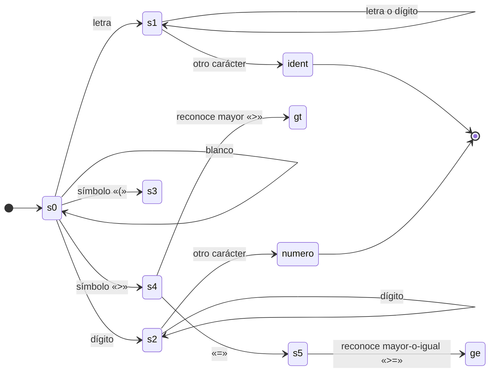

Tabla de estados/transiciones tal como se describe en la slide 22 (resumen):

| Estado origen | Entrada | Estado destino | Token reconocido al salir |
|---|---|---|---|
| `s0` | `" "` (blanco) | `s0` | (se ignora, no forma token) |
| `s0` | letra | `s1` | — |
| `s1` | letra o dígito | `s1` | (se mantiene leyendo el nombre) |
| `s1` | (otro carácter) | — | **ident** |
| `s0` | dígito | `s2` | — |
| `s2` | dígito | `s2` | (se mantiene leyendo el número) |
| `s2` | (otro carácter) | — | **numero** |
| `s0` | `(` | `s3` | **paréntesis izquierdo** |
| `s0` | `>` | `s4` | — |
| `s4` | `=` | `s5` | **mayor o igual** (`>=`) |
| `s4` | (otro) | — | **mayor** (`>`) |
| `s0` | `=` | ... | (según continúe, `==` o `=`) |

**Recorrido paso a paso de la entrada `"    max >=  30  "`** (tal como lo explica el profesor en `[30:25]`–`[31:50]` y se ilustra en la slide 22/27):

1. Se leen los espacios en blanco iniciales (`"    "`) → el autómata permanece en `s0` sin generar token (los blancos no forman parte del análisis).
2. Llega la letra `m` → entra por la transición "letra" de `s0` a `s1`.
3. Continúa viendo letras `a`, `x` → se queda en `s1` (bucle letra/letra).
4. Llega un carácter que no es letra ni dígito (el espacio después de `max`) → el autómata se detiene y reconoce el token completo: **`ident`**, con lexema `"max"`.
5. Vuelve a `s0`. Se saltea el espacio.
6. Llega `>` → transición de `s0` a `s4`.
7. Llega `=` → transición de `s4` a `s5` → se reconoce **`mayor o igual`** (`>=`).
8. Vuelve a `s0`. Se saltean los espacios (`"  "`).
9. Llegan los dígitos `3`, `0` → entra por "dígito" a `s2` y permanece en `s2` mientras sigan llegando dígitos.
10. Se detiene al encontrar un carácter no dígito (el espacio final) → se reconoce **`numero`**, con valor `30`.

Frase clave para recordar (aparece literalmente en la slide, dos veces — slides 22 y 27): **"After every recognized token the scanner starts in s0 again"** — después de cada token reconocido, el escáner vuelve a arrancar en `s0`.

#### 3.3 Conexión directa con el código: `ReadName` sobre el ejemplo `max` (slide 27)

La slide 27 conecta explícitamente el autómata con el código real, mostrando la traza de llamadas para la entrada `"    max"`:

```
while (ch <= ' ') NextCh();     // salta blancos hasta llegar a 'm'
Token t = new Token();
switch (ch) {
  case 'a': ... case 'z': case 'A': ... case 'Z':
      ReadName(t);              // <- entra acá porque 'm' es letra
      return t;
}
```

Y dentro de `ReadName`, el recorrido letra por letra:

```
Next → ReadName → lee 'm' → lee 'a' → lee 'x' → t = <ident, "max">
```

Esto es exactamente lo mismo que describe el AFD: el bucle de `ReadName` *es* el bucle del estado `s1` sobre sí mismo (letra/dígito → se mantiene leyendo), y la salida del bucle (cuando el carácter deja de ser letra o dígito) *es* la transición de salida de `s1` que reconoce el token `ident`.

---

### 4. La clase `Token`: constantes de clase y atributos

#### 4.1 Por qué existen las constantes de clase (transcripción `[31:50]`–`[32:52]`)

El parser necesita identificar de qué tipo es cada token, y para no tener que "acordarse" de un número mágico (p. ej. "el 6" para multiplicación), se define una **constante de clase** en `Token` con un nombre significativo (`IDENT`, `NUMBER`, `PLUS`, `TIMES`, etc.). El profesor lo resume así: "para no tener que estar acordando del identificador de token, que es un numerito, entonces directamente a ese numerito le ponemos un nombre".

#### 4.2 Tabla completa de constantes de `Token` (slide 24 + código real `Token.cs`)

| Constante | Valor | Categoría | Símbolo / significado |
|---|---|---|---|
| `NONE` | 0 | error token | (token de error) |
| `IDENT` | 1 | terminal | identificador |
| `NUMBER` | 2 | terminal | número |
| `CHARCONST` | 3 | terminal | constante de carácter |
| `PLUS` | 4 | operador | `+` |
| `MINUS` | 5 | operador | `-` |
| `TIMES` | 6 | operador | `*` |
| `SLASH` | 7 | operador | `/` |
| `REM` | 8 | operador | `%` |
| `EQ` | 9 | relacional | `==` |
| `GE` | 10 | relacional | `>=` |
| `GT` | 11 | relacional | `>` |
| `LE` | 12 | relacional | `<=` |
| `LT` | 13 | relacional | `<` |
| `NE` | 14 | relacional | `!=` |
| `AND` | 15 | lógico | `&&` |
| `OR` | 16 | lógico | `\|\|` |
| `ASSIGN` | 17 | asignación | `=` |
| `PPLUS` | 18 | compuesto | `++` |
| `MMINUS` | 19 | compuesto | `--` |
| `SEMICOLON` | 20 | especial | `;` |
| `COMMA` | 21 | especial | `,` |
| `PERIOD` | 22 | especial | `.` |
| `LPAR` | 23 | especial | `(` |
| `RPAR` | 24 | especial | `)` |
| `LBRACK` | 25 | especial | `[` |
| `RBRACK` | 26 | especial | `]` |
| `LBRACE` | 27 | especial | `{` |
| `RBRACE` | 28 | especial | `}` |
| `BREAK` | 29 | keyword | `break` |
| `CLASS` | 30 | keyword | `class` |
| `CONST` | 31 | keyword | `const` |
| `ELSE` | 32 | keyword | `else` |
| `IF` | 33 | keyword | `if` |
| `NEW` | 34 | keyword | `new` |
| `READ` | 35 | keyword | `read` |
| `RETURN` | 36 | keyword | `return` |
| `VOID` | 37 | keyword | `void` |
| `WHILE` | 38 | keyword | `while` |
| `WRITE` | 39 | keyword | `write` |
| `EOF` | 40 | especial | fin de archivo |
| `WRITELN` | 41 | keyword (real, no en slide) | `writeln` |
| `COMILLADOBLE` | 42 | especial (real, no en slide) | `"` |

Nota: la slide 24 muestra hasta `EOF = 40` (42 clases contando desde 0), y el profesor dice literalmente en `[36:17]`–`[36:46]` que el atributo `kind` "va a ser uno de estos 42 códigos". El código real (`Token.cs`) agrega dos constantes más que no aparecen en la slide: `WRITELN = 41` y `COMILLADOBLE = 42` — es decir, la slide está desactualizada respecto de la versión final del código, cosa a tener en cuenta si se comparan slide y código en un parcial.

Aclaración de la slide 24 sobre agrupación semántica de estas constantes (categorías remarcadas explícitamente en el propio texto de la slide):
- **error token** → `NONE`
- **end of file** → `EOF`
- **operators and special characters** → `PLUS ... RBRACE`
- **keywords** → `BREAK ... WRITE`

#### 4.3 Atributos de la clase `Token` (transcripción `[36:06]`–`[37:44]`, código real `Token.cs`)

Además de la constante de clase, cada instancia de `Token` guarda:
- **`kind`**: el código de token (uno de los valores de la tabla anterior); se carga "sí o sí", y depende de la gramática/de lo que se está escaneando en ese momento.
- **`line`**, **`col`**: la línea y columna donde se identificó el token (para mensajes de error).
- **`val`**: el valor numérico, si el token es un número o una constante de carácter.
- **`str`**: la representación en string del token, usada para identificadores y para números (se conserva el string de un número por si el literal es demasiado grande para un `int`, según el comentario del propio código real).

Ejemplo dado por el profesor con la palabra `class` `[37:00]`–`[37:44]`: "después de la palabra `class` siempre viene un identificador, eso me lo está mandando la gramática […] si es una string voy a tener que cargar el string al que estoy representando, o sea que en el caso de `class` voy a tener que cargar este valor que es `str`… El `kind` va a tener un número que va a ser, en este caso, 30" (el valor de `CLASS` en la tabla).

En el código real (`Token.cs`), esto se ve en el constructor y en `ToString()`:

```csharp
public int kind;    // token code (NONE, IDENT, ...)
public int line;    // token line number (for error messages)
public int col;     // token column number (for error messages)
public int val;     // numerical value (for numbers and character constants)
public string str;  // string representation of token (for numbers and identifiers)
```

Y el arreglo de nombres imprimibles (`names[]`) —usado para mensajes de error— indexa exactamente por el valor de `kind`, por eso el comentario del código real advierte: *"The token codes must index correctly into this array!"*.

---

### 5. Mecanismo de ventana doble: `token` / `laToken` y el método `Scan()`

Esta es una de las ideas más importantes de la semana (slide 25, transcripción `[31:50]`–`[34:32]`).

#### 5.1 Por qué hace falta "recordar dos tokens"

El parser, para decidir qué producción de la gramática aplicar, muchas veces necesita **mirar un token adelante** del que está procesando actualmente (technique de "lookahead"). Por eso el compilador **recuerda dos tokens de entrada** simultáneamente:

```csharp
static Token token;    // most recently recognized token   (el token "actual", ya reconocido/consumido)
static Token laToken;  // lookahead token (still unrecognized)  (el token "siguiente", el que viene)
```

- **`token`**: el token más recientemente reconocido — el que el parser está procesando/acaba de consumir.
- **`laToken`** ("lookahead token"): el token que **todavía no ha sido consumido** por el parser, el que "viene" — sirve para poder anticipar/decidir sin tener que "retroceder".

*(Nota de terminología: el glosario de la transcripción confirma que "la token" / "LA token" / "token con 1 y la token con un 1" que dice el profesor en el audio es, en todos los casos, una mala transcripción automática de **`laToken``.)*

#### 5.2 El método `Scan()` — cómo se actualiza la ventana

```csharp
static void Scan () {
    token = laToken;          // el que era "el próximo" pasa a ser "el actual"
    laToken = Scanner.Next();  // se pide al scanner el siguiente token, que pasa a ser el nuevo lookahead
    ....
}
```

Es decir, `Scan()` **desliza la ventana un paso hacia adelante**: lo que hasta ahora era el lookahead (`laToken`) se convierte en el token actual (`token`), y se le pide al scanner un token nuevo (llamando a `Scanner.Next()`) para que sea el nuevo lookahead.

Diagrama del "deslizamiento de la ventana" sobre el stream de tokens (a partir de la slide 25), usando como ejemplo el inicio del programa `class Cl { void Main …`:

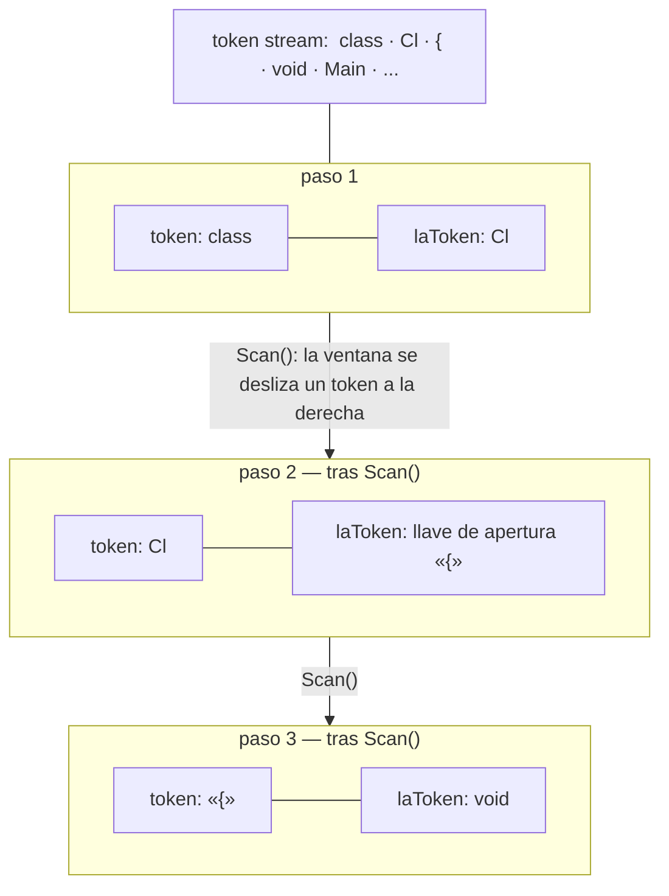

En la transcripción, el profesor lo explica con el ejemplo concreto del programa de la clase `[33:07]`–`[34:17]`: "voy a cargar las dos variables al principio: `token` con [un valor cualquiera] y `laToken` con un valor cualquiera, para que no me dé error el programa. Y después voy a ir a la función `Scan` […] entonces acá `token` queda con `laToken`, y `laToken` va a buscar el próximo. […] Al principio, el primer token, o sea que `laToken` va a quedarse cargado con `class` — si vemos este programita acá, va a quedarse con [`class`] una vez que lo reconoció."

#### 5.3 Rol de `Scan()` en el ciclo del parser (dónde vive el "lookahead")

Aclaración de terminología importante (posible confusión frecuente, marcada en el glosario de la transcripción): el profesor dice que la función `Scan()` "está en sparse" — la transcripción automática deformó la palabra, pero el glosario aclara que se refiere a **`Parser.cs`** (es el `Scan()` de la clase `Parser`, no de la clase `Scanner`). Es decir:

- `Scanner.Next()` → vive en `Scanner.cs`, devuelve **un solo** token nuevo cada vez que se lo llama.
- `Parser.Scan()` → vive en `Parser.cs`, es quien **mantiene la ventana doble** (`token` / `laToken`) y llama a `Scanner.Next()` para avanzarla.

Este dato (que la doble ventana no está en `Scanner.cs` sino en `Parser.cs`) es coherente con lo que se observa en el `Scanner.cs` real de COMPI: **no existen** allí ni el campo `laToken` ni el método `Scan()` — el archivo `Scanner.cs` solo expone `Scanner.Next()` (que devuelve un token genuino por vez) y variables de estado internas del propio escaneo (`ch`, `line`, `col`). Ver la sección 7 más abajo para el detalle exacto.

---

### 6. El método `Next()`: estructura completa y detallada del escáner

Esta sección sigue la explicación de las slides 26–27 y de la transcripción `[34:32]`–`[40:02]`, que resume literalmente: *"esto es básicamente como el resumen de la implementación del Scanner"*.

#### 6.1 Pseudocódigo tal como aparece en la slide 26

```csharp
public static Token Next () {
    while (ch <= '  ') NextCh();   // skip blanks, tabs, eofs
    Token t = new Token();
    switch (ch) {
        case 'a': ... case 'z': case 'A': ... case 'Z':
            ReadName(t); break;                              // names, keywords
        case '0': case '1': ... case '9':
            ReadNumber(t); break;                             // numbers
        case ';':
            NextCh(); t.kind = Token.SEMICOLON; break;        // simple tokens
        case '.':
            NextCh(); t.kind = Token.PERIOD; break;           // simple tokens
        case EOF:
            t.kind = Token.EOF; break;  // no NextCh() any more
        ...
        case '=':
            NextCh();
            if (ch == '=') { NextCh(); t.kind = Token.EQ; }   // composite tokens
            else t.kind = Token.ASSIGN;
            break;
        case '&':
            NextCh();
            if (ch == '&') { NextCh(); t.kind = Token.AND; }
            else t.kind = NONE;
            break;
        ...
        case '/':
            NextCh();
            if (ch == '/') {
                do NextCh(); while (ch != '\n' && ch != EOF);  // comments
                t = Next();  // call scanner recursively
            } else t.kind = Token.SLASH;
            break;
        default:
            NextCh(); t.kind = Token.NONE; break;             // invalid character
    }
    return t;
} // ch holds the next character that is still unprocessed
```

Variables estáticas del escáner (slide 26):
```csharp
static char ch;  // next input character (still unprocessed)
public static void Init () {
    NextCh();  // reads the next character into ch
}
```

#### 6.2 Paso a paso conceptual, siguiendo la explicación oral (`[34:50]`–`[36:06]`)

1. Lo primero que hace `Next()` es pedir el próximo carácter mediante `NextCh()`, **mientras sea blanco** va saltando (skip blanks). Cuando ya no es un espacio en blanco, se analiza el carácter actual.
2. Si el carácter es una **letra**: se entiende que puede haber distintos tipos de token descritos "de esta manera" — se llama a `ReadName`, que decide si el resultado es un **name** (identificador) o un **keyword** (palabra reservada del lenguaje).
3. Si es un **dígito**: se llama a `ReadNumber`, que arma el token numérico.
4. Si es un símbolo de un solo carácter sin ambigüedad (p. ej. `;`, `.`): se resuelve directamente como **simple token**.
5. Si el símbolo puede ser el comienzo de un operador de dos caracteres (p. ej. `=` puede ser `=` o `==`; `&` puede ser inválido o parte de `&&`): se mira **un carácter más** para decidir → **composite tokens** (tokens compuestos).
6. Si el símbolo es `/`: puede ser división (`SLASH`) o el inicio de un **comentario** de línea (`//`) — en ese caso se saltea todo hasta fin de línea o EOF, y se **llama recursivamente a `Next()`** para obtener el próximo token real (el comentario en sí no genera token).
7. Si no matchea nada de lo anterior: es un **carácter inválido** (error léxico).
8. Si se llegó al final del archivo: se devuelve el token `EOF` — y es el único caso en el que **no** se vuelve a llamar `NextCh()` ("no NextCh() any more"), porque ya no hay más caracteres que leer.

#### 6.3 `ReadName` y `ReadNumber` (transcripción `[38:07]`–`[40:02]`)

El profesor cierra remarcando específicamente estos dos métodos, señalándolos como parte importante a repasar:

> "hay que poner atención al `ReadName`; para que este `ReadName` es el que va a identificar si es un nombre de identificador, por ejemplo, o es una palabra clave. Y después el `ReadNumber` es cuando viene un número que — como habíamos visto recién en el autómata finito determinístico — puede venir un número de cuatro cifras, y va a tener que hacer cuatro veces eso; y después, en realidad, el encargado de eso va a ser el `ReadName`… o sea, todo lo que empiece con un número acá, todo lo que empiece con un número va a ir a leer, va a ser pasado a la función `ReadNumber`."

(Nota: en el audio el profesor se traba y por un momento dice "readName" donde claramente quiere decir "readNumber" para el caso de dígitos; el sentido correcto, y el que coincide con el código real, es: identificadores/keywords → `ReadName`; números → `ReadNumber`.)

Ejemplo dado para `ReadNumber`: un número puede tener "cuatro cifras" y el autómata "va a tener que hacer cuatro veces eso" — es decir, el bucle de `ReadNumber` se repite un carácter dígito a la vez, tantas veces como cifras tenga el número, exactamente igual que el bucle del estado `s2` del autómata de la sección 3.2.

---

### 7. Cómo se ve en el compilador real (COMPI)

Código real de `Scanner.cs` (ruta: `.../compi2026/text Box Mio/Scanner.cs`, namespace `at.jku.ssw.cc`). Se preservan los nombres reales de métodos y las diferencias respecto de la teoría de las slides.

#### 7.1 Variables de estado y `Init`

```csharp
const char EOF = '\u0080';  // retorna este valor al final del archivo
const char CR = '\r';       // constante Carriage Return
const char LF = '\n';       // constante Line Feed

static TextReader input;
static TextWriter output;

public static char ch;            // caracter lookahead
static public int line, col;      // número de línea y columna del ch de la entrada

public static void Init (TextReader r, TextWriter w) {
    input = r;   // deja en input el programa a compilar
    output = w;
    line = 1; col = 0;
    NextCh();               // Lee el primer carácter en ch e incrementa columna en 1
    GeneraHashKeywords();   // arma la tabla hash de palabras reservadas
}
```

Nota real vs. teoría: en la implementación real, `EOF` **no** es un valor booleano de fin de stream sino un carácter centinela (`'\u0080'`), y `NextCh()` lo asigna explícitamente cuando `TextReader.Read()` devuelve `-1`:

```csharp
public static void NextCh() {
    try {
        ch = (char)input.Read(); col++;
        switch (ch) {
            case LF: line++; col = 0; break;
            case CR: col = 0; break;
            case '￿':  // read returns -1 at end of file
                ch = EOF; break;
        }
    }
    catch (IOException) { ch = EOF; }
}
```

#### 7.2 `Next()` real — coincide con el pseudocódigo de la slide, con más casos

```csharp
public static Token Next () {  //zzz
    while ((ch == ' ') || (ch == LF) || (ch == CR)) // bloque que saltea los blancos
    { NextCh(); };
    if (ch == EOF) return new Token(Token.EOF, line, col);

    Token t = new Token(line, col);
    if ((ch >= 'a' && ch <= 'z') || (ch >= 'A' && ch <= 'Z')) //es Letra
        ReadName(t);
    else if ('0' <= ch && '9' >= ch)
        ReadNumber(t);
    else
        switch (ch) {
            case ';': t.kind = Token.SEMICOLON; t.str = ch.ToString(); NextCh(); break;
            case ',': t.kind = Token.COMMA; NextCh(); break;
            case '.': t.kind = Token.PERIOD; t.str = ch.ToString(); NextCh(); break;
            case '*': t.kind = Token.TIMES;  t.str = ch.ToString(); NextCh(); break;
            case '%': t.kind = Token.REM;    t.str = ch.ToString(); NextCh(); break;
            case '(': t.kind = Token.LPAR;   t.str = ch.ToString(); NextCh(); break;
            case ')': t.kind = Token.RPAR;   t.str = ch.ToString(); NextCh(); break;
            case '[': t.kind = Token.LBRACK; t.str = ch.ToString(); NextCh(); break;
            case ']': t.kind = Token.RBRACK; t.str = ch.ToString(); NextCh(); break;
            case '{': t.kind = Token.LBRACE; t.str = ch.ToString(); NextCh(); break;
            case '}': t.kind = Token.RBRACE; t.str = ch.ToString(); NextCh(); break;
            case EOF: t.kind = Token.EOF; break;

            // tokens compuestos
            case '=': NextCh();
                if (ch == '=') { NextCh(); t.kind = Token.EQ; t.str = "=="; }
                else { t.kind = Token.ASSIGN; t.str = "="; }
                break;
            case '!': NextCh();
                if (ch == '=') { NextCh(); t.kind = Token.NE; t.str = "!="; }
                else { t.kind = Token.NONE;  // debe reportar error
                       System.Console.WriteLine("Error:"+ch+" por el default despues del NextCh"); }
                break;
            case '+': NextCh();
                if (ch == '+') { NextCh(); t.kind = Token.PPLUS; t.str = "++"; }
                else t.kind = Token.PLUS; t.str = ch.ToString();
                break;
            case '-': NextCh();
                if (ch == '-') { NextCh(); t.kind = Token.MMINUS; t.str = "--"; }
                else { t.kind = Token.MINUS; t.str = ch.ToString(); }
                break;
            case '&': NextCh();
                if (ch == '&') { NextCh(); t.kind = Token.AND; t.str = "&&"; }
                else t.kind = Token.NONE;
                break;
            case '|': NextCh();
                if (ch == '|') { NextCh(); t.kind = Token.OR; t.str = "||"; }
                else t.kind = Token.NONE;
                break;
            case '>': NextCh();
                if (ch == '=') { NextCh(); t.kind = Token.GE; t.str = ">="; }
                else { t.kind = Token.GT; t.str = ">"; }
                break;
            case '<': NextCh();
                if (ch == '=') { NextCh(); t.kind = Token.LE; t.str = "<="; }
                else { NextCh(); t.kind = Token.LT; t.str = "<"; }
                break;

            // constante de carácter: '\n' '\r' '\\' o un carácter imprimible
            case '\'': /* ... ver 7.5 ... */ break;

            // comentarios /* ... */ (con anidamiento, ver 7.4)
            case '/': /* ... ver 7.4 ... */ break;

            default: {
                t.str = ch.ToString();
                throw new ErrorMio(line, col, 1, "caracter " + ch.ToString() + " invalido");
            }
        }
    return t;
}
```

#### 7.3 `ReadName` real — palabras reservadas vía tabla hash

```csharp
public static void GeneraHashKeywords(){
    string[] keywords = {"break", "class", "const", "else",
                          "if", "new", "read","return",
                          "void","while","write","writeln"};
    hashTableKeywords = new Hashtable();
    for (int i=0; i<keywords.Length; i++)
        hashTableKeywords.Add(keywords[i].GetHashCode(), keywords[i]);
}

public static bool esPalabraClave(string cadena) {
    return hashTableKeywords.ContainsValue(cadena);
}

static void ReadName(Token t) {
    while ((ch >= 'a' && ch <= 'z') || (ch >= 'A' && ch <= 'Z') || ch == '_') {
        t.str = t.str + ch;
        NextCh();
    }
    if (esPalabraClave(t.str))
        switch (t.str) {
            case "break":   t.kind = Token.BREAK;   break;
            case "class":   t.kind = Token.CLASS;   break;
            case "const":   t.kind = Token.CONST;   break;
            case "else":    t.kind = Token.ELSE;    break;
            case "if":      t.kind = Token.IF;      break;
            case "new":     t.kind = Token.NEW;     break;
            case "read":    t.kind = Token.READ;    break;
            case "return":  t.kind = Token.RETURN;  break;
            case "void":    t.kind = Token.VOID;    break;
            case "while":   t.kind = Token.WHILE;   break;
            case "write":   t.kind = Token.WRITE;   break;
            case "writeln": t.kind = Token.WRITELN; break;
        }
    else
        t.kind = Token.IDENT;
}
```

Esta es la implementación **real** de "identificador vs. palabra reservada": primero se lee el nombre completo (todo lo que sea letra o `_`), y **recién después** se decide si ese string coincide con una palabra reservada de la tabla hash (`esPalabraClave`); si no coincide con ninguna, se lo marca como `IDENT`. Este orden (leer todo el lexema primero, decidir la clase después) es la técnica estándar para distinguir identificadores de keywords en un scanner basado en autómata (evita tener que codificar cada palabra reservada letra por letra en el autómata).

**Dato importante para la práctica 3 (guion bajo en identificadores):** la guía de la práctica (`_Guia para la clase practica nro2 - cohorte 2026.docx.md`) pide explícitamente:

> "Intente introducir los cambios necesarios en el scanner para que el compilador pueda detectar identificadores que contengan el guion bajo "_", es decir que se pueda construir identificadores de la siguiente forma: `_max`, `max_number`, `__a`, `max__`."

Mirando el código real, **`ReadName` ya acepta `_` dentro del bucle** (`ch == '_'` está en la condición del `while`), por lo que identificadores como `max_number` o `max__` **ya funcionarían** con el código actual, siempre que el scanner **llegue a entrar** a `ReadName`. El problema real está en `Next()`, que decide si llamar a `ReadName` solo cuando el primer carácter es una letra:

```csharp
if ((ch >= 'a' && ch <= 'z') || (ch >= 'A' && ch <= 'Z')) //es Letra
    ReadName(t);
```

Como este chequeo **no incluye `ch == '_'`**, un identificador que **empiece** con guion bajo (`_max`, `__a`) nunca llega a invocar `ReadName`: cae al `switch` de más abajo y termina en el `default`, que lanza `ErrorMio` ("carácter inválido"). Es decir: el ejercicio de la práctica pide agregar `_` también a esta condición de entrada de `Next()` (no solo dentro de `ReadName`, que ya lo soporta) para que los casos con guion bajo **al principio** del identificador funcionen. Esto es un buen ejemplo concreto de la diferencia entre "dónde arranca" el autómata (el `switch`/`if` de `Next()`, que decide el estado inicial según el primer carácter) y "cómo continúa" (`ReadName`, que sería el bucle del estado `s1`).

#### 7.4 Comentarios anidados con una pila (`Pila`) — más allá de la teoría de la slide

La slide 26 muestra comentarios de línea simples (`//`) con `do NextCh(); while (ch != '\n' && ch != EOF);`. El código real de COMPI, en cambio, implementa comentarios de bloque `/* ... */` **anidables**, usando una estructura de pila (`Pila`) para llevar la cuenta de los niveles de anidamiento:

```csharp
case '/': NextCh();
    if (ch == '*')
    {
        Pila aux = new Pila(50);
        aux.push("comentario");
        while ((ch != EOF) && (!aux.estaVacia()))
        {
            NextCh();
            if (ch == '*')
            {
                NextCh();
                if ((ch == '/') && (!aux.estaVacia()))
                {
                    aux.pop();
                    if (aux.estaVacia())
                    {
                        NextCh();
                        t = Next();   // llamada recursiva, igual que en la teoría
                    }
                }
            }
            else if (ch == '/')
            {
                NextCh();
                if (ch == '*')
                    aux.push("comentario");   // abre un nuevo nivel de anidamiento
            }
        }
    }
    else
    {
        t.kind = Token.SLASH;
    }
    break;
```

Esto conserva la idea teórica de la slide (al terminar el comentario, se llama recursivamente a `Next()` para obtener el token real que sigue), pero la implementación real soporta **comentarios anidados** (`/* /* ... */ ... */`) mediante la pila, algo que va más allá del pseudocódigo simplificado de las slides.

#### 7.5 Constantes de carácter (`'a'`, `'\n'`, `'\r'`) — caso no cubierto en las slides

El código real también maneja literales de carácter entre comillas simples, con soporte de secuencias de escape básicas, algo que tampoco aparece en el pseudocódigo de la slide 26:

```csharp
case '\'': NextCh();               // ' (comilla)
    if (ch == '\\')                // => '\  (se prepara para '\n','\r','\\')
    {
        t.val = 0;
        NextCh();
        switch (ch) {
            case 'n': t.val = '\n'; NextCh(); break;
            case 'r': t.val = '\r'; NextCh(); break;
            case '\'': t.val = '\\'; break;
            default: t.val = 0; break;  // caracter escape no válido
        }
    }
    else                             // (comilla sola, y char siguiente en ch)
    {
        int inicio = 32, fin = 126;
        if (((ch >= inicio) && (ch <= fin)) || (ch == '\''))
        { t.val = ch; t.str = ch.ToString(); }
        else
            t.val = 0;               // carácter no válido
        NextCh();
    }
    if (ch != '\'')                  // si el 3er char no es comilla => error
        t.val = 0;
    else
        NextCh();
    t.kind = Token.CHARCONST;
    break;
```

#### 7.6 `ReadNumber` real

```csharp
static void ReadNumber(Token t) {
    while (ch>='0' && ch<='9' && ch!=EOF) {
        t.str = t.str + ch;
        NextCh();
    }
    if (t.str != null)
        try {
            t.val = Int16.Parse(t.str);
            t.kind = Token.NUMBER;
        }
        catch (Exception) {
            Error(ErrorStrings.BIG_NUM);
            t.kind = Token.NONE;         // número demasiado grande → error léxico
        }
}
```

Detalle real destacable: el número se parsea como **`Int16`** (rango aproximado -32768..32767); si el literal numérico es demasiado grande para entrar en un `Int16`, se produce una excepción que se traduce en el error `ErrorStrings.BIG_NUM` y el token queda marcado como `Token.NONE` (token de error), en vez de abortar la compilación. Esto conecta con el comentario del propio `Token.cs`: se guarda el `str` del número "para mensajes de error, por si el literal numérico es demasiado grande para un `int`".

---

### 8. Errores comunes, aclaraciones del profesor y puntos típicos de parcial

Recopilación de observaciones que el profesor remarcó explícitamente durante la clase (candidatas a preguntas de examen):

1. **No confundir "gramática completa" con "gramática implementada".** El profesor insiste dos veces (`[11:11]` y `[22:46]`–`[23:23]`) en que la gramática mostrada en las slides no está 100% implementada en COMPI: si se prueba a compilar algo que sí está en la gramática teórica pero no en el código, va a saltar error. **No asumir que "lo que dice la teoría, el compilador real lo acepta."**

2. **El compilador no ve el programa como lo ve el humano.** La metáfora del "rollo de papel higiénico" (`[24:00]`–`[24:39]`): la indentación, los saltos de línea y los espacios son solo para la comprensión humana; el compilador recibe una tira lineal de caracteres. La primera tarea del análisis léxico es justamente reconstruir estructura (tokens) a partir de esa tira plana.

3. **Los blancos, tabs, fin de línea y comentarios NO forman parte del análisis** (no generan tokens ni entran al parser). El scanner los reconoce y **los descarta** silenciosamente (`[15:52]`–`[16:12]`, y tareas del scanner en la slide 20).

4. **`token` vs. `laToken`: cuál es "el actual" y cuál es "el que viene".** Es un error común confundir el orden: `token` es el último **ya reconocido** (con el que trabaja el parser en este instante); `laToken` es el **lookahead**, todavía no consumido. `Scan()` es quien hace avanzar la ventana un paso: `token = laToken; laToken = Scanner.Next();`.

5. **La doble ventana (`token`/`laToken`) vive en el `Parser`, no en el `Scanner`.** El `Scanner.Next()` solo entrega **un** token por llamada; quien mantiene el estado de "actual" y "próximo" y hace lookahead es el `Parser` (método `Scan()`), no el escáner propiamente dicho.

6. **Distinguir identificador de palabra reservada es una decisión posterior a leer el lexema completo**, no algo que se decide letra por letra dentro del autómata: primero se junta todo el string (mientras sea letra, dígito o guion bajo — en `ReadName`), y luego se compara contra la tabla de palabras reservadas.

7. **El estado inicial del autómata decide qué "rama" tomar según el primer carácter, pero el bucle interno de cada rama puede aceptar más caracteres que el chequeo de entrada.** Es exactamente el problema del guion bajo inicial visto en 7.3: `ReadName` acepta `_` en su bucle interno, pero el `if` de `Next()` que decide *si entrar* a `ReadName` no contempla `_` como primer carácter — por eso `_max` falla aunque `max_` no.

8. **Tokens compuestos requieren mirar más de un carácter antes de decidir la clase final** (`=` vs `==`, `>` vs `>=`, `&` vs `&&` vs error, etc.). Si tras el segundo carácter no se completa el patrón esperado, en varios casos el resultado es directamente `Token.NONE` (p. ej. `&` seguido de algo que no es otro `&` → error, no se interpreta como un único `&`, porque el lenguaje de COMPI no tiene AND bit a bit de un solo símbolo).

9. **`EOF` es el único token que no dispara una nueva lectura de carácter** ("no NextCh() any more" en la slide 26): una vez que se llegó al final del archivo, no tiene sentido seguir pidiendo caracteres.

10. **Después de reconocer cada token, el autómata vuelve siempre a `s0`.** Esta frase aparece two veces en las slides (22 y 27) como para remarcar que es un punto de examen: cada token se reconoce de forma independiente, arrancando siempre desde el estado inicial.

11. **El práctico 3 exige documentar los prompts de IA usados** (`[40:21]`–`[41:00]`, y la guía docx): se puede usar IA generativa para resolver la práctica, pero es obligatorio entregar un informe básico de los prompts utilizados, ya que en la evaluación se van a evaluar esos prompts. El profesor lo remarca con énfasis: "usen la IA para aumentar sus capacidades, no sean simplemente espectadores de una IA que hace todo por ustedes... no aprenderán nada."

---

### 9. Glosario de términos técnicos (según transcripción y verificado contra las slides)

Este glosario documenta términos que el reconocimiento automático de voz transcribió mal, junto con el término técnico real (tomado del glosario del archivo de transcripción, cruzado contra las slides 7, 8, 11, 18–27):

| En la transcripción (ASR) | Término técnico real |
|---|---|
| escáner css | `Scanner.cs` |
| el parse css | `Parser.cs` |
| el parcel, el Parcel | `Parser.cs` / el parser |
| parciar | parsear / `Parser` |
| la token, LA token, token con 1 y la token con un 1 | `laToken` (*lookahead token*) |
| el SIL, un SIL muy parecido al SIL real, código SIN | **CIL** (*Common Intermediate Language*) |
| el pequeño / seal | el pequeño **CIL** (simulado) |
| el copiador, estructura de compi, Compi | **COMPI** (herramienta de la cátedra) |
| escala inédita | `Scanner.Init()` (probable) |
| sparse (la función `Scan()` que está en sparse) | `Parser.cs` (el `Scan()` de la clase `Parser`) |
| el punto anexo | el método `Next()` (probable) |
| toque.next | `Token.Next()` — en rigor, `Scanner.Next()` (el que devuelve tokens) |
| nextChange | `NextCh()` |
| rename | `ReadName` |
| renumber | `ReadNumber` |
| el fit de max | *el fin de* `max` (el final del identificador en el autómata) |
| idem | **`IDENT`** (`IDENT = 1`) |
| time | **`TIMES`** (`TIMES = 6`, el `*`) |
| el kind, el kine | **`kind`** (código del token) |
| Clash | **`class`** (palabra reservada) |
| Z-sharp, C-sharp, Csharp, Sechardt | **C#** |
| el lenguaje F | probable **F#** |
| la post declaración | **`PosDeclars`** (no terminal de la gramática) |
| carry return | *carriage return* (CR) |
| writer (en "en vez de writer es writer") | `write` (la función de impresión, `write(x,3)`) |
| CocoR | **Coco/R** (generador de compiladores de la ETH Zúrich, usado en el trabajo final) |
| promos | *prompts* (de IA) |

---

### 10. Resumen ejecutivo (para repaso rápido antes del parcial)

- El **scanner** convierte un stream de caracteres en un stream de **tokens**, descartando blancos/tabs/EOL/comentarios.
- Se implementa como un **AFD**: cada tipo de token es un camino de estados; tras reconocer un token, siempre se vuelve a `s0`.
- El **token** tiene una clase (`kind`, constante de `Token`, p. ej. `IDENT=1`, `NUMBER=2`, `TIMES=6`...) y atributos (`line`, `col`, `val`, `str`).
- El compilador usa **ventana doble**: `token` (último reconocido) y `laToken` (lookahead, aún no consumido). `Parser.Scan()` desliza la ventana: `token = laToken; laToken = Scanner.Next();`.
- `Scanner.Next()` es el corazón del escáner: salta blancos, y según el primer carácter decide si llamar a `ReadName` (identificadores/keywords), `ReadNumber` (números), resolver un token simple o compuesto, saltar un comentario (llamada recursiva a `Next()`), devolver `EOF`, o lanzar error si el carácter es inválido.
- `ReadName` primero lee el lexema completo y luego decide, contra una tabla hash de palabras reservadas, si es `IDENT` o un `keyword` específico.
- El compilador es de **una sola pasada**: escaneo, parseo, chequeo semántico y generación de código están entrelazados token a token, no en fases separadas.
- La gramática mostrada en clase **no está completamente implementada** en COMPI — cuidado al asumir equivalencia 1:1 entre teoría y código real.


---

## 4. Semana 4 - Parser (análisis sintáctico)

> Fuentes usadas para armar este apunte: `README.md`, `texto/03.Parsing 2025.pptx.md`, `texto/04.Parsing  2025 Adicional.pptx.md`, `texto/Guia para el trabajo práctico de la clase 4- Analisis sintactico.docx.md` y `transcripciones/clase parser - transcripcion completa.md` (carpeta `semana 4 - Parser - 31 ago 1sep 2026`), más el código real `Parser.cs` del compilador COMPI (`text Box Mio/Parser.cs`). Los ejemplos de gramática se preservan tal como aparecen en las slides. La transcripción es literal (con muletillas); el glosario del archivo original corrige los términos mal reconocidos por el ASR (ver sección final de errores/aclaraciones).

---

### 1. Ubicación del parser en el compilador

El compilador COMPI se estructura en fases, cada una con su archivo de código real:

| Fase | Teoría | Archivo real |
|---|---|---|
| Introducción / proyecto | — | `this` (proyecto completo) |
| Scanner (léxico) | Autómatas Finitos | `Scanner.cs` |
| **Parser (sintáctico)** | **Gramática Tipo 2** | **`Parser.cs`** |
| Semantic Processing | acciones semánticas embebidas en C# | (no hay archivo separado) |
| Code Generation 1 | lenguaje intermedio CIL | `miCodGen.cs` |
| Tabla de símbolos | estructura de datos | `SymTab.cs` |
| Code Generation 2 | metadatos | `miCodGen.cs` |

(Tabla reconstruida de la Slide 13 de `03.Parsing 2025.pptx`.)

El parser recibe el flujo de tokens que produce el **scanner** y verifica que ese flujo respete la **gramática tipo 2 (libre de contexto)** del lenguaje COMPI. Como el analizador léxico ya viene de la semana anterior, el parser arranca reutilizando exactamente el mismo mecanismo de "ventana doble" (`token` / `laToken`) que ya se había armado ahí.

---

### 2. La ventana doble: `token` y `laToken`

#### 2.1 Concepto

> "At any moment the parser knows the next input token. It remembers two input tokens." (Slide 1)

El parser necesita, en todo momento, dos cosas:

- **`token`**: el **último token reconocido** (ya consumido/aceptado).
- **`laToken`** (*lookahead token*): el **próximo token, todavía no reconocido**, que el parser "espía" para decidir qué hacer.

```csharp
static Token token;    // most recently recognized token
static Token laToken;  // lookahead token (still unrecognized)
static int la;         // shortcut: la = laToken.kind
```

Estas variables se actualizan en el método `Scan()`:

```csharp
static void Scan () {
    token = laToken;
    laToken = Scanner.Next();
    la = laToken.kind;
}
```

Es decir: cada `Scan()` "desliza" la ventana un token hacia adelante — lo que era lookahead pasa a ser el token reconocido, y se pide un token nuevo al scanner para que sea el nuevo lookahead.

#### 2.2 Por qué existen dos variables y no una

La transcripción lo explica con la metáfora del "rollo de papel higiénico":

> [00:56] "la idea de esto era que el escáner recibía una entrada que era como un rollo de papel higiénico donde venía todo el programa" [...] [01:24] "para comenzar se creaba una ventanita que estaba compuesta por el token y el LA token" [01:31] "laToken significa look-ahead token"

El parser necesita **mirar hacia adelante** (`laToken`) antes de decidir qué producción de la gramática aplicar, sin todavía "consumirlo" formalmente. Solo cuando decide que ese token es correcto en ese punto, lo consume (avanza la ventana con `Scan()`), momento en el cual pasa a ser `token`.

#### 2.3 Inicialización

```
token = null;
laToken = new Token(1, 1);   // basura, sólo para que no explote antes del 1er Scan
Scan();                       // primer scan real: token = basura, laToken = primer token del programa (class)
```

De la transcripción:

> [33:44] "Lo primero que hace es poner token, la variable token en null y la variable LA token cargarla con un 1 [...] con una basura, para evitar el crash." [34:02] "el primer scan lo que va a hacer es pasar el contenido de LA token a token y el contenido del primer token que es class ponerlo en el LA token."

Es decir, después del primer `Scan()`: `token` = basura (Token(1,1)), `laToken` = `class` (el primer token real del programa fuente), y `la = Token.CLASS`.

---

### 3. Gramáticas BNF/EBNF: notación usada

La gramática de COMPI (y del lenguaje-juguete tipo Cocol/EBNF que usa la cátedra, siguiendo el estilo Mössenböck/Wirth) usa esta notación:

- `A = ...` define la producción del no terminal `A` (el `.` final cierra la producción).
- `α | β | γ` → **alternativas** (una entre varias opciones).
- `[ α ]` → **opción** (0 o 1 veces).
- `{ α }` → **iteración** (0 o más veces).
- Minúsculas (`a`, `b`, `c`, `ident`, `class`) → **símbolos terminales** (tokens, hojas del árbol).
- Mayúsculas (`A`, `B`, `PosDeclars`, `MethodDecl`) → **símbolos no terminales** (nodos internos, se expanden con otra producción).

De la transcripción, ejemplo concreto pedagógico:

> [09:03] "todos estos que están acá, posdeclaraciones, declaraciones, método, declaración opcional, constante, todos estos son no terminales [...] mientras que los terminales que serían las hojitas del árbol es class, ident, punto."

#### 3.1 Árbol de derivación (parse tree)

El árbol de derivación es la representación gráfica de cómo un no terminal se expande sucesivamente hasta llegar a una cadena de terminales, siguiendo las producciones de la gramática. En COMPI, la vista "Paso a paso" del compilador **construye visualmente** ese árbol en un `TreeView` de Windows Forms a medida que el parser reconoce recursivamente cada no terminal (ver §7).

#### 3.2 Conjunto FIRST

> "El conjunto First de un símbolo no terminal es el conjunto de símbolos terminales que pueden aparecer como primer símbolo en una cadena derivada de dicho símbolo." (Slide 7)

El conjunto **FIRST(X)** se usa exactamente para decidir, ante una alternativa `α | β | γ`, cuál de las ramas tomar: se mira el token de lookahead `la` y se pregunta a cuál de los conjuntos FIRST pertenece.

Ejemplo textual de la slide 7:

```
A = a B | B b.
B = c | d.

First(aB) = {a}
First(Bb) = First(B) = {c, d}
```

> Nota de exhaustividad: el material de esta semana no desarrolla explícitamente el cálculo formal de FOLLOW ni casos de **gramática ambigua** o **recursividad a izquierda** (temas que suelen tratarse en profundidad en teoría de gramáticas LL); solo se usa FIRST de forma aplicada para elegir alternativas en el descenso recursivo. Si el parcial pregunta por FOLLOW/ambigüedad/recursividad izquierda como concepto general: FOLLOW(X) son los terminales que pueden seguir a X en alguna forma sentencial; una gramática es ambigua si una misma cadena tiene más de un árbol de derivación; la recursividad a izquierda (`A = A α | β`) es problemática para el descenso recursivo porque produce recursión infinita sin consumir ningún token, y debe eliminarse (convirtiéndola en recursividad a derecha / iteración) antes de programar el método de `A`. Esto no viene citado literalmente del material de la cátedra, se agrega como contexto teórico general para completar el tema.

---

### 4. Regla clave: cómo se implementa un No Terminal vs. un Terminal

Esta es **la regla central de todo el parser por descenso recursivo** y aparece explícitamente remarcada como pregunta de examen.

#### 4.1 No Terminal → método con el mismo nombre

> "Every nonterminal symbol is recognized by a parsing method with the same name." (Slide 3)

**Patrón:**

```
symbol to be parsed:  A
parsing action:       A();   // call of the parsing method A

private static void A() {
    ... parsing actions for the right-hand side of A ...
}
```

De la transcripción:

> [08:42] "un no terminal se parsea mediante un método [...] para todos los no terminales voy a tener un método." [09:56] "Designator, factor, term [...] son todos los métodos que estarían en la parte izquierda de la producción."

Es decir: **por cada no terminal de la gramática existe un método C# con exactamente ese nombre**, y el cuerpo de ese método contiene las acciones de parsing del lado derecho de la producción.

#### 4.2 Terminal → llamada a `Check`

> "How to Parse Terminal Symbols" (Slide 5)

**Patrón:**

```
symbol to be parsed:  a
parsing action:       Check(a);

static void Check (int expected) {
    if (la == expected) Scan();       // reconocido => leo el próximo
    else Error(Token.names[expected] + " expected");
}
```

De la transcripción:

> [12:04] "ahí voy a utilizar check, igual que lo que viene cuando son determinísticos y son hojas [...] si fuera un no terminal tendría que tener un método [...] check lo que va a hacer es comparar lo esperado con lo que debería venir."

**Regla de examen, en una frase:** *un no terminal se parsea llamando a un método que lleva su mismo nombre; un símbolo terminal se parsea llamando a `Check(código_del_terminal_esperado)`, nunca con un método propio.*

`Check` hace dos cosas:
1. Compara `la` (el `kind` del lookahead) contra el `expected` que exige la gramática en ese punto.
2. Si coincide → llama a `Scan()` (avanza la ventana doble). Si no coincide → dispara un error.

#### 4.3 Los nombres de terminal son constantes de la clase `Token`

```csharp
public const int NONE = 0,
    IDENT = 1, NUMBER = 2, ..., PLUS = 4, MINUS = 5, ... ;
public static string[] names = {"?", "identifier", "number", ..., "+", "-", ...};
```

`Token.names[expected]` es lo que arma el mensaje `"... expected"` cuando `Check` falla. En el código real de COMPI el mensaje es en español: `Errors.Error("Se esperaba un: " + Token.names[expected]);` (ver §9).

#### 4.4 Manejo de errores

```csharp
public static void Error (string msg) {
    ...
    throw new Exception("...");
}
```

De la transcripción:

> [14:36] "no es una excepción [...] tiene idea de lo que son las excepciones [...] se tiene que detener [...] yo lanzo una excepción."

El mecanismo de error del parser por descenso recursivo es **lanzar una excepción** ante un `Check` fallido; algún nivel superior la captura y la reporta.

---

### 5. Cómo se parsean las construcciones EBNF

#### 5.1 Secuencias

**Patrón (Slide 6):**

```
producción:      A = a B c.
método parsing:  static void A () {
                     // la contiene un terminal de inicio de A
                     Check(a);
                     B();
                     Check(c);
                     // la contiene un follower de A
                 }
```

Ejemplo completo de la slide:

```
A = a B c.
B = b b.

static void A () {
    Check(a);
    B();
    Check(c);
}
static void B() {
    Check(b);
    Check(b);
}
```

**Simulación** (parseando la cadena de entrada `a b b c`, reconstruyendo el rastro de la Slide 6, que muestra la entrada restante en cada paso):

| Paso | Acción | Entrada restante |
|---|---|---|
| 0 | (inicio) | `a b b c` |
| 1 | `Check(a)` consume `a` | `b b c` |
| 2 | entra a `B()` → `Check(b)` consume 1º `b` | `b c` |
| 3 | `Check(b)` consume 2º `b` (dentro de `B`) | `c` |
| 4 | retorna de `B()`, `Check(c)` consume `c` | *(vacío)* |

La cadena es válida porque en cada paso el terminal esperado por la gramática coincide con `la`.

De la transcripción, la idea general:

> [18:26] "yo tengo este tipo de producción [...] para el segundo determinante A voy a generar un método que esencialmente va a ser Check A, un método B y Check C [...] si son símbolos terminales directamente le coloco un check y si es un símbolo no terminal lo asocio con otro método."

Y su conexión con el código real (visto en clase, sección de `Program()`):

> [21:32] "fíjese que acá un check token id... primero un check token class y después viene un check token ident [...] acá tengo una secuencia que viene justamente de la gramática [...] class ident y después viene posdeclaraciones."

Esa secuencia real es exactamente `Check(Token.CLASS); Check(Token.IDENT); PosDeclars_logica...` dentro de `Program()` (ver Parser.cs, §9).

#### 5.2 Alternativas

**Patrón (Slide 7):**

```
α | β | γ         (α, β, γ son expresiones EBNF arbitrarias)

if (la ∈ First(α)) { ... parsea α ... }
else if (la ∈ First(β)) { ... parsea β ... }
else if (la ∈ First(γ)) { ... parsea γ ... }
else Error("...");   // buscar un mensaje de error significativo
```

Ejemplo completo de la slide:

```
A = a B | B b.
B = c | d.

First(aB) = {a}
First(Bb) = First(B) = {c, d}

static void B () {
    if (la == c)
        Check(c);
    else
        if (la == d) Check(d);
        else Error ("invalid start of B");
}

static void A () {
    if (la == a) {
        Check(a);
        B();
    } else
    if (la == c || la == d) {
        B();
        Check(b);
    } else Error ("invalid start of A");
}
```

**Ejemplos de la slide, resueltos** (`A = a B | B b.`, `B = c | d.`):

1. **`a d`** → `la = a` ∈ First(aB) = {a} → rama `a B`: `Check(a)` consume `a` → llama a `B()`: `la = d` ∈ {c,d} → `Check(d)` consume `d`. **Cadena válida.**
2. **`c b`** → `la = c`, no es `a`, pero `c` ∈ First(Bb) = {c,d} → rama `B b`: `B()` → `la=c` → `Check(c)` consume `c` → vuelve a `A()` → `Check(b)` consume `b`. **Cadena válida.**
3. **`b b`** → `la = b`, no está ni en {a} ni en {c,d} → cae en el `else Error("invalid start of A")`. **Cadena inválida.**

De la transcripción, la lógica paso a paso que da el profesor (coincide exactamente con el patrón anterior):

> [24:10] "como el primero de A B es A [...] entonces pongo LA [...] si es igual a, entonces hago un check A y después viene B. Si no, tendría que venir un B, y como B es puede ser C o D, entonces acá coloco un IF: LA tiene que ser C o LA tiene que ser D. Si sucede eso [...] llamo a B [...] va a ver si es un C o si es un D. Si es un C, hago un check C, y si es un D, hago un check D, y si no, lanzo un error [...] de ahí vuelvo acá [...] entonces lo que me sigue es un check B, y si no es nada de lo que estamos viendo, aparece otra cosa, es un error."

#### 5.3 Opciones EBNF `[ α ]`

**Patrón (Slide 8):**

```
[ α ]

if (la ∈ First(α)) { ... parsea α ... }
```

Ejemplo completo:

```
A = [ a b ] c.

static void A () {
    if (la == a) {
        Check(a);
        Check(b);
    }
    Check(c);
}
```

Ejemplos resueltos:
- `a b c` → `la=a` ∈ First(ab)={a} → entra al `if`, `Check(a)`, `Check(b)`, luego `Check(c)`. **Válida.**
- `c` → `la=c` ∉ {a} → el `if` no se ejecuta (la parte opcional se omite), directamente `Check(c)`. **Válida** (justamente porque `a b` es opcional).

#### 5.4 Iteraciones EBNF `{ α }`

**Patrón (Slide 9):**

```
{ α }

while (la ∈ First(α)) { ... parsea α ... }
```

Ejemplo completo:

```
A = a { B } b.
B = c | d.

static void A () {
    Check(a);
    while (la == c || la == d) B();
    Check(b);
}
static void B () {
    if (la == c)
        Check(c);
    else
        if (la == d) Check(d);
        else Error ("invalid start of B");
}
```

Ejemplos resueltos:
- `a c d c b` → `Check(a)` consume `a` → bucle: `la=c`→`B()`→`Check(c)`; `la=d`→`B()`→`Check(d)`; `la=c`→`B()`→`Check(c)`; `la=b` ya no está en {c,d} → sale del bucle (3 iteraciones) → `Check(b)`. **Válida.**
- `a b` → `Check(a)` consume `a` → `la=b` no está en {c,d} → el bucle ejecuta **0 veces** → `Check(b)`. **Válida** (la iteración EBNF admite cero repeticiones).

---

### 6. El árbol de sintaxis es implícito: pila, no árbol

Concepto remarcado fuerte en clase (Slides 10-12 + transcripción `[30:30]`):

> "The syntax tree is only built implicitly; it is denoted by the methods that are currently active, i.e. by the productions that are currently under examination."

Ejemplo de las slides:

```
A = a B c.
B = d e.
```

**Secuencia de "fotos" del árbol implícito** a medida que se ejecuta `A()`:

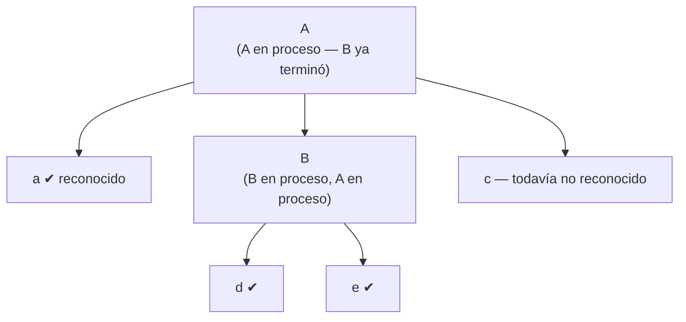

La pregunta retórica de la Slide 11 es exactamente **"¿Cuál es la representación? ¿Un árbol o un stack?"**, y la respuesta (Slide 12 / transcripción) es:

> [31:26] "todo esto internamente en realidad se maneja con una pila [...] entonces el árbol que tenemos nosotros, o mejor dicho que estamos dibujando, no es como está implementado, sino que viene a ser una figura para el análisis [...] no hay un árbol como tal, como estructura en el compilador, sino una pila." [32:39] "el compilador no trabaja con un árbol, trabaja con una pila."

**Distinción clave para el parcial:**
- **Internamente** (en el motor de recursión de C#/CIL), lo que existe es la **pila de llamadas** (`call stack`): cada llamada a un método-no-terminal apila un marco de activación; cuando ese método retorna, se desapila. El árbol de derivación **no existe como estructura de datos** en la ejecución "cruda" del parser.
- **En COMPI (Mini-Compi)**, sin embargo, sí se construye **explícitamente** un árbol real (un `System.Windows.Forms.TreeNode`) para poder **visualizarlo** en la interfaz "Paso a paso": cada método de no terminal, además de hacer el parsing puro, va colgando nodos (`.Nodes.Add(...)`) en ese `TreeView`. Es decir, COMPI agrega, sobre el parser teórico "puro", una construcción paralela y explícita del árbol con fines didácticos/visuales.

> [32:12] "la estructura que genera [...] el compiladorcito [...] se ha generado, pero internamente el compilador no trabaja con un árbol, trabaja con una pila."

---

### 7. La vista "Paso a paso" del COMPI: cuándo se pinta de VERDE (pregunta de examen)

Esta es la pregunta remarcada explícitamente por el usuario como "pregunta real de examen". Se reconstruye combinando la Slide 2 de `04.Parsing Adicional.pptx` y el tramo `[40:15]`–`[46:04]` de la transcripción, más el código real de `Parser.cs`.

#### 7.1 El mecanismo general

En la vista "Paso a paso", cada vez que el parser está por decidir algo sobre la gramática, la interfaz va marcando:

1. **Se pinta de ROJO** la producción de la gramática que se está examinando actualmente (`Code.seleccLaProdEnLaGram(n)`), y luego, una vez que un terminal fue efectivamente **reconocido** (después de un `Check` exitoso), ese terminal se pinta de rojo en el `token` (`Code.Colorear("token")`).
2. **Se pinta de VERDE** el terminal que está en `laToken`, **antes** de decidir el `Check`, cuando la única forma de saber qué rama de la gramática seguir es **mirar hacia adelante** (`Code.Colorear("latoken")`).

#### 7.2 La regla exacta: ¿cuándo es verde?

> Slide 2 (04.Parsing Adicional): "A partir de la Gramática, ¿Puede saber el terminal que debe venir? [...] 1º pinta (verde), y al final lo inserta en el Árbol [...] Discierne según lo que lee [...] si es 1º hijo... si... no (hay alternativas)."

> Transcripción [41:44]: "esto corresponde a un no terminal a un no terminal que presenta opciones o alternativas, mejor dicho, o sea puede ser punto o declaration y puede tener más de una declaración [...] entonces acá vamos a pintar de verde lo que trae el laToken [...] como no sé lo que trae lo pinto de verde."

**Respuesta completa para el parcial:**

> Un token se pinta de **verde** (en vez de directamente de rojo) exactamente cuando el compilador **no puede saber de antemano, sólo por la gramática, cuál va a ser el próximo terminal**, es decir, cuando la producción del no terminal que se está expandiendo en ese momento **tiene más de una opción/alternativa** (`A = α | β | ...`, o una opción `[α]`, o el "¿sigo o no sigo?" de una iteración `{α}`). En esos casos, el único modo de decidir qué rama de la gramática tomar es **mirar hacia adelante** (examinar `la`/`laToken`) — y ese acto de "mirar antes de decidir" es justamente lo que la interfaz representa pintando el `laToken` de **verde**: significa "estoy inspeccionando este token todavía no confirmado para decidir qué hacer", a diferencia del **rojo**, que significa "este terminal ya fue formalmente reconocido (`Check` exitoso) porque la gramática no dejaba otra alternativa posible en este punto (secuencia determinística)".

En otras palabras:
- **Rojo** = terminal ya **consumido/reconocido** vía `Check()` en un tramo **secuencial y determinístico** de la gramática (no había ambigüedad: sólo podía venir ese símbolo).
- **Verde** = terminal todavía **no confirmado**, que el parser está **espiando** (`la`) porque la producción actual **ofrece más de una opción** y hay que decidir cuál tomar antes de llamar al `Check` correspondiente.

#### 7.3 El caso especial de `yaPintado`

Hay una sutileza remarcada por el profesor: si un token **ya fue pintado de verde** (porque se usó para decidir una alternativa) y **luego** el flujo normal del parser llega a hacer el `Check` que lo consume formalmente, **no se lo vuelve a pintar de rojo**. Se queda visualmente en verde.

> [44:48] "voy a dar paso a paso y vengo a hacer el check de la llave que abre. Fíjese que acá queda una particularidad: que luego yo tendría que pintar esto de rojo, pero como ya está pintado de verde, no lo vuelvo a pintar de rojo [...] porque hay una variable que se llama **ya pintado**. Para ver esa variable tendríamos que venir a colorear [...] entraría por acá como ya está pintada y también saldría de la función sin efectuar ningún pintado. Por lo tanto en la interfase quedaría verde, porque la idea es indicar en los puntos en que se para el compilador y debe determinar qué es lo que viene, o sea hacer una mirada hacia adelante [...] esa es la idea de pintar de rojo, pintar de verde."

Es decir, la variable `yaPintada` (bandera booleana en `Parser.cs`, ver `public static bool yaPintada = false;`) evita repintar de rojo un token que ya fue destacado en verde por haber servido para resolver una alternativa; el color se conserva como registro visual de "acá hubo una decisión por lookahead".

#### 7.4 Ejemplo concreto trazado (con código real)

Reconstrucción del ejemplo mostrado en cámara con el programa `class ProgrPpal { void Main() ... }`:

1. `Check(Token.CLASS)` (secuencia obligatoria, sin alternativas: la gramática dice que el programa **siempre** arranca con `class`) → tras el `Scan()`, `Code.Colorear("token")` pinta **`class` de rojo**.
2. `Check(Token.IDENT)` (sigue siendo secuencia obligatoria: después de `class` siempre viene un identificador) → `Code.Colorear("token")` pinta **`ProgrPpal` de rojo**.
3. Ahora toca `PosDeclars`, cuya producción es `PosDeclars = . | Declaration PosDeclars.` — **tiene alternativas** (vacío o una declaración). El compilador no puede saber de antemano cuál aplica: **necesita mirar** `laToken`. Por eso, antes de decidir, `Code.Colorear("latoken")` pinta el lookahead (en este caso, `{`) **de verde**.
4. Como `la == Token.LBRACE`, la alternativa elegida es la vacía (`PosDeclars = .`); se agrega el nodo `"."` al árbol.
5. `Check(Token.LBRACE)` consume la llave — pero como ya estaba pintada de verde (paso 3) y `yaPintada` está en `true`, **no se repinta de rojo**.

Este es exactamente el fragmento real correspondiente (ver `Parser.cs`, método `Program()`):

```csharp
Check(Token.CLASS);       //class ProgrPpal
Code.Colorear("token");   // pinta "class" de rojo (secuencia obligatoria)
...
Check(Token.IDENT);       // "ProgrPpal"
Code.Colorear("token");   // pinta "ProgrPpal" de rojo (secuencia obligatoria)
...
while (la != Token.LBRACE && la != Token.EOF) {
    Code.Colorear("latoken"); // <-- PINTA DE VERDE: hay alternativas en PosDeclars,
                              //     necesito mirar hacia adelante para decidir
    ...
}
Code.Colorear("latoken");    // se vuelve a pintar de verde por la MISMA razón:
                              // decidir si sigo iterando o no (0 o más declaraciones)
if (!existeDecl) {
    posDeclars.Nodes.Add(".");   // eligió la alternativa vacía
    ...
}
...
Check(Token.LBRACE);          // consume '{' — no se repinta de rojo por 'yaPintado'
Code.Colorear("token");
```

Y en `MethodDecl()`, el mismo patrón se repite para decidir entre `void` y un `Type` (dos alternativas posibles para `TypeOrVoid`):

```csharp
if (la == Token.VOID || la == Token.IDENT)
{
    if (la == Token.VOID)
    {
        Code.Colorear("latoken");   // verde: hay alternativa (void vs. Type)
        Check(Token.VOID);          // token = void, laToken = Main
        ...
    }
    else if (la == Token.IDENT)
    {
        Type(out type);             // rama alternativa: es un Type
        Code.Colorear("token");
        ...
    }
    ...
}
```

---

### 8. Errores comunes y aclaraciones remarcadas por el profesor

Extraídas de la transcripción:

1. **No confundir "no terminal" con "terminal" en la tabla de la gramática.** El profesor insiste en mostrar en el propio código cuáles identificadores del `Parser.cs` corresponden a no terminales (`PosDeclars`, `Declaration`, `MethodDecl`, `Const`, `Designator`, `Factor`, `Term`) y cuáles son terminales/hojas (`class`, `ident`, `.`). *"todos estos que están acá [...] son no terminales [...] mientras que los terminales que serían las hojitas del árbol es class, ident, punto."* [09:03]

2. **`Check` no es "otro método más" para no terminales.** Remarcado explícitamente: *"si fuera un no terminal tendría que tener un método, tendría que llamarlo un método [...] check lo que va a hacer es comparar lo esperado con lo que debería venir."* [12:04] — Es decir, `Check` es **exclusivamente** para terminales; para no terminales siempre hay que escribir/llamar un método propio.

3. **El árbol de sintaxis es una figura didáctica, no la estructura de ejecución real.** Insistido dos veces: *"no hay un árbol como tal, como estructura en el compilador, sino una pila"* [31:47-31:52] y *"el compilador no trabaja con un árbol, trabaja con una pila"* [32:39]. Sólo en la interfaz gráfica de COMPI se construye un árbol real (`TreeView`) con fines de visualización.

4. **El valor inicial de `laToken` es "basura" a propósito.** *"la variable LA token cargarla con un 1 [...] con una basura, para evitar el crash"* [33:51-33:56] — el `new Token(1,1)` inicial no representa nada del programa fuente; sólo evita un `null`/crash antes del primer `Scan()` real.

5. **El mecanismo de error es una excepción, no un simple mensaje.** *"salta [...] yo lanzo una excepción [...] hay una otra cosa que hace un caché digamos de esa excepción [...] y lanza una ventana"* [14:36-15:02]: `Errors.Error(...)` hace `throw`, y hay una capa superior (la UI de Windows Forms) que atrapa esa excepción y la muestra en un diálogo.

6. **Advertencia sobre `Colorear("token")` vs `Colorear("latoken")` — no memorizar mecánicamente, entender el "por qué".** El profesor lo repite varias veces en distintos puntos justamente porque es un tema que "se presta a confusión" si no se entiende la idea de fondo (rojo = reconocido/determinístico, verde = lookahead/decisión de alternativa). Ver §7.

7. **Pasajes de audio ininteligibles** en `[03:02]` y `[51:24]` (registrados así en el glosario original, sin inventar contenido).

---

### 9. Cómo se ve en el compilador real (COMPI)

Fragmentos reales de `Parser.cs` (proyecto `at.jku.ssw.cc`, namespace real del compilador — basado en el esqueleto clásico de Mössenböck usado en la cátedra) que conectan cada pieza de teoría con el código:

#### 9.1 Punto de entrada real: `Parse()`

```csharp
public static void Parse(string prog)
{
    Scanner.Init(new StringReader(prog), null);
    Tab.Init();
    Errors.Init();
    curMethod = null;
    token = null;
    laToken = new Token(1, 1);  // avoid crash when 1st symbol has scanner error
    Scan();                     // scan first symbol
    Program();                  // start analysis
    Check(Token.EOF);
}
```

Esto es exactamente lo narrado en `[33:19]`–`[35:23]`: inicializar `token`/`laToken`, hacer el primer `Scan()`, y arrancar por la primera producción de la gramática, que es `Program`.

#### 9.2 `Scan` y `Check` reales

```csharp
static void Scan()
{
    token = laToken;
    laToken = Scanner.Next();
    la = laToken.kind;
}

static void Check(int expected)
{
    if (la == expected)
        Scan();
    else
        Errors.Error("Se esperaba un: " + Token.names[expected]);
}
```

Idénticos en estructura a los patrones teóricos de las slides 1 y 5, con el mensaje de error localizado en español.

#### 9.3 `Program()`: el no terminal raíz, con secuencia + alternativas + iteraciones mezcladas

```csharp
static void Program()
{
    ... // crea nodo raíz "Program" en el TreeView
    Check(Token.CLASS);      // class ProgrPpal
    Code.Colorear("token");
    Check(Token.IDENT);      // "ProgrPpal"
    Code.Colorear("token");
    Symbol prog = Tab.Insert(Symbol.Kinds.Prog, token.str, Tab.noType);
    Tab.OpenScope(prog);

    bool existeDecl = false;
    while (la != Token.LBRACE && la != Token.EOF)   // PosDeclars = . | Declaration PosDeclars.
    {
        Code.Colorear("latoken");
        switch (la)
        {
            case Token.CONST:  ConstDecl(hijodeclar); break;
            case Token.IDENT:  VardDecl(Symbol.Kinds.Global, hijo1); break;   // Type ident...
            case Token.CLASS:  ClassDecl(); break;
            default: Errors.Error("Se esperaba Const, Tipo, Class"); break;
        }
        existeDecl = true;
    }
    ...
    Check(Token.LBRACE);
    Code.Colorear("token");

    while ((la == Token.IDENT || la == Token.VOID) && la != Token.EOF)  // MethodDeclsOpc = . | MethodDecl MethodDeclsOpc.
    {
        MethodDecl(methodDeclsOpc);
    }
    Check(Token.RBRACE);
    Code.Colorear("token");
    Tab.CloseScope();
}
```

Este único método ilustra **las cuatro construcciones EBNF** vistas en teoría: secuencia (`Check(CLASS); Check(IDENT); ...`), alternativa por `switch(la)` dentro del `while` (`CONST | IDENT | CLASS`), iteración (`while (la != LBRACE ...)` para `PosDeclars`, y `while (la == IDENT || la == VOID ...)` para `MethodDeclsOpc`).

#### 9.4 No terminal con recursión real: `ClassDecl`, `MethodDecl`, `Designator`

- **`ClassDecl()`** se llama a sí misma (vía el `switch` de `Program`/`ClassDecl`, caso `Token.CLASS`), reflejando que una clase puede contener declaraciones de clases anidadas.
- **`Designator(out Item item)`** implementa `Designator = ident opcRestOfDesignator.` con un `while ((la == Token.PERIOD || la == Token.LBRACK) ...)` para manejar accesos a campo (`.campo`) o a arreglo (`[expr]`) encadenados — la iteración EBNF `{ '.' ident | '[' Expr ']' }` aplicada tal cual al patrón `while (la ∈ First(α))`.
- **`Expr`, `Term`, `Factor`, `Condition`, `CondTerm`, `CondFact`** forman la cadena clásica de precedencia de expresiones aritméticas/booleanas, cada uno como no terminal con su propio método, exactamente según la regla de §4.1. Cada uno tiene además una **segunda sobrecarga** que recibe un `TreeNode padre` — es la versión que, además de parsear, cuelga nodos en el árbol visual de "Paso a paso" (evidencia concreta de la distinción teórica de §6: la pila de llamadas hace el parsing real; el `TreeNode` es la construcción paralela sólo para visualización).

#### 9.5 El terminal se implementa siempre igual: nunca un método propio

En absolutamente ningún lugar del archivo hay un método `Class()`, `Ident()` o `Semicolon()`: siempre que la gramática pide un terminal, aparece `Check(Token.XXX)` inline dentro del método del no terminal contenedor — coincide con la regla de §4.2 en las **más de 80 llamadas a `Check(...)`** distribuidas en todo `Parser.cs`.

#### 9.6 Pintado rojo/verde real (`Code.Colorear`)

Como se detalló en §7.4, el patrón se repite sistemáticamente:

```csharp
Code.Colorear("token");    // -> rojo:  terminal ya reconocido (Check exitoso, sin alternativa)
Code.Colorear("latoken");  // -> verde: lookahead inspeccionado para decidir una alternativa
```

y aparece decenas de veces en `Program`, `ConstDecl`, `VardDecl`, `ClassDecl`, `MethodDecl`, `Statement`, `Block`, `Expr`, `Designator`, siempre siguiendo la misma regla semántica.

---

### 10. Trabajo práctico de la clase (guía docx)

Objetivo de la guía: introducir al alumno en el análisis sintáctico, identificando las técnicas y métodos utilizados por el compilador (gramáticas tipo 2 y autómatas de pila), ejemplificando con la plataforma COMPI.

Consigna práctica concreta:

1. Hacer fork de `https://github.com/compiladoresUNSJ/compi2019_ej1`, compilar y ejecutar para verificar que funciona.
2. El compilador base **no valida** que se use un nombre de **tipo** (`int`, `char`) como **identificador** de variable. Programa fuente que hoy es (incorrectamente) válido:

```c
class Program1
{
    void Main()
    int int ;
    {
        int = 2+4;
    }
}
```

3. Modificar el código para que **no** se acepte declarar variables con nombre de tipo (`int int`, `char char`), mostrando el mensaje: **"No se puede declarar una variable con el nombre de un tipo"**.
4. Pregunta abierta de la guía: *"¿este trabajo exige modificar el scanner y el parser?"* — Es una pregunta de reflexión propuesta por la cátedra: el `Scanner` seguiría clasificando `int`/`char` como identificadores/palabras clave sin cambios; el chequeo de "no permitir nombre de tipo como identificador" es una regla que **excede lo puramente sintáctico (libre de contexto)** — es información semántica que depende de la tabla de símbolos (saber que ese `ident` coincide con el nombre de un tipo ya declarado). Por eso el lugar natural para agregarlo es en el **parser**, en el punto donde se procesa la declaración de variable (`VardDecl`/`Type`), consultando la tabla de símbolos (`Tab.Find`), sin necesidad de tocar el `Scanner`.
5. Comparando con compiladores comerciales, identificar qué otros errores podrían detectarse/solucionarse en la fase de análisis sintáctico (parser).

---

### 11. Resumen ultra-condensado para repaso rápido

- **Ventana doble**: `token` (reconocido) / `laToken` (lookahead) / `la = laToken.kind`; se actualiza con `Scan()`.
- **No terminal → método homónimo**; **Terminal → `Check(esperado)`**.
- `Check`: si `la == esperado` → `Scan()`; si no → `Error(...)`.
- **Secuencia** `A = a B c.` → `Check(a); B(); Check(c);`
- **Alternativa** `α|β|γ` → cadena de `if (la ∈ First(...))`.
- **Opción** `[α]` → `if (la ∈ First(α)) {...}`.
- **Iteración** `{α}` → `while (la ∈ First(α)) {...}`.
- El árbol de derivación en el descenso recursivo **no existe como estructura real**: internamente hay una **pila de llamadas**; COMPI sí construye un árbol real (`TreeView`) sólo para visualización didáctica.
- **Verde** = el compilador está mirando `laToken` porque la producción actual **tiene más de una alternativa** y debe decidir cuál tomar antes de hacer `Check`. **Rojo** = terminal ya `Check`-eado con éxito en un tramo sin ambigüedad. `yaPintado` evita repintar de rojo lo que ya se pintó de verde.
- Punto de entrada real: `Parser.Parse(prog)` → `Scan()` inicial → `Program()` → `Check(Token.EOF)`.

---

*Apunte generado a partir del material de cátedra y del código fuente real de COMPI, para estudio del parcial de Compiladores (UNSJ). Las citas de transcripción llevan su marca de tiempo `[mm:ss]` para poder ir al video original si hace falta verificar contexto.*


---

## 5. Semana 5 - Procesamiento semántico

> Materia: Compiladores (UNSJ). Basado en el deck de cátedra `05.SemanticProcessing 2026.ppt`
> (material de base de Mössenböck / JKU Linz), las dos transcripciones de clase de la semana 5
> ("clase 5 - proc semant 2026" y "proc semant parte 2") y la guía de la clase práctica nro. 5.
> Se cruza además con el código real de COMPI (`Parser.cs`, `SymTab.cs`).

---

### 1. Fuentes utilizadas

- `README.md` de la carpeta de la semana.
- `texto/05.SemanticProcessing 2026.ppt.md` y `texto/05.SemanticProcessing 2026.ppt.pdf.md` (dos
  extracciones del mismo PowerPoint, una desde el contenedor OLE y otra desde el PDF exportado;
  el contenido es el mismo con variaciones de OCR/orden de lectura).
- `texto/Guia para la clase práctica nro 5 -  análisis semántico.docx.md` (consigna de la práctica).
- `transcripciones/clase 5 - proc semant 2026 - transcripcion completa.md` (video 1, 33:11 min,
  341 segmentos, de `[00:03]` a `[26:05]`).
- `transcripciones/proc semant parte 2 - transcripcion completa.md` (video 2, 38:31 min, 566
  segmentos, de `[00:00]` a `[38:29]`).
- Código real: `Parser.cs` y `SymTab.cs` de la carpeta `text Box Mio` del compilador COMPI
  (repositorio `compi2026`).

Todas las transcripciones fueron generadas automáticamente (faster-whisper) y son literales, con
muletillas y palabras mal reconocidas; se usó el glosario de cada transcripción para interpretar
los términos deformados (por ejemplo "el copiadorcito" = COMPI, "el LA token" = `laToken`, "código
sellar" = "código C#", "el SIL" = CIL).

---

### 2. Ubicación del procesamiento semántico en el pipeline del compilador

Según la tabla de la diapositiva 1/2 del deck (reproducida tal cual, incluyendo la columna "Lo que
usa" y "Código"):

| # | Etapa | Lo que usa | Código |
|---|-------|-----------|--------|
| 1 | Introducción | (proyecto en sí) | `this` / Proyecto |
| 2 | Scanner | Autómatas Finitos | `Scanner.cs` |
| 3 | Parser | Gramática Tipo 2 | `Parser.cs` |
| 4 | Parser Adicional | Gramática Tipo 2 | `Parser.cs` |
| **5** | **Semantic Processing** | **+ semantic actions: C# Code** | **NO** (no tiene archivo propio) |
| 6 | Code Generation 1 | Lenguaje Intermedio: CIL | `miCodGen.cs` |
| 7 | Tabla de Símbolos | Estructura de Datos | `SymTab.cs` |
| 8 | Code Generation 2 | Metadatos | `miCodGen.cs` |

Punto clave remarcado por el profesor al principio de la clase 1 (`[01:06]`-`[01:17]`): el
procesamiento semántico **no tiene un archivo `.cs` propio** ("acá ponemos que no tiene código
pero en realidad está inserto en el código del parser"). Es decir, el procesamiento semántico no
es una fase física separada del análisis sintáctico en COMPI: sus acciones se **insertan dentro
de las mismas funciones del parser** (dentro de `Parser.cs`), intercaladas entre el reconocimiento
de los símbolos de la gramática.

Repaso previo (min `[01:25]`-`[04:52]` de la clase 1) que sirve de base:
- El programa fuente se transforma en una lista de tokens.
- Esa lista se recorre con una "ventanita" de dos variables: `token` (el token ya reconocido,
  "el que está siendo analizado") y `laToken` (el token de *lookahead*, el que se está mirando
  hacia adelante). `la` es el `kind` (tipo) de `laToken`.
- La gramática se usa como **verificador**: para cada posición del programa, la gramática indica
  qué token tendría que venir. Si coincide, el parser avanza (arma el árbol de derivación); si no,
  hay un error.
- Aclaración importante del profesor: **que el programa compile bien no significa que el programa
  sea correcto** ("compile bien, no quiere decir que el programa sea el correcto"). Para saber si
  el programa hace lo que uno quiere hay que ejecutarlo/depurarlo, no alcanza con que compile.

---

### 3. Qué es una gramática con atributos (*attribute grammar*)

#### 3.1 Definición y propósito

Una **gramática con atributos** es la gramática de la fase sintáctica (EBNF/BNF) a la que se le
agregan dos cosas más, tal como lo resume literalmente la diapositiva 8 ("Gramáticas con
Atributos"):

1. **Producciones EBNF** (o BNF, según el nivel: teoría vs. implementación).
2. **Atributos (parámetros)**: información que viaja asociada a los símbolos no terminales,
   marcada como *output* o *input*.
3. **Acciones semánticas**: fragmentos de código (en COMPI, código C#) que se ejecutan en puntos
   concretos de la producción, encerrados entre `(. ... .)`.

La idea central (transcripción parte 1, `[18:34]`-`[19:39]`, cita casi literal): *"la gramática
con [a]tributos me permite implementar las acciones semánticas [...] en el caso de las
expresiones todas [...] van a necesitar que yo vaya pasando valores para arriba [...] o hacia
abajo"*.

En la implementación real (COMPI, en C#), cada **no terminal** de la gramática se traduce en una
**función/método de parsing** (por ejemplo, `Expr`, `Term`, `Factor`, `VarDecl`). Los atributos de
esa producción se traducen literalmente en los **parámetros de esa función**:
- un atributo de **salida** (*synthesized attribute*) se implementa como un parámetro `out` (o el
  valor de retorno) del método;
- un atributo de **entrada** (*inherited attribute*) se implementa como un parámetro normal de
  entrada del método.

Esto es explícito en la transcripción parte 2 (`[01:45]`-`[02:12]`): *"cada vez que veo expresión
tengo que crear un método que se llame igual, porque es no terminal [...] y estas variables de
salida se le pone un out [...] y cuando sale de aquí tiene que [...] terminar con un valor de
salida en este argumento"*.

#### 3.2 Atributos de no terminales vs. terminales (regla clave de examen)

Esta es la distinción que el material remarca como fundamental y que suele preguntarse en el
parcial:

- **Los no terminales** de la gramática (`Expr`, `Term`, `Factor`, `VarDecl`, `IdentList`, etc.)
  se implementan **como funciones de parsing propias**, con su propio nombre de método. Esas
  funciones **sí pueden tener parámetros de entrada y de salida** (atributos heredados y
  sintetizados) porque son las que llevan adelante una acción semántica potencialmente compleja
  (acumular una suma, devolver un tipo, decidir un formato de impresión, etc.).
- **Los terminales** de la gramática (`number`, `ident`, `"+"`, `";"`, etc.) **no se implementan
  como una función de parsing con atributos propios**: se resuelven llamando a una función común
  de verificación, `Check(expected)` (o el `number`/`ident` de las slides, que internamente llaman
  a `Check`). Cita textual de la transcripción parte 2 (`[01:49]`-`[01:56]`): *"cada vez que veo
  expresión tengo que crear un método que se llame igual, porque es no terminal, los terminales
  por otro lado van a parar a un check"*.
  - `Check` no tiene atributos de entrada/salida asociados a una acción semántica particular: su
    única función es comparar `la` (el tipo del token de *lookahead*) contra el token esperado, y
    si coincide, hacer `Scan()` (avanzar la ventana); si no, dar error. Del deck (slide 4/5):
    ```
    static void Check (int expected) {
        if (la == expected) Scan();  // recognized => read ahead
        else Error();
    }
    ```
  - El valor concreto que trae un terminal (por ejemplo, el número leído) se obtiene por otro
    lado, leyendo el campo `token.val` o `token.str` **después** de haber hecho `Check`/`Scan`, y
    es la acción semántica de la producción del no terminal (no del terminal) la que lo toma y lo
    guarda en un atributo de salida (ver ejemplo `Factor = number. (. val = token.val; .)` en la
    sección 5.7).

En síntesis: **el atributo de entrada/salida (parámetro) es una propiedad del método que
implementa un no terminal; el terminal no tiene ese mecanismo "propio" — se apoya en `Check`/
`Scan` y en las variables globales `token`/`laToken`/`la` para exponer su valor**.

---

### 4. Notación usada en el material de la cátedra

#### 4.1 EBNF (teoría) vs. BNF (implementación real de COMPI)

Aclaración explícita y repetida en ambas clases:

- Las producciones se presentan primero en **EBNF** ("Extended BNF", con llaves `{ }` para
  "cero o más veces" y corchetes para lo opcional) porque **es más fácil de leer y de razonar
  conceptualmente**. Es la forma que se usa "para la parte teórica" (parte 1, `[19:54]`-`[20:07]`;
  parte 2, `[00:21]`-`[00:52]`).
- La gramática que realmente usa/genera COMPI está escrita en **BNF** (sin las llavecitas de
  repetición), de forma recursiva explícita. Ejemplo dado en la diapositiva 8:

  ```
  EBNF: Expr = Term { "+" Term }.
  BNF:  Expr    = Term | Term MasTerm.
        MasTerm = . | "+" Term MasTerm.
  ```

  Es decir, la repetición `{ "+" Term }` de la EBNF se "desenrolla" en BNF como un no terminal
  auxiliar (`MasTerm`) que se define recursivamente y que puede ser vacío (`.`) o `"+" Term
  MasTerm`.
- Cita textual (parte 2, `[38:00]`-`[38:29]`): *"en el compilador de verdad es un poco más
  complejo todavía [...] porque acá fíjense que yo estoy utilizando el Extended BNF que me permite
  simplificarlo y verlo en forma más conceptual, si esto yo lo hago con el BNF no Extended [...]
  ya se complica bastante, y a eso hay que meterle todas las colgadas"* (las acciones semánticas
  "colgadas" de cada producción).

#### 4.2 Notación de atributos: heredados/sintetizados, entrada/salida

El material **no usa literalmente las etiquetas `<in>`/`<out>`** como palabras dentro de la
notación de la gramática. La notación real que aparece en las slides es:

- El atributo se escribe entre `< >` a continuación del nombre del no terminal, con su tipo y
  nombre de variable, por ejemplo:
  - `Term <int val>` — un atributo, tipo `int`, llamado `val`.
  - `Expr<bool printHex>` — un atributo, tipo `bool`, llamado `printHex`.
  - `Term<sum>`, `Term<val>`, `Term<val1>` — el mismo mecanismo usado en distintas producciones,
    donde el nombre entre `< >` es el identificador de la variable con la que se recibe/envía el
    valor en esa ocurrencia concreta de la producción.
- La diapositiva 8 rotula explícitamente cuál es de salida y cuál es de entrada, escribiendo las
  palabras **"output"** e **"input"** debajo de cada ejemplo:

  ```
  2. Atributos (parametros)
     Term<int val>        Expr<bool printHex>
        output                  input
  ```

- En la **implementación en C#**, el atributo de salida se traduce en un parámetro `out` del
  método (y en la llamada), y el atributo de entrada se traduce en un parámetro normal (por
  valor) del método. Cita textual (parte 1, `[13:46]`-`[14:24]` y slide 6): *"Notar que usa 'Term
  (out ...)'. Se agrega 'out' en la def. y en la llamada"*.
- Sentido del pasaje de atributos en el árbol (parte 1, `[19:26]`-`[19:51]`, cita casi literal):
  *"cuando van hacia arriba en el árbol son atributos de salida y cuando van hacia abajo son
  atributos de entrada [...] el pasaje de parámetros es hacia abajo [para printHex] y en el caso
  de la suma el pasaje de parámetros es hacia arriba"*. Esto es la noción estándar de **atributo
  sintetizado** (sube, se calcula a partir de los hijos y se entrega al padre) vs. **atributo
  heredado** (baja, el padre se lo pasa al hijo como un parámetro/"modificador" de la acción que
  el hijo va a ejecutar).

  > **Nota de fidelidad a la fuente**: el material no dice explícitamente "atributo heredado" ni
  > "atributo sintetizado" con esas palabras técnicas; usa siempre "atributo de entrada" y
  > "atributo de salida". Se documentan aquí ambos nombres porque son sinónimos estándar de la
  > teoría de compiladores y puede aparecer cualquiera de los dos en el parcial.

#### 4.3 Acciones semánticas: la notación `(. ... .)`

Las acciones semánticas —código C# intercalado en medio de la producción— se escriben encerradas
entre paréntesis y puntos: **`(. ... .)`**. Ejemplos textuales del deck:

```
(. int n = 1; .)
(. n++; .)
(. Console.WriteLine(n); .)
```

```
(. int sum, val; .)
(. sum += val; .)
```

```
(. Struct type; .)
(. Tab.insert(token.str, type); .)
```

Esta notación `(. ... .)` es la que usan generadores de parsers tipo *Coco/R* (de la misma
tradición Mössenböck/JKU Linz que inspira la materia) para marcar acciones semánticas embebidas
directamente en la gramática. El profesor las llama simplemente "acciones semánticas: código C#"
(título de la slide 5) y, en la transcripción, "códigos sellar" (deformación de "código C#").

---

### 5. Ejemplos completos de gramáticas con atributos (reproducidos tal cual figuran en el material)

#### 5.1 Ejemplo 0 — la gramática *sin* acción semántica (punto de partida)

Gramática EBNF (slide 4):

```
Expr = Term { "+" Term }
Term = number
```

Implementación en C# (sin ninguna acción semántica, solo reconoce si la cadena es válida):

```csharp
static void Expr () {
    Term();
    for (;;) {
        if (la == Token.PLUS) { Scan(); Term(); }
        else break;
    }
}

static void Scan () {
    token = laToken;
    laToken = Scanner.Next();
    la = laToken.kind;
}

static void Check (int expected) {
    if (la == expected) Scan();   // recognized => read ahead
    else Error();
}
// ... Check(Token.NUMBER)
```

Cadenas de ejemplo usadas en el deck para este punto de partida (sin resultado numérico, solo se
verifica que la cadena esté bien formada):

```
1 + 2 + 3
47 + 1
909
```

Aclaración del profesor (parte 1, `[09:15]`-`[09:35]`): *"esto no arroja ningún resultado, lo que
analiza es si esta cadena es correcta [...] no va a arrojar ningún resultado"*.

#### 5.2 Ejemplo 1 — acción semántica sin atributos: contar términos

Primera acción semántica introducida: **contar** cuántos términos tiene la cadena (no sumarlos).
Gramática con la acción semántica agregada (slide 6, versión "contador"):

```
Expr = Term (. int n = 1; .) { "+" Term (. n++; .) } (. Console.WriteLine(n); .) .
```

Implementación C# correspondiente (slide 6):

```csharp
static void Expr () {
    Term();
    int n = 1;
    for (;;) {
        if (la == Token.PLUS) { Scan(); Term(); n++; }
        else break;
    }
    Console.WriteLine(n);
}
```

Salidas para las mismas cadenas de entrada (contando términos):

```
1 + 2 + 3 → 3   (tres términos)
47 + 1     → 2   (dos términos)
909        → 1   (un término)
```

Punto remarcado por el profesor (parte 1, `[16:10]`-`[16:20]`): en este ejemplo **no hace falta
ningún atributo, ni de entrada ni de salida**, porque `n` es una variable puramente local/interna
a la función `Expr` — nunca tiene que salir de `Expr` hacia quien la llamó, ni entrar desde afuera.

#### 5.3 Ejemplo 2 — atributo de salida: sumar términos

Ahora la acción semántica es **sumar** los términos (no solo contarlos). Gramática con atributo
de salida (slide 6, título "Atributos"):

```
Term <int val>
```
> "Term retorna su valor numérico como un atributo output"

```
Expr (. int sum, val; .) = Term<sum> { "+" Term<val> (. sum += val; .) } (. Console.WriteLine(sum); .) .
```

Resultados (ahora sí, sumando):

```
1+2+3   → 6
47+10   → 57
909     → 909
```

Implementación C#, remarcando el `out` agregado tanto en la definición como en la llamada (slide
6):

```csharp
static void Expr () {
    int sum, val;
    Term(out sum);
    for (;;) {
        if (la == Token.PLUS) {
            Scan();
            Term(out val);
            sum += val;
        } else break;
    }
    Console.WriteLine(sum);
}
```

Nota de la slide: *"Notar que usa 'Term (out ...)'. Se agrega 'out' en la def. y en la llamada"*.

#### 5.4 Ejemplo 3 — atributo de entrada: `printHex`

Gramática con un atributo de **entrada** agregado a `Expr`, para decidir el formato de impresión
(slide 7, título "Atributos de Entrada"):

```
Expr<bool printHex>
```
> "printHex: true => hexadecimal (caso contrario: decimal)"

```
Expr<bool printHex> (. int sum, val .)
    = Term<sum> { "+" Term<val> (. sum += val; .) }.
      (. if (printHex) Console.WriteLine("{0:X}", sum)
         else Console.WriteLine("{0:D}", sum);
      .)
```

Implementación C#:

```csharp
static void Expr (bool printHex) {
    int sum, val;
    Term(out sum);
    for (;;) {
        if (la == Token.PLUS) { Scan(); Term(out val); sum += val; }
        else break;
    }
    if (printHex) Console.WriteLine("{0:X}", sum);
    else Console.WriteLine("{0:D}", sum);
}
```

#### 5.5 Síntesis: los tres componentes de una gramática con atributos (slide 8)

Reproducción literal de la diapositiva "Gramáticas con Atributos":

```
1. Productiones EBNF
   Expr = Term { "+" Term }.

2. Atributos (parametros)
   Term<int val>          Expr<bool printHex>
       output                    input

3. Actiones Semanticas
   (. ... Sentencias en C#... .)
```

Y la misma producción reescrita en BNF (sin llaves), la forma que realmente usa el generador de
COMPI:

```
Productiones BNF
Expr    = Term | Term MasTerm.
MasTerm = . | "+" Term MasTerm.
```

La slide agrega también, en el mismo cuadro, un fragmento de ejemplo con declaración de variables
y un árbol de derivación de una suma encadenada (texto extraído literal, sin editar, tal como
aparece en el OCR de la diapositiva — el material no aclara si es un ejemplo separado o
continuación del mismo):

```
int x , y , z ;

        E
        |
        T
        |
      MasT
        |
  1 + 2 + 6
        |
      MasT
        |
      MasT
```

> **Nota de fidelidad a la fuente**: este último fragmento (`int x , y , z ;` y el árbol
> `E / T / MasT / "1 + 2 + 6"`) aparece en el texto extraído de la diapositiva 8 tal cual, pero
> mezclado con el resto por el orden de extracción del OCR del `.ppt`; no hay forma de reconstruir
> con certeza si es un árbol de derivación de `1+2+6` (posible error de OCR por `1+2+3`) mostrando
> cómo `MasTerm` se expande recursivamente en BNF, o un fragmento de otro slide. Se reproduce
> igual, sin corregir el número, para no inventar contenido.

#### 5.6 Ejemplo 4 — `VarDecl` / `IdentList`: atributo de tipo y tabla de símbolos

Declaración de variables múltiples en una sola línea (`int var1, var2, var3;`). Gramática con
atributos (slide 9):

```
VarDecl  = Type IdentList ";" .
IdentList = ident { "," ident } .
```

Acciones semánticas y atributos anotados en la slide (reproducidos en el orden en que aparecen):

```
(. Struct type; .)                        -- declarada en VarDecl
<type>                                    -- Type entrega el tipo (salida de Type)
<type>                                    -- ese type entra a IdentList (entrada de IdentList)
(. Tab.insert(token.str, type); .)        -- primera inserción (el primer ident)
<Struct type>
(. Tab.insert(token.str, type); .)        -- inserción dentro del { "," ident } (los siguientes)
```

Implementación C# (slide 9), notar que `type` sale de `Type` como atributo de salida (`out`) y
entra a `IdentList` como atributo de entrada (parámetro normal):

```csharp
static void VarDecl () {
    Struct type;
    Type(out type);
    IdentList(type);
    Check(Token.SEMICOLON);
}

static void IdentList (Struct type) {
    Check(Token.IDENT);
    Tab.Insert(token.str, type);
    while (la == Token.COMMA) {
        Scan();
        Check(Token.IDENT);
        Tab.Insert(token.str, type);
    }
}
```

Ejemplo de cadena y su procesamiento (`int var1, var2, var3;`):
1. `Type(out type)` reconoce `int` y devuelve como salida un `Struct type` que representa "entero".
2. Ese `type` entra a `IdentList(type)` como atributo de **entrada**.
3. Dentro de `IdentList`, en cada `ident` reconocido (`var1`, luego `var2`, luego `var3`, uno por
   vuelta del `while` de comas) se ejecuta la acción semántica `Tab.Insert(token.str, type)`, que
   **inserta la variable en la tabla de símbolos** con su nombre (`token.str`) y el tipo recibido.
4. El `while` sigue mientras el token de *lookahead* (`la`) sea `COMMA`; en cuanto deja de venir
   una coma, se interpreta que terminó la lista y debe venir el `;`.

Explicación textual del profesor sobre el mecanismo `token`/`laToken` en este ejemplo (clase 1,
`[24:22]`-`[26:05]`): *antes de llamar a `Check(IDENT)`, `laToken` tiene, por ejemplo, "int";
después de `Type()`, `type` queda con el `Struct` de `int`, y `laToken` avanza y queda apuntando a
"var1" con `la == IDENT`. `Check` compara lo esperado (un `ident`) contra `la` y llama a `Scan`.
`token` queda entonces apuntando a "var1"; en la vuelta siguiente del `while`, a "var2"; y así.*

#### 5.7 Ejemplo 5 (completo) — Expresiones constantes: `Expr`/`Term`/`Factor` con atributos `val`/`val1`

Este es el ejemplo integrador de la parte 2 de la clase, usado para el seguimiento de código
completo de `3 * (2 + 4)` (resultado deseado: `18`). Gramática EBNF (slide 10):

```
Expr   = Term { "+" Term | "-" Term }.
Term   = Factor { "*" Factor | "/" Factor }
Factor = number | "(" Expr ")"
```

Atributos y acciones semánticas anotadas en la slide, reproducidas en el orden en que aparecen
asociadas a cada producción (usando la notación `<...>` de la slide):

```
Expr<int val>
    = Term<val>
      { "+" Term<val1> (. val += val1; .)
      | "-" Term<val1> (. val -= val1; .)
      }.

Term<int val>
    = Factor<val>
      { "*" Factor<val1> (. val *= val1; .)
      | "/" Factor<val1> (. val /= val1; .)
      }.

Factor<int val>
    = number        (. val = token.val; .)
    | "(" Expr<val> ")".
```

Aclaración textual de la slide sobre el caso `Factor = "(" Expr ")"`: **"No necesita acción sem.
porque usa una sola var (val)"** — es decir, cuando `Factor` deriva en una expresión entre
paréntesis, el valor de `Factor` es exactamente el mismo `val` que devuelve `Expr` (no hay que
combinarlo con nada más), por lo que no hace falta escribir una acción semántica adicional: el
propio parámetro de salida de `Expr` se reutiliza directamente como salida de `Factor`.

Instrucciones CIL que se generan a medida que se ejecutan las acciones semánticas (reproducidas
del árbol de la slide, en el orden de aparición): `Ldc.i4.3`, `Ldc.i4.2`, `Ldc.i4.4`, `add`, `mul`.

Este mismo ejemplo se recorre en detalle, paso a paso, en la sección 8.

---

### 6. Cuándo se disparan las acciones semánticas durante el parsing descendente recursivo

El parser de COMPI es un **parser descendente recursivo** (*recursive descent*): cada no terminal
de la gramática es una función, y reconocer una producción consiste en llamar, en el mismo orden
en que aparecen en la producción, a las funciones/`Check` de cada símbolo del lado derecho.

Una acción semántica `(. ... .)` se dispara **exactamente en el punto de la producción donde está
escrita**, es decir:

- Si está **antes** de cierto símbolo (a la izquierda de un no terminal o terminal en la
  producción), la acción se ejecuta **antes** de invocar la función/`Check` de ese símbolo (por
  ejemplo, `(. int sum, val; .)` al principio de `Expr`, que declara las variables antes de llamar
  al primer `Term`).
- Si está **después** de cierto símbolo, se ejecuta **inmediatamente después** de que esa llamada
  retorna (por ejemplo, `(. sum += val; .)` después de `Term<val>` dentro del `{ "+" Term<val>
  ... }`, que se ejecuta apenas vuelve la llamada a `Term` que dejó su resultado en `val`).
- Si está al **final** de toda la producción, se ejecuta **al terminar** de reconocer todos los
  símbolos de esa alternativa, justo antes de que la función retorne a quien la llamó (por
  ejemplo, `(. Console.WriteLine(sum); .)` al final de `Expr`).

En otras palabras: como el parser recorre el árbol de derivación con **llamadas a función que se
anidan** (cada no terminal llama a los no terminales de su lado derecho), las acciones semánticas
se ejecutan intercaladas con esas llamadas, en un recorrido que es efectivamente un recorrido del
árbol de sintaxis en **profundidad**, ejecutando código antes, entre y después de "bajar" a cada
hijo, según dónde esté escrita la acción dentro de la producción.

Esto es justamente lo que la transcripción parte 2 describe paso a paso con las "manitos" de
colores: cada llamada a una función (`Expr`, `Term`, `Factor`) es una activación distinta (un
"registro de activación" distinto, aunque sea el mismo método), y dentro de esa activación, las
acciones semánticas se disparan en el orden textual en que aparecen en la producción, combinado
con el momento en que retornan las llamadas anidadas.

---

### 7. El caso clave de examen: por qué `1+2+3 → 6` necesita un atributo de salida y `1+2+3 → 3` (contar) no

Este es el razonamiento completo, reconstruido paso a paso tal como se explica en la transcripción
parte 1 (`[11:01]`–`[16:57]`), comparando los tres casos de cadenas de entrada y salida que trae
el material:

```
1 + 2 + 3 → 6   (suma)
1 + 2 + 3 → 3   (cuenta de términos)
Write('hola') → hola
```

> **Nota de fidelidad a la fuente**: el ejemplo `Write('hola') → hola` no aparece de manera
> explícita en las transcripciones ni en el texto extraído de las diapositivas de esta semana;
> el material sí trae, con el mismo espíritu didáctico (una acción semántica que **no necesita
> ningún atributo** porque solo consume/imprime, sin tener que devolver nada hacia arriba ni
> recibir nada configurable desde arriba), el ejemplo de **contar términos** (`1+2+3 → 3`). Se
> documenta esa equivalencia conceptual porque el razonamiento que sigue el profesor para
   descartar/exigir atributos es idéntico para ambos casos.

#### Caso A — Contar términos (`1+2+3 → 3`): NO hace falta atributo

Acción semántica: cada vez que aparece un término, se incrementa un contador `n`; al final se
imprime `n`.

- La variable `n` **nace y muere dentro de la misma llamada a `Expr`**: se declara al entrar
  (`int n = 1;`), se modifica en cada iteración (`n++;`), y se consume (se imprime) al final de
  esa misma función, **antes de que `Expr` retorne**.
- **Nadie de afuera de `Expr` necesita ese valor**, y `Expr` tampoco necesita que le llegue nada
  desde afuera para decidir cómo contar. Por eso el profesor concluye (parte 1, `[16:14]`-
  `[16:20]`): *"acá no necesitaba tener ningún atributo, de entrada ni de salida"*.
- Como consecuencia, en la implementación, la función `Expr()` **no tiene parámetros** (ni de
  entrada ni `out`): `static void Expr () { ... int n = 1; ... Console.WriteLine(n); }`.

#### Caso B — Sumar términos (`1+2+3 → 6`): SÍ hace falta un atributo de salida

Acción semántica: cada vez que aparece un término, hay que **sumar su valor** al acumulado.

- Para sumar, la acción semántica de `Expr` necesita el **valor concreto** de cada término (el 1,
  el 2, el 3), no solo "que apareció un término". Ese valor **no lo tiene `Expr` por sí sola**: lo
  tiene que **traer `Term`**, porque es `Term` quien reconoce el número.
- Razonamiento del profesor (parte 1, `[14:36]`-`[15:55]`, parafraseado y con la cita textual
  clave): *"la idea es que tomo el 1 que sería el término sum [...] y como parte de mi función
  expresión mando a llamar a term y term lo que me va a dar al final [...] es el sum [...] llama a
  term y lo que va a entregar primero es 1 [...] cuando vuelve a llamar de vuelta [...] voy a tomar
  2 [...] entonces al valor que tenía term le sumo el valor actual que me entrega term"*.
- Es decir: `Term` tiene que **devolver hacia afuera (hacia `Expr`, quien la llamó)** el valor que
  reconoció. Eso es exactamente lo que define a un **atributo de salida**: información que nace
  dentro de la función de un no terminal y tiene que **salir** de ella para que quien la llamó la
  use.
- Por eso, a diferencia del Caso A, acá `Term` necesita un parámetro `out` (`Term(out val)`), y
  `Expr` necesita una variable (`sum`) donde ir acumulando lo que cada llamada a `Term` le va
  devolviendo.
- Conclusión textual del profesor (parte 1, `[16:20]`-`[16:27]`): *"en cambio acá necesito un
  atributo de salida para poder ejecutar esa acción semántica"*.

#### Regla general que se desprende de la comparación

> **Hace falta declarar un atributo (de entrada o de salida) en la función que implementa un no
> terminal exactamente cuando la acción semántica necesita intercambiar información entre esa
> llamada y quien la invocó o quien ella invoca — no cuando la información se usa y se descarta
> íntegramente dentro de la misma activación de la función.** Si la variable nace y muere adentro
> de la misma función (como el contador `n`), no hace falta ningún atributo. Si un no terminal
> necesita **traer** un valor calculado por sus hijos hacia quien lo llamó, hace falta un
> **atributo de salida** (`out`, sube en el árbol). Si un no terminal necesita **recibir** un valor
> o una configuración desde quien lo llamó, para modificar su propio comportamiento, hace falta un
> **atributo de entrada** (parámetro normal, baja en el árbol).

---

### 8. Recorrido completo paso a paso de `3 * (2 + 4) → 18` (intérprete vs. compilador)

Este es el ejemplo central de la parte 2 de la clase (min `[00:00]` a `[38:29]`), usado también
como la consigna de la guía de la clase práctica nro. 5 (`x = 3*(2+4)`).

#### 8.1 Idea central repetida por el profesor (al menos 6 veces, a propósito)

> Un **intérprete**, al recorrer el árbol, **calcularía** los valores en el momento (apilaría el 3,
> apilaría el 2, apilaría el 4, sumaría 2+4=6, multiplicaría 3×6=18, todo *durante* el análisis
> sintáctico).
>
> Un **compilador real (como COMPI) no calcula nada en tiempo de compilación**: en cada punto
> donde un intérprete "subiría" un número o "haría" una cuenta, el compilador simplemente **emite
> una instrucción CIL** (`load`, `add`, `mul`) que, recién **cuando se ejecute la máquina virtual**
> (en tiempo de ejecución), va a efectivamente subir el valor a la pila o hacer la cuenta.

Cita textual clave (parte 2, `[11:21]`-`[12:29]`): *"no sube ningún 3, el 3 va a subir en la pila
pero recién cuando se ejecuta la máquina virtual [...] cuando estoy en la etapa de compilación
[...] en vez de subir un 3 tendría que generar una instrucción [...] que haga un load del 3, que
no es lo mismo que subir un 3"*.

#### 8.2 Árbol de derivación con las "manitos" de colores (reconstrucción ASCII)

El profesor usa colores para distinguir cada **llamada** (cada activación/registro de activación)
a un mismo método no terminal, aclarando que "es el mismo nombre del método, pero son llamadas
diferentes, son instancias diferentes" (parte 2, `[21:06]`-`[21:20]`). Reconstrucción del árbol
para `3 * (2 + 4)`, con el color de "manito" que usa el profesor para cada nodo:

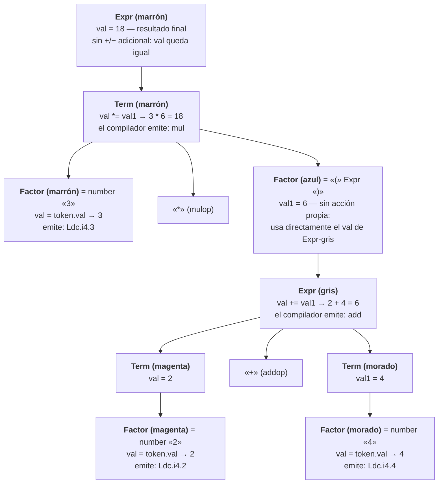

Notas de fidelidad al recorrido explicado verbalmente:
- El **factor azul** (`"(" Expr ")"`) no ejecuta ninguna acción semántica propia para calcular su
  `val`: como se explicó en 5.7, toma directamente el `val` que le devuelve la llamada a
  `Expr`-gris (por eso, en el árbol de la slide 10, aparece anotado "No necesita acción sem. porque
  usa una sola var (val)").
- Cada color (marrón / azul / magenta / morado / gris) corresponde a una activación distinta,
  aunque varias sean llamadas al mismo método (`Factor` se llama tres veces: marrón, magenta y
  morado; `Expr` se llama dos veces: marrón —la raíz del árbol— y gris —la expresión entre
  paréntesis—; el profesor insiste en no confundirlas, ver sección 10).
- El orden de ejecución (y por lo tanto el orden en que se generan las instrucciones CIL) sigue el
  recorrido de la recursión descendente: primero se resuelve completamente el `Factor` marrón
  (número 3 → `Ldc.i4.3`), luego se entra al paréntesis y se resuelve completo el lado izquierdo
  del `+` (número 2 → `Ldc.i4.2`), luego el lado derecho (número 4 → `Ldc.i4.4`), luego se cierra
  la suma (`add`), se cierra el paréntesis, y recién ahí se cierra la multiplicación (`mul`).

#### 8.3 Tabla de instrucciones CIL generadas, en el orden real de emisión

| Orden | Instrucción CIL | Corresponde a | Momento (según recorrido) |
|---|---|---|---|
| 1 | `Ldc.i4.3` | `Factor` marrón = `number "3"` | Al reconocer el primer `number` (3), antes de ver el `*` |
| 2 | `Ldc.i4.2` | `Factor` magenta = `number "2"` | Al reconocer el primer `number` dentro del paréntesis |
| 3 | `Ldc.i4.4` | `Factor` morado = `number "4"` | Al reconocer el segundo `number` dentro del paréntesis |
| 4 | `add` | acción semántica de `Expr` gris (`val += val1`) | Al terminar de reconocer `2 + 4`, antes de cerrar el paréntesis |
| 5 | `mul` | acción semántica de `Term` marrón (`val *= val1`) | Al terminar de reconocer `Factor` azul (el paréntesis completo), después de `)` y antes de EOF |

Resultado en tiempo de ejecución (cuando la máquina virtual ejecuta esta secuencia): apila 3,
apila 2, apila 4, `add` sacapila 2 y 4 y apila 6, `mul` saca pila 3 y 6 y apila 18. El "18" nunca
aparece como valor en tiempo de **compilación**: solo existen los `val`/`val1` de las acciones
semánticas (que en el compilador real terminan siendo, en la mayoría de los casos, simplemente el
disparador para emitir la instrucción correspondiente, no el resultado aritmético en sí).

---

### 9. Otros ejemplos de análisis semántico mencionados en el material

Además de contar/sumar términos y de la declaración de variables (`VarDecl`/`IdentList`), el
material menciona o ejemplifica los siguientes usos de acciones semánticas y atributos, todos
ligados a la **tabla de símbolos** (que se profundiza recién la semana siguiente, pero se
introduce acá como ejemplo de acción semántica):

- **Inserción de variables en la tabla de símbolos** (clase 1, `[22:39]`-`[24:12]`): la acción
  semántica de `VarDecl`/`IdentList` no solo lee el tipo, sino que **almacena** cada variable
  declarada junto con su tipo. Cita textual: *"la acción semántica únicamente que vamos a hacer
  cuando hagamos esta declaración de variable es insertar esa variable en la tabla de símbolos, en
  donde voy a almacenar el nombre de la variable [...] y el tipo [...] que es el que en este caso
  va a entrar como atributo de entrada"*. Es decir: el **tipo** es un atributo de **entrada** para
  la acción de inserción (viene de afuera, de haber reconocido `Type` antes), y el **nombre** de la
  variable se obtiene del terminal recién reconocido (`token.str`).
- **Alcance (`scope`)**: se menciona que la tabla de símbolos permite **abrir/cerrar un alcance**
  y que las mismas variables declaradas en distintos alcances (por ejemplo, una variable local de
  una función y una variable con el mismo nombre en la función que la llama) son **variables
  distintas**. Cita: *"dependiendo del alcance, cuando yo declaro en una función o en la función
  llamadora declaro la misma variable, son diferentes variables"* (clase 1, `[23:19]`-`[23:36]`).
  El profesor aclara explícitamente que este tema (la estructura de datos de la tabla de símbolos
  en sí) se profundiza en la clase siguiente, no en esta semana.
- **Chequeo de tipos**: si bien el material de la semana 5 (slides/transcripción) no dedica un
  ejemplo didáctico separado y explícito al chequeo de tipos (más allá de mencionar el tipo como
  atributo de entrada/salida en `VarDecl`), el **código real de COMPI** sí contiene chequeos de
  tipo como acciones semánticas embebidas directamente en `Expr`/`Term`/`Factor` (ver sección 11),
  por ejemplo validar que los operandos de una suma sean de tipo `int` antes de emitir el `add`.
  Se documenta en la sección de conexión con el código real porque es el ejemplo más concreto y
  fiel de "chequeo de tipos como acción semántica" disponible en las fuentes.

---

### 10. Errores comunes y aclaraciones explícitas del profesor

Recopilación de las advertencias y aclaraciones que el profesor marca explícitamente como puntos
de confusión frecuente (ambas transcripciones):

1. **No confundir intérprete con compilador.** Es la aclaración más repetida de toda la semana
   (al menos seis veces en la parte 2, según nota del propio índice de la transcripción). Un
   intérprete calcula valores durante el recorrido del árbol; un compilador **solo emite
   instrucciones** que la máquina virtual va a ejecutar después. Cita explícita de énfasis (parte
   2, `[24:00]`-`[24:11]`): *"Que me sirve para ayudar a entender [pensar como intérprete] pero lo
   que realmente sucede no es que este 2 esté subiendo [...] Tienen que siempre tener esa
   diferencia"*. Y otra vez (`[30:20]`-`[30:24]`): *"otra vez, lo voy a repetir 20 veces porque es
   muy importante"*.
2. **No confundir dos llamadas al mismo método no terminal entre sí** (por ejemplo, dos llamadas a
   `Factor` o a `Expr` en puntos distintos del árbol). Aunque el código fuente que las define es el
   mismo método, **cada llamada es una activación distinta** ("registro de activación diferente"),
   con sus propias variables locales y su propio valor de retorno. Es justamente para evitar esta
   confusión que el profesor usa colores distintos ("manitos") para cada llamada: *"Son dos
   registros de activación diferentes, porque son llamadas a métodos, es el mismo nombre del
   método, pero son llamadas diferentes, son instancias diferentes"* (parte 2, `[21:06]`-
   `[21:20]`). En particular remarca la diferencia entre la `Expr` raíz del árbol (marrón) y la
   `Expr` que aparece dentro del paréntesis (gris): *"Son llamadas distintas [...] Esta expresión
   era la raíz del árbol, mientras que esta expresión va a ser esta que está acá"* (parte 2,
   `[17:23]`-`[17:54]`).
3. **EBNF es para razonar, BNF es lo que realmente implementa el compilador.** Confundir ambas
   notaciones (o esperar encontrar las llaves `{ }` de la EBNF directamente en el código de COMPI)
   es un error típico: el generador usa producciones BNF explícitamente recursivas (con no
   terminales auxiliares tipo `MasTerm`), no la EBNF resumida de las slides.
4. **Un atributo no es automático: hay que decidir, producción por producción, si hace falta.**
   El ejemplo del contador de términos vs. la suma (sección 7) es exactamente el caso que el
   profesor usa para que quede claro que **no toda acción semántica necesita un atributo**; agregar
   un atributo "por las dudas" no es la regla — se agrega solo cuando la información necesita
   cruzar el límite de la función (entrar desde afuera o salir hacia afuera).
5. **El terminal no tiene su propia función con atributos "de la misma forma" que el no
   terminal.** Ya visto en la sección 3.2: el profesor lo dice explícitamente ("los terminales
   [...] van a parar a un check"), como contraste directo con "cada vez que veo [un no terminal]
   tengo que crear un método que se llame igual".

---

### 11. Cómo se ve en el compilador real (COMPI)

Código real de `Parser.cs` y `SymTab.cs` (repositorio `compi2026`, carpeta `text Box Mio`), que
confirma y a la vez complejiza los ejemplos didácticos de las slides (COMPI usa un tipo propio
`Item` en lugar de `int`/`bool` sueltos, porque cada expresión real acarrea valor, tipo y "clase"
de ítem, no solo un número):

- **`Type`, atributo de salida como `out`** (`Parser.cs:791`):
  ```csharp
  static void Type(out Struct xType)
  ```
  Exactamente el patrón de la slide 9 (`Type(out type)` en `VarDecl`): el tipo reconocido se
  entrega hacia afuera mediante un parámetro `out`.

- **`Expr`, con atributo de salida `out Item item`** (`Parser.cs:1444`):
  ```csharp
  static void Expr(out Item item)
  {
      ...
      Term(out item, null);
      ...
      while ((la == Token.PLUS || la == Token.MINUS) && la != Token.EOF)
      {
          ...
          Code.Load(item);
          Term(out itemSig);
          Code.Load(itemSig);
          if (item.type != Tab.intType || itemSig.type != Tab.intType)
              Errors.Error("Los operandos deben ser de tipo int");
          nroDeInstrCorriente++;
          Code.il.Emit(op);
          ...
      }
  }
  ```
  Esto es la versión real del `Expr(. sum += val; .)` de la slide 10: en vez de sumar directamente
  un `int`, COMPI hace `Code.Load(item)` / `Code.Load(itemSig)` (que son las llamadas que
  efectivamente emiten las instrucciones `Ldc.i4.x`/`load` correspondientes) y recién después
  `Code.il.Emit(op)` (que emite `add`/`sub`), exactamente en la línea de lo explicado en la
  sección 8.1: nunca se calcula el valor en tiempo de compilación, solo se emiten instrucciones.
  Además, la línea `if (item.type != Tab.intType || itemSig.type != Tab.intType) Errors.Error(...)`
  es un **chequeo de tipos** real, embebido como acción semántica (el ejemplo que en la sección 9
  se señaló como ausente de las slides pero presente en el compilador real).

- **`Term` y `Factor`, mismo patrón de atributo de salida** (`Parser.cs:1838` y `Parser.cs:1730`):
  ```csharp
  static void Term(out Item item)
  static void Factor(out Item item)
  ```
  Dentro de `Factor`, el caso `Token.NUMBER` reproduce casi literalmente la acción semántica
  `Factor = number. (. val = token.val; .)` de la slide 10:
  ```csharp
  case Token.NUMBER:
      Check(Token.NUMBER);
      item = new Item(token.val);   // equivalente real de "val = token.val;"
      Code.Load(item);
      break;
  ```
  Y el caso `Token.LPAR` reproduce el "no necesita acción sem., usa una sola var" de `Factor =
  "(" Expr ")"`:
  ```csharp
  case Token.LPAR:
      Check(Token.LPAR);
      Expr(out item);   // el item de Factor es directamente el item que devuelve Expr
      Check(Token.RPAR);
      break;
  ```

- **`VardDecl`, atributo de entrada `kind` y uso de la tabla de símbolos** (`Parser.cs:483`):
  ```csharp
  static void VardDecl(Symbol.Kinds kind, System.Windows.Forms.TreeNode padre)
  {
      Struct type;
      ...
      Type(out type);          // atributo de salida: el tipo
      ...
      Symbol vble = Tab.Insert(kind, token.str, type);
      Code.CreateMetadata(vble);
      ...
      Identifieropc(hijo2, type, kind);   // "type" entra como atributo de entrada a la lista de identificadores
      ...
      Check(Token.SEMICOLON);
  }
  ```
  Este es el `VarDecl`/`IdentList` de la slide 9 llevado al compilador real: `type` sale de `Type`
  como `out` y entra a la función que procesa la lista de identificadores (`Identifieropc`, el
  equivalente real de `IdentList`) como parámetro de entrada, para poder insertar cada variable
  con su tipo correcto en la tabla de símbolos.

- **`SymTab.cs`, la operación real de inserción** (`SymTab.cs:151`):
  ```csharp
  public static Symbol Insert (Symbol.Kinds kind, string name, Struct type) {
      Symbol s;
      s = new Symbol(kind, name, type);
      ...
      Symbol actual = topScope.locals, ultimo = null;
      while (actual != null) {
          if (actual.name == name)
              Parser.Errors.Error(name + " está declarado más de una vez ");
          ...
      }
      if (ultimo == null) topScope.locals = s;
      else ultimo.next = s;
      return s;
  }
  ```
  Esta es la implementación real de `Tab.insert(token.str, type)` de la slide 9. Nótese que además
  agrega, como chequeo semántico adicional no mencionado en las slides de esta semana, la
  detección de **redeclaración** de una variable en el mismo alcance (`"... está declarado más de
  una vez"`), y que el alcance mismo se maneja con `OpenScope`/`CloseScope` (`SymTab.cs:115` y
  `SymTab.cs:135`), que es justamente el mecanismo de *scope* que el profesor menciona que se
  profundizará en la clase siguiente.

---

### 12. Resumen ejecutivo (para repaso rápido antes del parcial)

1. El procesamiento semántico **no tiene archivo propio**: sus acciones viven embebidas en
   `Parser.cs`, dentro de las funciones que ya implementan cada no terminal.
2. **Gramática con atributos = producciones (EBNF/BNF) + atributos (parámetros in/out) + acciones
   semánticas `(. ... .)`.**
3. Cada **no terminal** ⇒ una función de parsing propia, que puede llevar atributos de **entrada**
   (parámetro normal, "baja" en el árbol, modifica el comportamiento del hijo) y/o de **salida**
   (parámetro `out`, "sube" en el árbol, es el resultado calculado por el hijo). Cada **terminal**
   ⇒ se resuelve con `Check`/`Scan`, sin este mecanismo de atributos propio.
4. Se agrega un atributo únicamente cuando la acción semántica necesita **cruzar el límite de la
   función** (recibir algo de afuera, o entregar algo hacia afuera). Si la variable nace y muere
   dentro de la misma activación (como el contador de términos), no hace falta ningún atributo.
5. Un **intérprete calcula**; un **compilador solo emite instrucciones** (CIL) que la máquina
   virtual va a ejecutar después. Nunca confundir ambos momentos.
6. Llamadas distintas al mismo no terminal son **activaciones distintas** con su propio valor:
   no hay que confundirlas entre sí (de ahí las "manitos" de colores del profesor).
7. El código real de COMPI generaliza `int`/`bool` con un tipo propio `Item` (valor + tipo), y
   agrega chequeos de tipo y de redeclaración como acciones semánticas adicionales no mostradas en
   las slides simplificadas, pero coherentes con la misma teoría de atributos de entrada/salida.


---

## 6. Semana 6 - Tabla de símbolos

> Fuente: material de cátedra (`05.SymbolTable 2026 Parte 1-dan` y `Parte 2-dan`, base Mössenböck/JKU Linz, adaptado por el profesor Daniel), Guía de práctica de la semana 6, transcripciones completas de las clases del 14 y 15 de septiembre de 2026 (parte 1 y parte 2), y el código real del compilador **COMPI** (`SymTab.cs`, `Pila.cs`). Lenguaje didáctico del material: **Z#**. Lenguaje de la cátedra real: **COMPI**.

---

### 1. Qué es la Tabla de Símbolos y para qué sirve

La **tabla de símbolos** (en inglés *Symbol Table*, clase `Tab` en el código) es la estructura de datos que el compilador usa para llevar registro de **todos los nombres declarados** en el programa fuente: constantes, variables (globales y locales), argumentos, tipos, clases y métodos.

Sirve para dos cosas, exactamente simétricas a su interfaz básica:

1. **Insertar (`Tab.Insert`)**: cada vez que el parser reconoce una **declaración** (de una variable, un argumento, una constante, un método, una clase), crea un nuevo nodo `Symbol` y lo agrega a la tabla.
2. **Buscar (`Tab.Find`)**: cada vez que el parser encuentra el **uso** de un nombre (en una expresión, una asignación, un tipo referenciado, etc.), busca ese nombre en la tabla para:
   - verificar que esté declarado (si no está, es un **error semántico**: "no está declarado"),
   - y recuperar su información (tipo, dirección, clase de símbolo, etc.) para poder generar código o seguir chequeando tipos.

> Del deck (Slide #3, Parte 1): *"Given the following declarations `const int n = 10; class T { ... } int a, b, c; void M () { ... }` we get the following linear list — for every declared name there is a Symbol node."*

Es decir: **la tabla de símbolos se va construyendo dinámicamente a medida que el parser recorre el árbol de derivación** (se expande cuando declara, y como se ve más adelante, también se contrae cuando el parser sale de un método/clase). Esta dinámica —expansión y contracción— es señalada explícitamente por el profesor como un concepto de examen (ver §6.8).

La interfaz básica documentada en los slides es:

```csharp
public class Tab {
    public static Symbol Insert (Symbol.Kinds kind, string name, ...);
    public static Symbol Find (string name);
}
```

En el código real de COMPI (`SymTab.cs`) esta interfaz se amplía con `OpenScope`, `CloseScope`, `FindSymbol`, `FindField`, además de código adicional para dibujar el árbol de la tabla de símbolos en el formulario (`Form1`), que **no es parte de la teoría** sino instrumentación pedagógica del compilador (ver §11).

#### 1.1 Qué información guarda la tabla por cada símbolo

Cada símbolo declarado se representa como una instancia de la clase `Symbol`, con estos campos (tal como aparecen en el deck, Slide #5 Parte 1, calcado literalmente en `SymTab.cs`):

```csharp
class Symbol {
    public enum Kinds { Const, Global, Field, Arg, Local, Type, Meth, Prog }
    Kinds kind;       // de qué clase de declaración se trata
    string name;      // el nombre del símbolo (identificador)
    Struct type;      // el tipo del símbolo (se ve en profundidad en la Parte 2)
    Symbol next;      // puntero al siguiente símbolo DEL MISMO SCOPE (lista enlazada)
    int val;          // Const: el valor de la constante
    int adr;          // Arg, Local: dirección relativa (orden 0,1,2... dentro del scope)
    int nArgs;        // Meth: cantidad de argumentos del método
    int nLocs;        // Meth: cantidad de variables locales del método
    Symbol locals;    // Meth: lista de args + variables locales; Prog: tabla de símbolos del programa
}
```

**Explicación campo por campo (con lo remarcado en la transcripción, `[06:51]`–`[13:47]` parte 1):**

| Campo | Para qué se usa | Aclaración del profesor |
|---|---|---|
| `kind` | Distingue de qué tipo de entidad se trata: constante, variable global, campo de clase, argumento, variable local, tipo, método o programa | En COMPI solo hay **una clase y un método**, por lo que `Field` (campos de clase) casi no se usa en la implementación real, aunque sí está previsto en la teoría para si se ampliara la herramienta |
| `name` | El identificador tal cual aparece en el código fuente | Ej.: `n`, `T`, `a`, `b`, `M` |
| `type` | Puntero a un objeto `Struct` que representa el tipo (ver §9) | "Por ahora" no se explica en la parte 1; se retoma en la parte 2 |
| `next` | Enlaza los símbolos **dentro del mismo scope** en una lista simplemente enlazada | Es lo que arma la "lista lineal" mencionada en el Slide #3 |
| `val` | Solo tiene sentido para constantes | "Es el único que se va a almacenar en el símbolo de la tabla" — para variables, ese valor en tiempo de ejecución se maneja en el *scanner/token*, no en el símbolo |
| `adr` | Dirección relativa: qué posición ocupa un argumento o variable local dentro de su scope (0, 1, 2, …) | Ej.: si `x` es el primer argumento, `adr=0`; si `y` es el segundo, `adr=1` |
| `nArgs` / `nLocs` | Solo tienen sentido si `kind == Meth` (o `Prog`): cuentan cuántos argumentos y cuántas variables locales tiene ese método | Estos valores **se terminan de conocer recién al final de parsear el método completo** (cuando se cierra el scope), porque antes de terminar de leer el cuerpo no se sabe cuántas variables locales habrá |
| `locals` | Puntero a la lista de símbolos (argumentos + variables locales) que "cuelgan" de ese método/clase una vez cerrado su scope | Representa el enlace entre "scopes": el scope del método pasa a colgar de su símbolo dueño |

> Aclaración del profesor: *"fíjense que acá es como que hay otra lista enlazada, y es porque corresponden a diferentes scope o alcances"* — es decir, `locals` no es lo mismo que `next`: `next` conecta símbolos hermanos dentro de **un mismo** scope; `locals` es el puntero que conecta un símbolo *método/clase/programa* con la lista de símbolos de **su propio** scope (uno hacia adentro).

---

### 2. Concepto de Scope (Ámbito)

#### 2.1 Definición

> Slide #8, Parte 1: **"Scope = Range in which a Name is Valid"**.

Hay scopes separados (listas de objetos distintas) para:

- el **universo** (*universe*): contiene los nombres predeclarados (tipos base `int`, `char`; constantes estándar como `null`; métodos estándar `ord`, `chr`, `len`) **y el símbolo del programa**;
- el **programa**: contiene los nombres globales (constantes, variables globales, clases, métodos);
- **cada método**: contiene los nombres locales (argumentos y variables locales de ese método).

#### 2.2 Regla clave de examen: ¿cuándo se abre un Scope nuevo?

> **En la tabla de símbolos, se debe abrir un Scope solamente cada vez que se inserta un método o una clase.** No se abre un scope por cada bloque `{ }`, ni por cada variable, ni por cada sentencia.

Esto está dicho explícitamente en la transcripción, `[26:52]`–`[27:25]` (parte 1):

> *"ahora viene la declaración de un método, entonces tengo que hacer un tabInsert para M y como es un método, como dijimos voy a abrir un scope cuando sea un método, cuando sea una clase [...] si es un método o una clase, debo abrir un nuevo scope."*

Y se refuerza en la Parte 2 (`[00:42]`–`[01:29]`):

> *"creaba todo el universo, después creaba P, después de crear P, abría un scope para P [...] cuando viene M, genero otro scope para M."*

Es decir, el **evento que dispara `OpenScope()`** es exactamente la inserción de un símbolo `Kind.Meth` o de un símbolo que representa una clase/programa (`Kind.Prog` en COMPI, ya que no hay clases anidadas reales). Una declaración de variable, de constante, o el ingreso a un bloque de sentencias `{ ... }` **NO** abre un scope nuevo — usan el scope que ya está abierto (`topScope`).

#### 2.3 Ejemplo de examen: contar los Scopes de un programa

Programa:

```
class ProgPpal { void Main() { writeln("hola"); } }
```

**Respuesta correcta documentada: 2 Scopes.**

Razonamiento paso a paso, aplicando la regla anterior:

1. Antes de compilar cualquier programa, `Tab.Init()` ya creó el **scope del universo** (contiene `int`, `char`, `null`, `chr`, `ord`, `len`, `writeln`, etc.). Este scope **no lo genera el programa del usuario**: existe siempre, independientemente de qué programa se compile. Por eso no cuenta como un scope "generado por este programa".
2. Se reconoce `class ProgPpal { ... }`. Esto dispara la inserción del símbolo del programa (`Symbol.Kinds.Prog`, equivalente teórico a una clase) → **se abre el Scope #1** (el scope de la clase/programa `ProgPpal`).
3. Dentro de ese scope se reconoce `void Main() { ... }`. Esto dispara la inserción del símbolo del método (`Symbol.Kinds.Meth`) → **se abre el Scope #2** (el scope del método `Main`).
4. Dentro de `Main`, `writeln("hola")` es apenas una **llamada** a un método predeclarado (uso, no declaración). Usar un nombre nunca abre un scope: solo se hace un `Tab.Find("writeln")`, no un `Insert` ni un `OpenScope`.
5. Al llegar a la `}` de `Main`, se cierra el Scope #2 (`CloseScope`, cuelga `locals` de `Main`). Al llegar a la `}` de `ProgPpal`, se cierra el Scope #1 (cuelga `locals` de `ProgPpal`).

**Por qué NO es 1**: contar solo 1 scope es olvidar que **el método también genera su propio scope**. Es un error típico pensar "la clase abre un scope, y dentro de la clase todo comparte ese mismo scope" — pero la regla es explícita: *también* se abre scope al insertar un método, no solo al insertar una clase.

**Por qué NO es 3**: contar 3 suele venir de sumar el scope del universo como si fuera "generado" por este programa en particular. El universo es una estructura preexistente (se crea una única vez en `Tab.Init()`, antes de parsear cualquier programa), no un scope que "este programa" abre. Otro origen posible del error "3" es contar el bloque `{ ... }` del cuerpo de `Main` como si abriera un scope propio distinto del scope del método — pero un bloque de sentencias no dispara `OpenScope()`; usa el mismo scope de `Main` que ya estaba abierto por la declaración del método.

#### 2.4 Ejemplo extendido del deck: `class P { int a, b; void M (int x) { int b, c; ... } ... }`

Diagrama (recreado en texto de los Slides #8–#10, Parte 1):

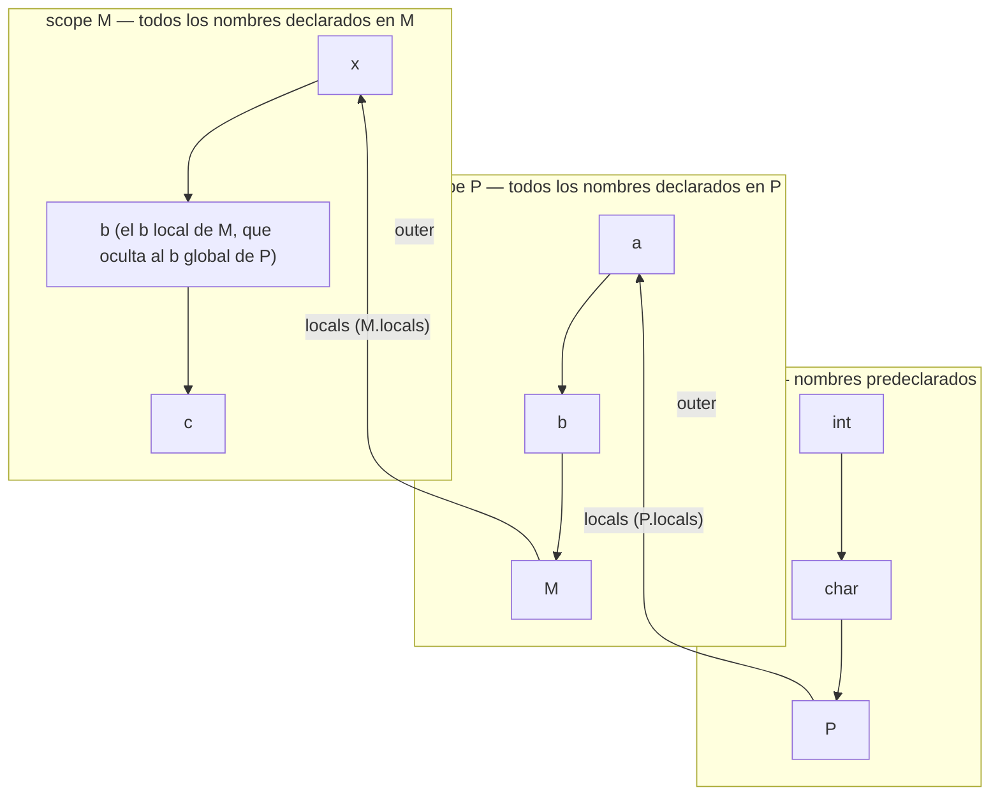

- `topScope` apunta siempre al scope más interno (el último abierto y aún no cerrado).
- Cada scope tiene un puntero `outer` al scope inmediatamente exterior: `scope M .outer == scope P`, `scope P .outer == universe`.
- La búsqueda de un nombre (`Find`) **siempre empieza en `topScope`** y, si no lo encuentra ahí, sigue por `outer` hacia scopes cada vez más externos.
- Ejemplo del deck: *"Searching for a name always starts in topScope. If not found, the search continues in the next outer scope. Example: search b, a and int"* — buscar `b` lo encuentra ya en `scope M` (el `b` local de `M`, que oculta al `b` global de `P` — shadowing); buscar `a` no está en `scope M`, sigue a `scope P` y lo encuentra ahí; buscar `int` no está en `scope M` ni en `scope P`, sigue hasta `universe` y lo encuentra ahí.

#### 2.5 La clase `Scope`

```csharp
class Scope {
    Scope outer;    // al siguiente scope hacia afuera
    Symbol locals;  // a los símbolos de este scope
    int nArgs;      // # de argumentos en este scope (para asignar direcciones)
    int nLocs;      // # de variables locales en este scope (para asignar direcciones)
}
```

#### 2.6 `OpenScope` (versión teórica del deck)

```csharp
static void OpenScope () {           // en la clase Tab
    Scope s = new Scope();
    s.nArgs = 0; s.nLocs = 0;
    s.outer = topScope;
    topScope = s;
}
```

Se llama **al comienzo de un método (o de una clase)**. Enlaza el nuevo scope con los existentes (`s.outer = topScope`) y el nuevo scope pasa a ser el `topScope`.

#### 2.7 `Insert` (versión teórica del deck, con recorrido de ejemplo)

```csharp
static Symbol Insert (Symbol.Kinds kind, string name, Struct type) {
    //--- crear el nodo símbolo
    Symbol sym = new Symbol(name, kind, type);
    sym.next = null;
    if (kind == Symbol.Kinds.Arg)   sym.adr = topScope.nArgs++;
    else if (kind == Symbol.Kinds.Local) sym.adr = topScope.nLocs++;
    //--- insertar el nodo símbolo (al FINAL de la lista del scope actual)
    Symbol cur = topScope.locals, last = null;
    while (cur != null) {
        if (cur.name == name) Error(name + " declared twice");
        last = cur; cur = cur.next;
    }
    if (last == null) topScope.locals = sym;   // primer símbolo del scope
    else last.next = sym;                       // se agrega al final
    return sym;
}
```

Puntos remarcados en el deck y en la transcripción:

- **"Names are always entered in topScope"**: `Insert` siempre trabaja sobre el scope más interno vigente, nunca hace falta indicarle en qué scope insertar.
- El recorrido `while (cur != null)` sirve para dos cosas a la vez: (a) detectar declaración duplicada (`"declared twice"`) y (b) encontrar el final de la lista para encadenar el nuevo símbolo.
- `adr` se asigna **solo** si el símbolo es `Arg` o `Local`, incrementando el contador correspondiente del `topScope` (`nArgs++` / `nLocs++`). Para `Const`, `Global`, `Type`, `Meth`, `Prog` no se toca `adr`.

#### 2.8 `CloseScope` y el ejemplo de `MethodDecl`

Producción atribuida (Slides #15–#16, Parte 1):

```
MethodDecl (. Struct type; .)
= Type<type>                                   // type devuelve void
  ident (. curMethod = Tab.Insert(Symbol.Kinds.Meth, token.str, type);
           Tab.OpenScope();                     // con nArgs = nLocs = 0
        .)
  ...                                           // encuentra int x, y y hace los Insert
  "{"                                           // acá adentro incrementa nLocs con cada var local
  ...
  "}" (. curMethod.nArgs  = topScope.nArgs;
         curMethod.nLocs  = topScope.nLocs;
         curMethod.locals = Tab.topScope.locals;
         Tab.CloseScope();
      .)
  .
```

Secuencia explicada en la transcripción (`[28:10]`–`[33:16]`, Parte 1):

1. Se reconoce el tipo de retorno del método (`Type` → en el ejemplo `void`).
2. Se reconoce el identificador del método (`M`). Se hace `Tab.Insert(Kinds.Meth, "M", type)` y el puntero devuelto se guarda en la variable global `curMethod` ("current method" = método actual).
3. Inmediatamente se llama a `Tab.OpenScope()`: se crea el scope temporal de `M`, con `nArgs = nLocs = 0`, y `topScope` "sube" (pasa a apuntar al scope nuevo).
4. Mientras se parsean los argumentos y las variables locales del cuerpo de `M`, cada uno dispara un `Tab.Insert`, que va incrementando `topScope.nArgs` / `topScope.nLocs`.
5. Al llegar a la `}` final del método:
   - se copian los contadores finales a los campos del símbolo `M`: `curMethod.nArgs = topScope.nArgs;` `curMethod.nLocs = topScope.nLocs;`
   - se "cuelgan" los símbolos del scope temporal del método: `curMethod.locals = Tab.topScope.locals;`
   - recién ahí se cierra el scope: `Tab.CloseScope();`, que hace `topScope = topScope.outer;`

Cita textual clave (Slide #16, Parte 1): *"Before a scope is closed its local objects are assigned to m.locals (M.locals). Scopes are also opened and closed for classes (para P)."*

Y la explicación en palabras del profesor (`[31:16]`–`[32:20]`, Parte 1):

> *"esto es una creación temporal, o sea, va a desaparecer, o mejor dicho, lo voy a inhabilitar más que desaparecer, lo cual lo voy a hacer colgándolo de M a esta lista cuando yo abandone con el parser el método [...] no tiene visibilidad después, [pero siguen] las variables a seguir con el programa."*

Es decir: el scope como *estructura activa para buscar* desaparece (`CloseScope` mueve `topScope` hacia afuera), pero los símbolos no se pierden: quedan "colgando" del campo `locals` del símbolo dueño (el método o la clase), disponibles para inspección posterior (por ejemplo, para generación de código), aunque ya no sean alcanzables por búsqueda normal desde otro punto del programa.

**El mismo mecanismo se repite para el programa/clase** (Parte 2, `[00:42]`–`[04:06]`): se crea el universo, se inserta `P` (símbolo `Prog`), se abre scope para `P`, se insertan `a`, `b`, `M` en ese scope; cuando termina el programa (llave final), se cuelgan `a`, `b`, `M` de `P.locals` y se cierra el scope de `P`. La producción teórica es "similar a `MethodDecl`" pero con nombres distintos: en vez de `MethodDecl` es `Program`, en vez de `Type` es el token fijo `class`, en vez de `curMethod` es (típicamente) `prog`, y en vez de insertar `Kind.Meth` se inserta `Kind.Prog`.

```
MethodDecl = Type<type> ident (. curMethod = Tab.Insert(Symbol.Kinds.Meth, token.str, Tab.noType);
                                  Tab.OpenScope(); .)
             "{" ... "}" (. prog.locals = Tab.topScope.locals;   // a, b y M cuelgan de P
                            Tab.CloseScope();                     // se elimina el scope temporal, topScope sube
                         .) .
```

#### 2.9 Dinámica de la tabla: "la tabla se expande y se contrae"

Cita textual (Slide #18, Parte 1 y Parte 2):

> *"La tabla de símbolos se expande y se contrae a medida que el parser avanza en el programa. Esta acción dinámica permite evaluar el alcance de las variables y decidir qué variable es la que se debe usar. Una pregunta de examen puede ser 'cuál de las formas de la tabla de símbolos es la correcta'. La respuesta depende de dónde se encuentre parseando el compilador."*

Ejemplo de "trampa" de examen (Slides #19–#20, Parte 1): se muestran dos "fotos" distintas de la tabla de símbolos (una con el scope de `M` todavía abierto colgando de `topScope`, y otra donde ya se cerró y `M` con sus locals aparece colgado de `P`). La pregunta es cuál es la correcta **en un punto dado del parseo**. Respuesta (según la transcripción, `[35:37]`–`[36:52]`): si el compilador todavía está parseando **dentro** del cuerpo de `M`, la tabla correcta es la que tiene el scope de `M` **abierto** (con `x`, `y` colgando directamente de `topScope`, antes de cerrar), no la que ya lo tiene cerrado y colgado de `P`. Es decir: la "foto correcta" de la tabla de símbolos siempre corresponde exactamente a la posición actual del parser en el árbol de derivación — no hay una única tabla estática, sino un snapshot que cambia en cada paso del parseo.

---

### 3. `Tab.Find`: qué tipo de objeto devuelve

#### 3.1 Regla clave de examen

> **`Tab.Find("int")` (o `Tab.Find` de cualquier nombre) devuelve una instancia de la clase `Symbol`** (el "objeto símbolo" completo), **no** un booleano, ni un string, ni directamente un `Struct`/tipo.

Cita textual (Slide #5, Parte 2 y transcripción `[05:48]`–`[06:04]`, Parte 2):

> *"El método Find busca un name en la tabla de símbolos, si lo encuentra devuelve el obj símbolo, que contiene al nombre buscado, sino lo encuentra retorna `noSym`."*
> *"el objetivo es buscar un name [...] si lo encuentra, va a devolver el objeto símbolo, o sea, va a devolver el objeto completo."*

Firma (idéntica en el deck y en `SymTab.cs`):

```csharp
static Symbol Find (string name) {
    for (Scope s = topScope; s != null; s = s.outer)
        for (Symbol sym = s.locals; sym != null; sym = sym.next)
            if (sym.name == name) return sym;
    Parser.Error(name + " is undeclared");
    return noSym;
}
```

#### 3.2 Cómo funciona: dos `for` anidados

Explicación exacta de la transcripción (`[06:22]`–`[09:00]`, Parte 2):

- **Primer `for` (externo)**: recorre **todos los scopes**, empezando por el que apunta `topScope`, y siguiendo por `s.outer`, hasta llegar a `null`. Si en algún scope se encuentra el símbolo, la función retorna inmediatamente ese símbolo (sale por el `return sym;` de adentro).
- **Segundo `for` (interno, anidado)**: dentro de **un** scope, recorre la lista enlazada de símbolos (`s.locals`, siguiendo `sym.next`) comparando cada `sym.name` contra el `name` buscado. Si no encuentra nada en ese scope, el `for` interno termina normalmente y el `for` externo avanza al siguiente scope más afuera (`s = s.outer`).
- Si el `for` externo llega a `s == null` (se acabaron los scopes, incluido el universo) sin haber encontrado el nombre, se dispara el error semántico `"<name> is undeclared"` / `"no está declarado"` y la función retorna `noSym`.

`noSym` es un símbolo "centinela" predefinido justamente para evitar que el compilador explote con una referencia nula al no encontrar el nombre — permite seguir compilando (para reportar más errores) sin arrojar excepciones de puntero nulo.

#### 3.3 Objeto símbolo vs. objeto tipo (`Struct`)

Es importante no confundir: `Find` devuelve un `Symbol`. El **tipo** de ese símbolo se obtiene después, leyendo su campo `sym.type` (que es un `Struct`, ver §9). Esto se ve explícitamente en la producción de `Type` (Slide #15, Parte 2):

```
Type<Struct type> = ident (. Symbol sym = Tab.Find(token.str);
                             type = sym.type;
                          .)
```

Es decir: primero `Find` trae el **símbolo** completo (`sym`), y **luego**, en un segundo paso, se extrae de ese símbolo el puntero a su `Struct` (`sym.type`). `Find` nunca devuelve el `Struct` directamente.

---

### 4. Stack Frame

#### 4.1 Regla clave de examen

Un **Stack Frame** (marco de pila / registro de activación de un método) está formado, según lo documentado en la clase `Symbol` y su uso durante `MethodDecl`, por:

- **Method States** (el estado del método en ejecución: dirección de retorno, contexto de invocación),
- **Argumentos** (`Arg`): los parámetros recibidos por el método, cada uno con su propia dirección relativa (`adr`) asignada en orden (0, 1, 2, …),
- **Variables locales** (`Local`): las variables declaradas dentro del cuerpo del método, también numeradas con `adr` en orden (0, 1, 2, …, independiente del conteo de argumentos).

En términos de la tabla de símbolos, el stack frame de un método se corresponde exactamente con el **scope temporal** que se abre al insertar el método (`Tab.OpenScope()`) y que contiene, colgando de `topScope.locals`, la secuencia de símbolos `Arg` y `Local` de ese método —contadores llevados en `topScope.nArgs` y `topScope.nLocs`, y volcados finalmente en `curMethod.nArgs` / `curMethod.nLocs` al cerrar el scope. Es decir: **el "marco de pila" de un método es, a nivel de la tabla de símbolos, su scope**: mientras el scope está abierto (`topScope` apuntando a él), sus símbolos `Arg`/`Local` describen exactamente qué variables y en qué posición (`adr`) ocupan ese marco de activación; al cerrarse el scope, esa información queda resumida y fijada en `nArgs`/`nLocs`/`locals` del símbolo del método, lista para ser usada en la generación de código (por ejemplo, para emitir instrucciones CIL de acceso a argumentos/locales por índice).

#### 4.2 Direcciones relativas (`adr`)

Ejemplo del deck (Slide #5, Parte 1): para `void M (int x, int y) { char ch; }`:

| kind | name | adr |
|---|---|---|
| Arg | `x` | 0 |
| Local | `ch` | 0 |
| Arg | `y` | 1 |

Nótese que `adr` se numera **por separado** para `Arg` y para `Local` (cada contador arranca en 0 dentro del scope del método): `x` es el argumento 0, `y` es el argumento 1; `ch`, aunque se declaró "en el medio" cronológicamente, es la variable local 0 porque es la primera `Local` de ese scope. Esto es consistente con el código de `Insert`: `sym.adr = topScope.nArgs++` para `Arg`, y `sym.adr = topScope.nLocs++` para `Local` — dos contadores independientes.

---

### 5. Manejo de la pila de scopes (push/pop)

#### 5.1 ¿Cómo se apila y desapila un scope?

La tabla de símbolos maneja sus scopes como una **pila implícita**, materializada mediante una **lista enlazada simple** de objetos `Scope`, no mediante un arreglo ni mediante la clase genérica `Pila`/`Stack<T>`:

- **"push" de scope** = `Tab.OpenScope()`: crea un `Scope` nuevo, lo enlaza (`s.outer = topScope`) y lo hace tope (`topScope = s`).
- **"pop" de scope** = `Tab.CloseScope()`: `topScope = topScope.outer;` — el tope simplemente retrocede un nivel; el objeto `Scope` que queda "por debajo" ya no tiene una referencia directa hacia él (nadie más apunta al scope recién cerrado salvo, indirectamente, a través de `locals` colgado del símbolo dueño), así que queda disponible para el recolector de basura salvo que algo lo referencie.

Este mecanismo push/pop se dispara **exactamente** en los mismos eventos descriptos en §2.2: se hace push al insertar un método o una clase/programa, y se hace pop al llegar a la llave de cierre `}` de ese método/clase.

#### 5.2 Búsqueda recorriendo scopes del más interno al más externo

Como se detalló en §3.2, `Find` recorre la pila de scopes **desde el tope (`topScope`, el más interno)** y avanza hacia scopes cada vez **más externos** siguiendo el puntero `outer`, hasta agotar la pila (`s == null`, que en la implementación real ocurre después de pasar por el universo). Esto es lo que garantiza las reglas de visibilidad usuales de un lenguaje con bloques anidados: un nombre declarado en un scope interno "tapa" (shadowing) a un nombre igual declarado en un scope externo, porque la búsqueda encuentra primero el más interno y se detiene ahí.

#### 5.3 ¿Y la clase `Pila.cs`?

En el proyecto de COMPI existe una clase genérica `Pila` (autoría marcada "//Manuel" en el código), con la interfaz típica de una pila por arreglo:

```csharp
public class Pila {
    protected int cantMaxDeElem;
    public int tope;
    protected object[] elementos;
    public Pila(int espacio) { ... }
    public bool estaVacia() { ... }
    public void push(object elemento) { ... }
    public object pop() { ... }
    public object verElementoTope() { ... }
}
```

Es importante para el examen **no confundirla** con la "pila de scopes" de la tabla de símbolos: `Pila.cs` es una utilidad genérica de propósito general (arreglo de `object` con `push`/`pop`/`verElementoTope`), usada en otras partes del compilador (por ejemplo, en el parser o en la generación de código, para pilas auxiliares de análisis), **no** es la estructura que gestiona `topScope`. La pila de scopes de `Tab` está implementada "a mano" como una lista enlazada de objetos `Scope` encadenados por `outer`, con `OpenScope`/`CloseScope` haciendo de `push`/`pop`, y `topScope` haciendo de puntero al tope. De hecho, en `SymTab.cs` lo que sí se ve son dos pilas de la biblioteca estándar (`System.Collections.Generic.Stack<TreeNode>` y `Stack<List<TreeNode>>`, llamadas `ultimosNodos` y `ultimosParametros`), pero esas se usan **solo para dibujar el árbol visual de la tabla de símbolos** en el formulario (`Form1`), no para la lógica semántica de scopes en sí (ver §11).

---

### 6. Validez sintáctica vs. validez semántica: el caso de la variable no declarada

#### 6.1 Regla clave de examen

> Puede ocurrir que **la concatenación de las hojas del árbol de derivación coincida exactamente con la cadena de entrada** (es decir, el programa es **sintácticamente válido**: respeta perfectamente la gramática) y que, **sin embargo, el compilador acuse error**. Esto sucede **únicamente** cuando existe alguna variable que no fue declarada en el scope correspondiente (o, en general, cuando se detecta un error semántico vía la tabla de símbolos, aunque el caso canónico de examen es exactamente ese: variable no declarada).

#### 6.2 Por qué pasa esto: dos etapas distintas de verificación

Es fundamental distinguir dos niveles de corrección de un programa:

1. **Validez sintáctica**: el programa respeta la gramática del lenguaje. Se verifica durante el *parsing* (análisis sintáctico), comparando tokens contra las producciones (`Check`, `Scan`, etc.). Si el árbol de derivación se puede construir completo y sus hojas —leídas de izquierda a derecha— reproducen exactamente la cadena de entrada, el programa es sintácticamente correcto. Esto **no** dice nada sobre si las variables usadas están declaradas: la gramática no "sabe" qué identificadores existen, solo sabe que "en esta posición va un `ident`".
2. **Validez semántica**: además de tener una estructura gramatical correcta, el programa debe respetar reglas de significado que la gramática libre de contexto no puede expresar por sí sola: que toda variable usada haya sido declarada antes, que los tipos sean compatibles, que no se declare dos veces el mismo nombre en el mismo scope, etc. Esta verificación se hace **durante el mismo recorrido del parser**, pero apoyándose en la **tabla de símbolos** (`Tab.Insert` al declarar, `Tab.Find` al usar), no en las reglas de la gramática.

Un identificador (`ident`) es sintácticamente válido en cualquier posición donde la gramática lo permita, sin importar si "existe" o no como variable declarada. Por eso un programa puede ser 100% sintácticamente correcto (el árbol se construye sin problemas, las hojas concatenadas dan exactamente el programa de entrada) y aun así fallar: cuando el parser llega al uso de ese identificador y hace `Tab.Find(name)`, si el nombre no está en ningún scope alcanzable (recorriendo `topScope` → `outer` → ... → universo sin encontrarlo), se dispara el error `"<name> is undeclared"` / `"no está declarado"` — un **error semántico**, detectado por la tabla de símbolos, **no** un error sintáctico.

En síntesis:

| | Error sintáctico | Error semántico (caso: variable no declarada) |
|---|---|---|
| Se detecta con | Reglas de la gramática (producciones, `Check`/`Scan`) | La tabla de símbolos (`Tab.Find`) |
| El árbol de derivación | No se puede construir completo / las hojas no coinciden con la entrada | Se construye completo y sus hojas coinciden exactamente con la entrada |
| Ejemplo | Falta un `;`, paréntesis desbalanceados, token inesperado | `x = 5;` donde `x` nunca fue declarado en ningún scope visible |
| Cuándo se detecta | Durante el parseo, al no poder aplicar ninguna producción válida | Durante el mismo parseo, en la acción semántica que hace `Tab.Find(name)` |

---

### 7. La clase `Struct`: el sistema de tipos (Parte 2)

#### 7.1 Motivación

Hasta la Parte 1, el campo `type` de `Symbol` quedaba señalado como "no incluido por ahora". La Parte 2 explica en detalle cómo se representa el tipo de un símbolo: mediante un puntero a un objeto de la clase `Struct` (que **no** es un `struct` de C#, es una clase propia del compilador con ese nombre — aclaración explícita del profesor, `[12:32]`–`[13:10]` Parte 2, para evitar la confusión).

```csharp
class Struct {
    enum Kinds { None, Int, Char, Arr, Class }
    Kinds kind;          // tipo base que representa este Struct
    Struct elemType;     // Arr: tipo de los elementos del arreglo
    Symbol fields;       // Class: lista enlazada de los campos (símbolos) de la clase
}
```

(En `SymTab.cs`, el enum real agrega además `String`: `enum Kinds { None, Int, Char, String, Arr, Class }` — una extensión de la implementación real respecto de la teoría pura del deck, que solo contempla `None, Int, Char, Arr, Class`.)

#### 7.2 Estructuras para cada caso

**Tipos primitivos (`int`, `char`)** (Slide #9, Parte 2): cada símbolo de tipo primitivo apunta a un `Struct` cuyo `kind` es `Int` o `Char`, sin usar `elemType` ni `fields`.

```
Global "a" -0---     int a, b; char c;
Global "b" -1---
Global "c" --2---
```
```
Struct: kind=Int   elemType=–  fields=–
Struct: kind=Char  elemType=–  fields=–
```

**Clases** (Slide #10, Parte 2): `class C { int x; int y; int z; } C v;`. El `Struct` de `C` tiene `kind = Class` y `fields` apunta a la lista de símbolos `Field` (`x`, `y`, `z`), cada uno con su propio `type` apuntando al `Struct` de `Int`.

```
Type "C"  →  Struct: kind=Class  fields → Field "x" → Field "y" → Field "z"
Global "v" → type apunta al Struct de C
```

**Arreglos** (Slide #11, Parte 2): `int[] a; int b;`. El `Struct` de `a` tiene `kind = Arr`, y `elemType` apunta al `Struct` de `Int` (el tipo de los elementos). Aclaración remarcada: *"The length of an array is statically unknown. It is stored in the array at run time"* — a diferencia de C/C++ donde el tamaño del arreglo se conoce en tiempo de compilación, en el estilo C#/COMPI el tamaño se resuelve en tiempo de ejecución, por lo que el `Struct` de un arreglo no necesita (ni puede) guardar la longitud.

**El universo** (Slide #13, Parte 2): contiene los símbolos `Type "int"` y `Type "char"`, cada uno apuntando a su propio `Struct` (`Int`, `Char`). Estos objetos `Struct` de los tipos base se crean **una sola vez**, en la clase `Tab`, típicamente como campos estáticos:

```csharp
class Tab {
    static Scope topScope;
    static Struct intType  = new Struct(Struct.Kinds.Int);
    static Struct charType = new Struct(Struct.Kinds.Char);
    static Symbol Insert (Symbol.Kinds kind, string name, Struct type) {...}
    static Symbol Find (string name) {...}
    static void OpenScope () {...}
    static void CloseScope () {...}
}
```

Esto es exactamente lo que se ve en `SymTab.cs` real (con más variantes: `noType`, `stringType`, `nullType`, ver §11).

#### 7.3 Uniendo los conceptos: `Type` → `Find("int")` → `Symbol.type` → `Struct`

Secuencia explicada en detalle (`[23:19]`–`[28:49]`, Parte 2), para una declaración como `int a, b;`:

1. El parser reconoce el token `int` en la posición de un tipo. Llama a la producción `Type`.
2. `Type` hace `Symbol sym = Tab.Find("int");` — busca el **símbolo** llamado `"int"` (que ya fue insertado en el universo al arrancar el compilador).
3. `Find` recorre la pila de scopes (desde `topScope` hacia afuera) hasta encontrarlo en el universo, y devuelve ese `Symbol` (no un `Struct`, ver §3.3).
4. `Type` extrae `type = sym.type;` — ahí sí se obtiene el puntero al `Struct` (el objeto `Struct` de kind `Int`, el mismo objeto único creado en `Tab`).
5. Ese `type` (el `Struct` de `int`) es el que se pasa después a cada `Tab.Insert(Kind.Global, "a", type)` y `Tab.Insert(Kind.Global, "b", type)` — es decir, `a` y `b` **comparten el mismo objeto `Struct`** (el `intType` único), no cada uno crea su propio `Struct`.

Cita textual: *"este mismo `sym.type` va a ser cargado tanto en `a` como en `b` [...] el puntero que va a traer [...] va a apuntar al objeto de la clase struct que tiene int, en cada tanto a, b [...] de esa es la forma en cómo relaciona el `type` cuando encuentra una declaración de variable."*

Resumen del cierre de la Parte 2 (`[29:52]`–`[31:02]`): primero se crea el universo; en el universo se crean los símbolos de los tipos base (`int`, `char`); cada uno de esos símbolos tiene un puntero a un `Struct` que define su tipo; esa dirección (ese puntero) es la que se guarda y se reutiliza cada vez que se declara una variable de ese tipo, copiándola en el campo `type` del nuevo símbolo.

---

### 8. Otros ejemplos y tablas de los slides (preservados)

#### 8.1 Interfaz completa de la tabla de símbolos (Slide #6, Parte 2)

```csharp
class Tab {
    static Scope topScope;                                 // scope actual
    static Symbol Insert (Symbol.Kinds kind, string name, Struct type) {...}
    static Symbol Find (string name) {...}
    static void OpenScope () {...}
    static void CloseScope () {...}
}
```

#### 8.2 Nombres predeclarados (Slide #7, Parte 1)

> *"Which names are predeclared in Z#? Standard types: int, char. Standard constants: null. Standard methods: ord(ch), chr(i), len(arr). Predeclared names are also stored in the symbol table ('Universe')."*

| kind | name |
|---|---|
| Type | `int` |
| Type | `char` |
| … | … |

#### 8.3 Tabla resumen `Symbol` con ejemplo completo (Slide #5, repetido Parte 1 y Parte 2)

Para `const int n = 10; class T { ... } int a, b; void M (int x, int y) char ch; { ... }`:

| kind | name | next | val | adr | nArgs | nLocs | locals |
|---|---|---|---|---|---|---|---|
| Const | `n` | → | 10 | – | – | – | – |
| Type | `T` | → | – | – | – | – | – |
| Global | `a` | → | – | – | – | – | – |
| Global | `b` | → | – | – | – | – | – |
| Meth | `M` | → | – | – | 2 | 1 | → (x, ch, y) |
| Arg | `x` | | – | 0 | – | – | – |
| Local | `ch` | | – | 0 | – | – | – |
| Arg | `y` | | – | 1 | – | – | – |

Notas del slide: 1) "No incluye type (por ahora)" — es la Parte 1, antes de explicar `Struct`. 2) "Para el caso de `class T { ... }` habrá un puntero a los datos miembros de la clase T" — anticipa el campo `fields` de `Struct` que se explica en la Parte 2.

#### 8.4 Ejercicio de la guía de práctica (semana 6)

La guía de la práctica (`Guia de la práctica para las clases de la semana 6 - Tabla de símbolos.docx`) plantea:

> *Objetivo:* introducir al alumno en los conceptos de construcción de la tabla de símbolos.
> *Objetivos específicos:* comprender en qué consiste la tabla de símbolos de un compilador; identificar las técnicas y métodos utilizados para su construcción.
> *Desarrollo (3 pasos):*
> 1. Ver los videos parte 1 y parte 2 de tabla de símbolos.
> 2. Como la implementación actual de COMPI **no tiene implementada de forma completa la definición de clases** (aunque la gramática sí indica dónde debería definirse una), escribir —solo a nivel teórico— un programa en `#Z` (Z#) que declare y defina una clase que contenga únicamente atributos de tipo `int` y `char`.
> 3. Para ese programa, dibujar la tabla de símbolos correspondiente, de forma similar a los gráficos vistos en los slides (ver §8.3 y §7.2 de este documento como referencia de formato).

Esto conecta directamente con la aclaración de la transcripción (`[17:00]`–`[17:21]`, Parte 2): *"esto es de manera teórica y no está implementado [...] está implementado casi que diría parcialmente pero tiene errores [...] si yo defino una clase voy a tener un error cuando lo vaya a compilar [...] lo puede tomar como trabajo final."* Es decir: **COMPI real solo soporta una clase y un método** (aclarado repetidamente en la Parte 1, `[14:38]`–`[15:01]`), y el tratamiento de clases múltiples con campos (`Struct.Kinds.Class`, `fields`) es teoría de la gramática/tabla de símbolos que no está completamente operativa en la herramienta pedagógica entregada al alumno.

---

### 9. Errores comunes y aclaraciones remarcadas por el profesor

1. **COMPI tiene una sola clase y un solo método** (el programa principal). No hay llamadas a funciones ni definición de múltiples métodos/clases en la herramienta entregada — aunque la teoría (y la gramática) sí contemplarían extenderla. Probar features de clases/funciones en el compilador real "va a hacer error por todo lado".
2. **El scope se abre solo al insertar método o clase**, nunca por bloques `{ }` sueltos ni por cada declaración de variable (regla ya remarcada en §2.2, pero el profesor insiste varias veces porque es una fuente común de error de examen).
3. **Antes de cerrar un scope, sus símbolos deben "colgarse" (`locals`) del símbolo dueño** (`curMethod.locals = topScope.locals;` o `prog.locals = topScope.locals;`) — si se hiciera `CloseScope()` primero, se perdería la referencia a esos símbolos.
4. **El scope creado para un método es "temporal"**: una vez cerrado, dejar de ser alcanzable por búsqueda normal (`Find` ya no lo recorre porque `topScope` avanzó hacia afuera), pero sus símbolos siguen existiendo, colgados de `locals`, disponibles para otras fases del compilador (por ejemplo, generación de código).
5. **`adr` se cuenta por separado para argumentos y locales** (dos contadores, `nArgs` y `nLocs`, cada uno arrancando en 0).
6. **Errata detectada en un video anterior de la cátedra** (mencionada explícitamente en la Parte 2, `[14:51]`–`[15:04]`): en un ejemplo, un símbolo `char c` que en realidad es una variable **global** aparece marcado por error como `Local` en el video de otro profesor ("Francisco"); el profesor Daniel aclara: *"es muy probablemente es un error que tiene los videos anteriores [...] pero es global"*. Sirve como recordatorio de revisar el `kind` correcto según el contexto de declaración (global vs. local), no fiarse ciegamente de un gráfico si contradice la lógica del scope en el que aparece.
7. **`Tab.Find` siempre devuelve un objeto `Symbol` completo** (o `noSym`), nunca directamente un booleano ni el `Struct`/tipo — hay que leer `sym.type` en un segundo paso si se necesita el tipo (§3.3).
8. **La dinámica de expansión/contracción de la tabla es un tema de examen en sí mismo**: preguntas del tipo "¿cuál de estas dos tablas de símbolos es la correcta en este punto del parseo?" dependen exclusivamente de en qué posición del árbol de derivación se encuentra el compilador en ese instante (§2.9).
9. **No confundir el tipo `Struct` del compilador con un `struct` de C#**: es una clase propia (`class Struct`) que modela el sistema de tipos del lenguaje compilado, sin relación con el value type de C#.
10. **`writeln`/`ord`/`chr`/`len` y demás nombres predeclarados usan el mismo mecanismo `Find`** que cualquier otro nombre: están en el universo, así que una búsqueda que no los encuentra en scopes internos los termina encontrando ahí, tal como cualquier tipo base.

---

### 10. Cómo se ve en el compilador real (COMPI)

El archivo real es `SymTab.cs` (namespace `at.jku.ssw.cc`). Diferencias y coincidencias clave respecto de la teoría del deck:

- **`Symbol.Kinds`**: idéntico al deck — `Const, Global, Field, Arg, Local, Type, Meth, Prog`.
- **`Struct.Kinds`**: el deck define `None, Int, Char, Arr, Class`; la implementación real agrega `String`: `enum Kinds { None, Int, Char, String, Arr, Class }`.
- **`Tab.Insert(Symbol.Kinds kind, string name, Struct type)`**: mismo algoritmo que el teórico (recorre `topScope.locals`, detecta duplicados con `Parser.Errors.Error(name + " está declarado más de una vez ")`, asigna `adr` para `Arg`/`Local`), más código adicional para alimentar el árbol visual de la tabla de símbolos en el formulario (`Program1.form1.arbolTS`), que es **pura instrumentación de UI**, no parte de la teoría.
- **`Tab.Find(string name)`**: exactamente los dos `for` anidados de la teoría (`for (Scope s = topScope; s != null; s = s.outer) for (Symbol sym = s.locals; sym != null; sym = sym.next) if (sym.name == name) return sym;`), terminando en `Parser.Errors.Error(name + " no está declarado"); return noSym;` si no lo encuentra.
- **`Tab.OpenScope(Symbol sym)`**: a diferencia de la versión teórica sin parámetros, la real recibe un `Symbol sym` — pero ese parámetro **solo se usa para el árbol visual** (`Program1.form1.arbolTS.Nodes.Add(...)`) y para decidir si incrementar `profundidad`; la lógica de scope en sí (`s.outer = topScope; topScope = s;`) es igual a la teoría.
- **`Tab.CloseScope()`**: la línea semántica real es idéntica a la teoría (`topScope = topScope.outer;`); el resto del método es manejo del árbol visual (`ultimosNodos`, `ultimosParametros`, remoción de nodos del `TreeView`).
- **`Tab.Init()`**: es el método real que arma el universo (equivalente a lo narrado en Parte 2, `[00:00]`–`[04:06]`): abre el scope del universo (`Tab.OpenScope(null)`), inserta `int`, `char`, `null`, y los métodos predeclarados `chr(i)`, `ord(ch)`, `len(arr)` — cada uno de estos tres últimos abre su propio scope temporal (igual que un método de usuario) para declarar su argumento, fija `nArgs`/`nLocs`/`locals`, y cierra el scope, exactamente con el mismo patrón Insert→OpenScope→Insert(args)→CloseScope visto para `MethodDecl`.
- **Tipos base ya creados como `readonly` en `Tab`**: `noType, intType, charType, stringType, nullType` — más tipos que los dos (`intType`, `charType`) mencionados en el deck, reflejando extensiones reales del lenguaje (soporte de `string` y de un tipo `null`/clase).
- **`noSym`**: `public static readonly Symbol noSym = new Symbol(Symbol.Kinds.Const, "noSymbol", noType);` — el símbolo centinela exactamente como lo describe la teoría.
- **`FindSymbol(string name, Symbol puntSymbol)`**: variante de `Find` que busca **dentro de una lista de símbolos ya dada** (no recorriendo scopes desde `topScope`), útil por ejemplo para buscar un campo dentro de `locals`/`fields` de un símbolo puntual.
- **`FindField(string name, Struct type)`**: está **declarado pero no implementado** en el código real (`/* insert your code here */`, devuelve `null`) — es justamente el método que resolvería el caso de "clases con campos" mencionado en la guía de práctica (§8.4): la teoría lo contempla, pero la implementación entregada lo deja como ejercicio/trabajo final, coherente con la aclaración del profesor de que el soporte de clases no está completo en COMPI.
- **Campos adicionales para emisión de CIL** (no mencionados en la teoría pedagógica, agregados para que el compilador realmente genere ensamblados con `System.Reflection.Emit`): `Symbol.meth` (`MethodBuilder`), `Symbol.fld` (`FieldBuilder`), `Symbol.ctor` (`ConstructorBuilder`), y en `Struct`, `sysType` (el `System.Type` de CLR correspondiente, usado por ejemplo para crear el tipo de un arreglo `Array.CreateInstance(elemType.sysType, 0).GetType()`). Estos campos conectan la tabla de símbolos con la fase de generación de código real hacia CIL, más allá de lo que cubre la teoría de la Semana 6.
- **`Pila.cs`**: clase genérica de pila por arreglo (`push`, `pop`, `verElementoTope`, `estaVacia`), **no** es la estructura usada para la pila de scopes de `Tab` (ver §5.3): la pila de scopes está implementada con la lista enlazada `Scope.outer` + `topScope`, no con `Pila`.
- **`mostrarTab()` / `mostrarSymbol()` / `mostrarStruct()`**: métodos agregados solo para volcar el contenido completo de la tabla de símbolos a un string (`Tab.tabSimbString`) con fines de depuración/visualización en el formulario — recorren recursivamente `locals`/`fields`, análogos a un "pretty-print" de la estructura teórica de scopes anidados.

En síntesis: el **núcleo semántico** de `SymTab.cs` (`Symbol`, `Scope`, `Struct`, `Insert`, `Find`, `OpenScope`, `CloseScope`) reproduce fielmente la teoría de Mössenböck/JKU vista en los dos videos; las diferencias observables son extensiones de ingeniería (UI de árbol visual, tipos adicionales `string`/`null`, soporte de emisión CIL) y una funcionalidad explícitamente incompleta (`FindField`, soporte pleno de clases), coherente con que COMPI es una herramienta pedagógica de una sola clase y un solo método.


---

## 7. Semana 7 - Generación de código (CIL)

**Fuente:** README, guía de actividades (docx/pdf), diapositivas `generacion de codigo en compi.ppt` (basadas en el
material de Johannes Kepler University Linz, System Software Institute — ssw.jku.at) y las 7 transcripciones
completas de la carpeta `semana 7 - generacion de codigo - 21 y 22 septiembre 2026/`, más el código real
`miCodGen.cs` y `Pila.cs` del compilador COMPI, y el archivo `instrucciones CIL.txt` con una salida real de ILDASM.

---

### Índice

1. Contexto general: el problema N×M y el código intermedio
2. Qué es CIL (Common Intermediate Language)
3. El CLR como máquina de pila (stack machine)
4. Áreas de datos del CLR: method state, stack frames y heap
5. Catálogo de instrucciones CIL vistas en la materia
6. Modos de direccionamiento
7. `System.Reflection.Emit`: el workflow de generación dinámica de código
8. Metadatos y `il.DeclareLocal(sym.type.sysType)`
9. Los `Item` e `Item.Kinds`: cómo el compilador rastrea dónde está cada operando
10. Traducción de expresiones aritméticas: gramática atribuida y ejemplo paso a paso completo
11. Trace completo de pila: `2 + (7 * (3 + 5))`
12. Patrones de código para asignaciones (5 casos)
13. Otras sentencias: `write`, `if`/`while` (branch + patching), bucle real de ILDASM
14. El grafo Parser ↔ CodeGen: cómo cada no terminal dispara generación de código
15. Errores comunes y aclaraciones remarcadas por el profesor
16. Cómo se ve en el compilador real (COMPI): recorrido por `miCodGen.cs`

---

### 1. Contexto general: el problema N×M y el código intermedio

Antes de la generación de código intermedio, el modelo clásico era: por cada lenguaje fuente (Cobol, Fortran, C,
...) y por cada arquitectura de máquina (Z80, 8086, 8051, ...) hacía falta **un compilador distinto**. Si había
*N* lenguajes y *M* arquitecturas, se necesitaban *N × M* compiladores.

La solución que adoptaron las plataformas modernas (y en particular .NET) es introducir un **código intermedio**
que se ejecuta sobre una **máquina virtual** única:

- Cada lenguaje fuente se compila **una sola vez** a ese código intermedio (en .NET: **CIL**, *Common
  Intermediate Language*).
- La máquina virtual (en .NET: el **CLR**, *Common Language Runtime*) es la única pieza que sabe traducir ese
  código intermedio a código máquina real, para cada arquitectura concreta (hoy básicamente Windows y Linux, en
  distintas variantes de procesador).
- De esta forma solo hace falta **un compilador por lenguaje** (que traduzca a CIL) y **un CLR por plataforma**
  (que traduzca de CIL a código máquina). El problema N×M se reduce a N + M.

COMPI (el "compiladorcito" pedagógico de la cátedra) sigue exactamente este esquema: compila un lenguaje fuente
propio, **Z#** (llamado también "COMPI" o "Z#" indistintamente en clase), generando CIL que luego ejecuta el CLR
de .NET Framework.

> **Aclaración del profesor:** el video introductorio remarca que "por cada lenguaje necesitábamos un
> compilador, y ese compilador a su vez, por cada máquina, era un compilador distinto"; con código intermedio
> "ahora solamente debemos ser un compilador para que traduzca a un código intermedio o máquina virtual".

---

### 2. Qué es CIL (Common Intermediate Language)

**CIL** (también llamado **IL** o, en los materiales en inglés, *MSIL*) es el lenguaje intermedio común de la
plataforma .NET. Características clave (preguntas típicas de examen):

- Es el código de salida de **cualquier compilador o herramienta para .NET** (C#, VB.NET, COMPI/Z#, ...).
- Está **basado en una máquina abstracta de pilas** (*stack-based*, ver sección 3): no hay registros, las
  operaciones toman sus operandos del tope de una pila de evaluación.
- Es **muy compacto**: la mayoría de las instrucciones ocupan **1 byte** (algunas 2), a diferencia de los
  microprocesadores reales (Intel, PowerPC, SPARC) que tienen formatos de instrucción mucho más complejos.
- Es **mayormente "sin tipo" (untyped)**: las indicaciones de tipo se refieren generalmente al tipo del
  resultado, no a los operandos (p.ej. `add` no indica tipos: opera sobre lo que haya en el tope de la pila).
  Alguna instrucción sí lleva tipo explícito, como `ldc.i4.3` (carga una constante entera de 4 bytes).
- Formato de instrucción: `Code = { Instruction }`, `Instruction = opcode [operand]`. El opcode ocupa 1 o 2
  bytes; el operando (si existe) es un valor primitivo o un **token de metadatos**.
- Ejemplos de cantidad de operandos:
  - **0 operandos**: `add` (toma sus dos operandos implícitamente del tope de la pila).
  - **1 operando**: `ldc.i4.s 9` (el 9 es el operando inmediato).
- CIL es generado por `System.Reflection.Emit` (o por un ensamblador estático como `ilasm.exe`/ILAsm), y luego
  es **tomado por el CLR**, que lo compila JIT (*Just-In-Time*) a código máquina real para el microprocesador
  concreto donde se ejecuta.

> **Aclaración del profesor (glosario/transcripciones):** el reconocedor de voz suele escribir "el SIL" en vez
> de CIL; es un artefacto de la transcripción automática, el término correcto siempre es **CIL**.

---

### 3. El CLR como máquina de pila (stack machine)

El **CLR** (*Common Language Runtime*) es la máquina virtual de .NET. Es una **stack machine**: no tiene
registros de propósito general; en su lugar tiene una **pila de expresiones** (*expression stack*, abreviada
**`estack`**) sobre la cual se cargan (`push`) y se sacan (`pop`) los valores.

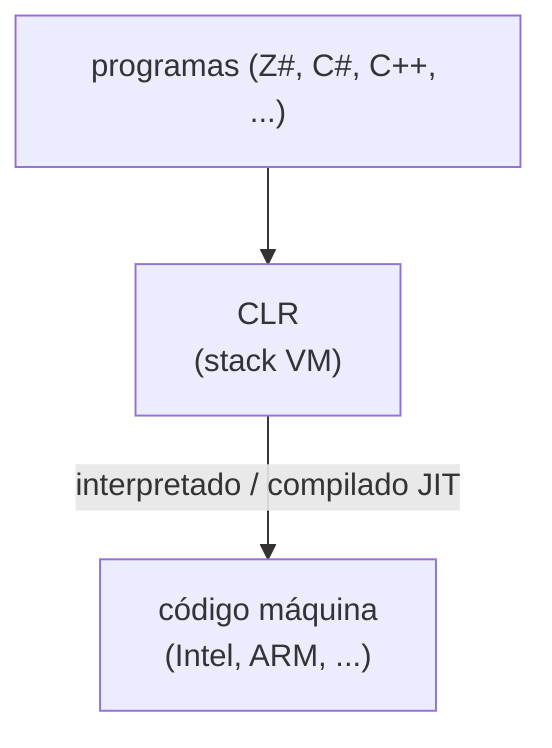

- No hay registros: en su lugar existe el **`estack`** (*expression stack*), sobre el cual se cargan valores.
- `esp` = *expression stack pointer*, apunta al tope de la pila.
- El tamaño máximo de la pila se guarda como **metadato** de cada método (`.maxstack` en el CIL emitido).
- El CLR **ejecuta bytecode compilado JIT**: cada método se compila justo antes de su primera ejecución
  (*just-in-time*). Los operandos se direccionan simbólicamente en el IL (la información está en los
  metadatos).

#### Responsabilidades del CLR (preguntas típicas de examen)

El video "generación de código en COMPI" lista explícitamente estas responsabilidades, que el compilador **no**
tiene que implementar porque las resuelve el CLR automáticamente:

1. **Recolección de basura** (*garbage collector*): limpia automáticamente los objetos del heap que ya no
   tienen referencias. Contrasta con C/C++, donde el desarrollador debía hacer `malloc`/`delete` explícitos e
   indicar incluso la cantidad de bytes a reservar.
2. **Asignación de memoria** (memory allocation).
3. **Compilación Just-In-Time (JIT)**: determina cuándo se ejecuta el código y hace pequeñas optimizaciones.
4. **Seguridad y manejo de errores**: sostiene mecanismos como `try`/`catch` (excepciones).

> **Aclaración del profesor:** "cuando yo traduzco desde mi lenguaje al SIL, hay cosas que yo coloco en SIL que
> son bastante simples de implementar. Si lo tuviera que hacer para otro tipo de microprocesador, yo tendría
> que generar todas las rutinas básicas" — es decir, el CLR le ahorra al compilador (y a COMPI) reimplementar
> GC, manejo de pila de llamadas, etc.

#### Cómo trabaja una stack machine — ejemplo canónico del deck: `i = i + j * 5;`

Este es el ejemplo base que reaparece en casi todas las transcripciones. Supongamos `i = 3`, `j = 4` (ya
cargados previamente en `locals[0]` e `locals[1]`):

| Instrucción | Efecto | Pila resultante (tope a la derecha) |
|---|---|---|
| `ldloc.0` | carga `locals[0]` (i = 3) | `3` |
| `ldloc.1` | carga `locals[1]` (j = 4) | `3, 4` |
| `ldc.i4.5` | carga la constante 5 | `3, 4, 5` |
| `mul` | multiplica los dos elementos del tope (4 × 5 = 20) | `3, 20` |
| `add` | suma los dos elementos del tope (3 + 20 = 23) | `23` |
| `stloc.0` | saca el tope (23) y lo guarda en `locals[0]` (i) | *(vacía)* |

> **Regla de examen remarcada en el deck:** *"At the end of every statement the expression stack is empty!"*
> ("Al final de cada sentencia la pila de expresiones queda vacía"). Es una invariante clave: cualquier
> traducción correcta de una sentencia debe dejar el `estack` vacío al terminar.

---

### 4. Áreas de datos del CLR: method state, stack frames y heap

El CLR administra dos grandes áreas de datos:

#### 4.1 Method state (registro de activación) y stack frames

Cada vez que se invoca un método se crea un **method state** (MS) — lo que en otras materias se llama
**registro de activación**. El *method state* contiene tres áreas:

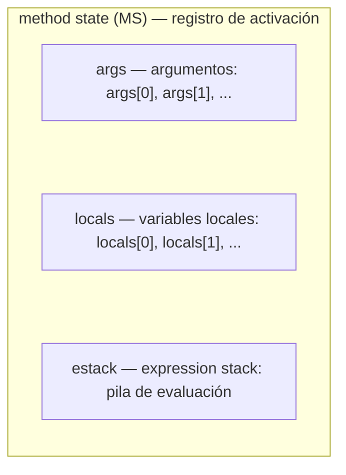

- **args**: argumentos del método. `ldarg.n` carga `args[n]`; `starg.s b` guarda en `args[b]`.
- **locals**: variables locales. `ldloc.n` carga `locals[n]`; `stloc.n` guarda en `locals[n]`.
- **estack**: pila de expresiones, usada para evaluar subexpresiones.
- Cada parámetro y cada variable local ocupa un **slot** de tamaño dependiente del tipo; las direcciones son
  **números consecutivos que reflejan el orden de declaración** (p.ej. `int x, y, z;` → `x` = `locals[0]`,
  `y` = `locals[1]`, `z` = `locals[2]`).

Cuando un método llama a otro, se crea un **nuevo** method state, que se apila sobre los anteriores. Al
conjunto de todos los method states apilados se lo llama **stack frames**:

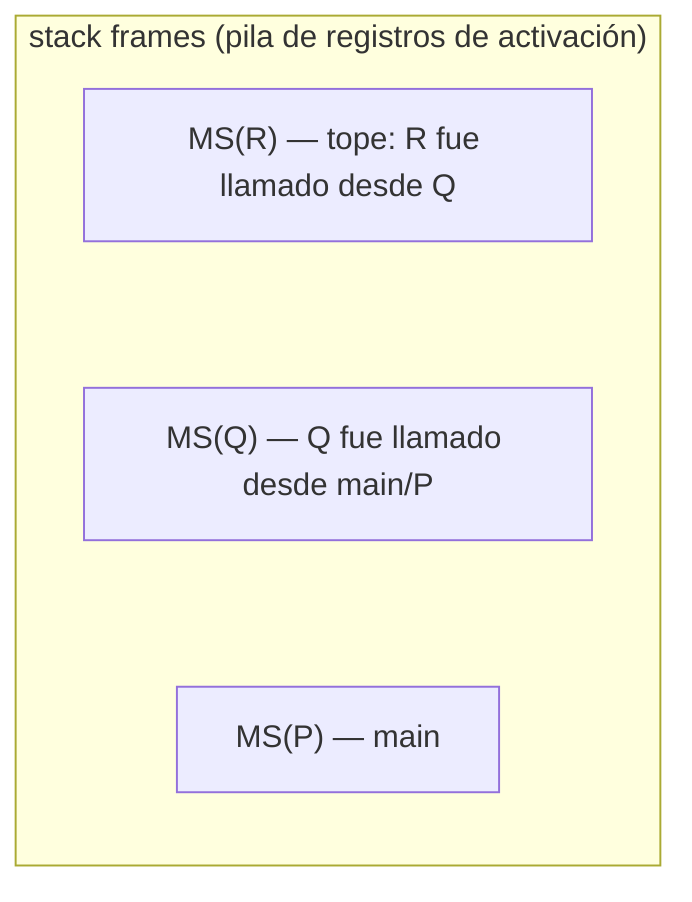

> **Aclaración del profesor:** "cada método llama a su propio method state o registro de activación... de
> manera tal que una vez creado el registro para el main, es administrado en el stack, pero ya es un stack más
> grande, y por lo tanto se llama **stack frames**". Y sobre por qué hace falta guardar todo esto: "si un
> método está usando recursión, tengo que guardar todo esto porque al final, cuando llega al punto de retorno,
> tengo que ir recuperando valores... por eso tengo que guardar todo esto".

En COMPI, al ser un compilador de una sola clase y un solo método (`Main`), en la práctica solo existe **un**
method state activo, pero conceptualmente (y en la gramática, que sí permitiría extenderlo) el mecanismo es el
mismo que en cualquier programa con llamadas anidadas.

#### 4.2 El heap

El **heap** (montículo) contiene los **objetos de clase** y los **objetos de arreglo** (a diferencia de args,
locals y estack, que viven en los stack frames).

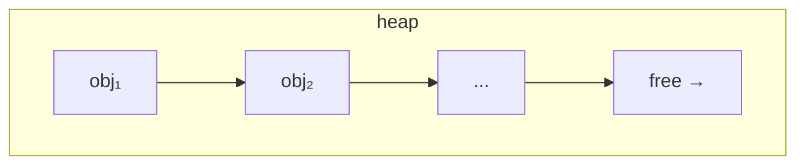

- Los nuevos objetos se asignan en la posición `free`, que se va incrementando; esto lo hacen las instrucciones
  CIL **`newobj`** (para objetos de clase) y **`newarr`** (para arreglos).
- Los objetos se **desalojan automáticamente por el garbage collector** cuando dejan de tener referencias (a
  diferencia de C++, donde había que hacer `delete` / gestión manual).
- **Objetos de clase**: se direccionan por **campo relativo al objeto** (*field token relative to `obj`*). Por
  ejemplo, `class X { int a, b; char c; }` con `X obj = new X;` — los campos `a`, `b`, `c` están direccionados
  por *field token* relativo a la dirección base de `obj`.
- **Objetos de arreglo**: se direccionan por **índice relativo a la base del arreglo** (p.ej. `a[3]`). El hecho
  de que todos los elementos tengan el mismo tamaño permite acceso directo (no hace falta recorrer los
  elementos anteriores).
- **Z# solo soporta vectores** (arreglos de una dimensión, índices desde 0); las instrucciones CIL específicas
  para esto son **`newarr`, `ldlen`, `ldelem`, `stelem`**.
- Esta parte del lenguaje (clases, arreglos, campos) **no está implementada en COMPI**: el profesor la muestra
  solo a nivel conceptual y la propone como posible ampliación de trabajo final.

> **Regla de examen:** "el stack frame (con args, variables locales y expression stack) se va guardando en un
> stack, mientras que los objetos se guardan en el heap" — dos áreas de datos claramente separadas, con
> mecanismos de liberación distintos (pila vs. garbage collector).

---

### 5. Catálogo de instrucciones CIL vistas en la materia

#### 5.1 Carga y almacenamiento de argumentos

| Instrucción | Efecto en la pila | Semántica |
|---|---|---|
| `ldarg.n` (n = 0..3) | `..., → ..., val` | `push(args[n])` |
| `ldarg.s b` | `..., → ..., val` | `push(args[b])` |
| `starg.s b` | `..., val → ...` | `args[b] = pop()` |

#### 5.2 Carga y almacenamiento de variables locales

| Instrucción | Efecto en la pila | Semántica |
|---|---|---|
| `ldloc.n` (n = 0..3) | `..., → ..., val` | `push(locals[n])` |
| `ldloc.s b` | `..., → ..., val` | `push(locals[b])` |
| `stloc.n` (n = 0..3) | `..., val → ...` | `locals[n] = pop()` |
| `stloc.s b` | `..., val → ...` | `locals[b] = pop()` |

#### 5.3 Carga de constantes

| Instrucción | Efecto en la pila | Semántica |
|---|---|---|
| `ldc.i4.n` (n = 0..8) | `..., → ..., n` | `push(n)` — forma corta para constantes chicas |
| `ldc.i4 i` | `..., → ..., i` | `push(i)` — forma general, cualquier entero de 32 bits |
| `ldc.i4.m1` | `..., → ..., -1` | `push(-1)` |
| `ldnull` | `..., → ..., null` | `push(null)` |
| `ldstr` | `..., → ..., "str"` | carga una cadena literal (usada, p.ej., para imprimir separadores en `write`) |

#### 5.4 Aritmética

| Instrucción | Efecto en la pila | Semántica |
|---|---|---|
| `add` | `..., val1, val2 → ..., val1+val2` | `push(pop() + pop())` |
| `sub` | `..., val1, val2 → ..., val1-val2` | `push(-pop() + pop())` |
| `mul` | `..., val1, val2 → ..., val1*val2` | `push(pop() * pop())` |
| `div` | `..., val1, val2 → ..., val1/val2` | `x = pop(); push(pop() / x)` |
| `rem` | `..., val1, val2 → ..., val1%val2` | `x = pop(); push(pop() % x)` |
| `neg` | `..., val → ..., -val` | `push(-pop())` |

> Nota conceptual: aunque las fórmulas de la CLR se escriben con dos `pop()` consecutivos, en la práctica hay
> que leerlas "de adentro hacia afuera": el **primer** `pop()` que aparece en la fórmula saca el valor que
> estaba **más arriba** en la pila (el que se cargó último). Por eso en `sub` y `div` el orden importa: el
> segundo operando cargado es el que se resta/divide.

#### 5.5 Manipulación de pila

| Instrucción | Efecto | Semántica |
|---|---|---|
| `pop` | `..., val → ...` | descarta el tope de la pila (lo "tira a la basura") |
| `dup` | `..., val → ..., val, val` | duplica el tope |

#### 5.6 Control de flujo

| Instrucción | Semántica |
|---|---|
| `call` | invoca un método; sus argumentos se sacan implícitamente de la pila |
| `ret` | retorno del método (abreviatura de *return*) |
| `br <label>` | salto incondicional |
| `beq / bge / bgt / ble / blt / bne.un <label>` | saltos condicionales (*branch if equal/greater-equal/greater-than/less-equal/less-than/not-equal*), comparan los dos valores del tope de la pila |

#### 5.7 Campos (objetos y variables globales/estáticas)

| Instrucción | Semántica |
|---|---|
| `ldsfld Tfld` | `push(statics[Tfld])` — carga variable estática/global |
| `stsfld Tfld` | `statics[Tfld] = pop()` — guarda en variable estática/global |
| `ldfld Tfld` | `obj = pop(); push(heap[obj+Tfld])` — carga campo de objeto (la dirección del objeto ya debe estar en la pila) |
| `stfld Tfld` | `val = pop(); obj = pop(); heap[obj+Tfld] = val` — guarda campo de objeto |

#### 5.8 Objetos y arreglos (heap)

| Instrucción | Semántica |
|---|---|
| `newobj` | crea un nuevo objeto de clase en el heap |
| `newarr` | crea un nuevo arreglo en el heap |
| `ldlen` | longitud de un arreglo |
| `ldelem.*` (p.ej. `ldelem.i4`, `ldelem.ref`) | carga un elemento de arreglo |
| `stelem.*` (p.ej. `stelem.i2`, `stelem.i4`, `stelem.ref`) | guarda un elemento de arreglo |

#### 5.9 Metadatos importantes que aparecen en el código emitido (no son "instrucciones" en sí, son directivas)

- `.locals init (int32 V_0, int32 V_1, ...)`: declara el arreglo de variables locales de un método y sus
  tipos, con nombres generados automáticamente `V_0`, `V_1`, ... (los nombres del código fuente, `i`, `j`, `x`,
  desaparecen al bajar a CIL: solo quedan **posiciones dentro del arreglo `locals`**).
- `.entrypoint`: marca el método que es el punto de entrada del programa (`Main`).
- `.maxstack N`: tamaño máximo que alcanzará la pila de expresiones durante la ejecución del método (metadato
  calculado automáticamente por `System.Reflection.Emit`).

> **Aclaración remarcada por el profesor:** "acuérdense que cuando me voy al SIL desaparecen estos nombres I,
> J, K, etc. Y lo que quedan son posiciones dentro del arreglo local" — es una de las ideas más preguntadas en
> examen: **el nombre de la variable es un concepto de la tabla de símbolos / código fuente; en CIL solo existe
> el índice dentro de `locals`.**

---

### 6. Modos de direccionamiento

El deck lista los modos de direccionamiento del CLR y su instrucción representativa:

| Modo de direccionamiento | Instrucción de ejemplo | Dónde está el operando |
|---|---|---|
| **Immediate** (inmediato) | `ldc.i4 123` | el valor viaja embebido en la instrucción (constantes) |
| **Arg** | `ldarg.s 5` | área de argumentos del method state |
| **Local** | `ldloc.s 12` | área de variables locales del method state |
| **Static** | `ldsfld fld` | campo estático (`fld` = token de metadatos) |
| **Stack** | `add` | valores ya cargados en el `estack` (operandos implícitos) |
| **Relative** (relativo) | `ldfld fld` | campo de objeto; la referencia al objeto ya está en el `estack` |
| **Indexed** (indexado) | `ldelem.i4` | elemento de arreglo; la referencia al arreglo y el índice ya están en el `estack` |

Cada instrucción "sabe" (por su propio código de operación) qué modo de direccionamiento usar; por eso el
generador de código, para "cargar un operando", primero debe determinar de qué **kind** es ese operando (ver
sección 9, `Item.Kinds`) y en función de eso elegir la instrucción de carga correcta.

---

### 7. `System.Reflection.Emit`: el workflow de generación dinámica de código

#### 7.1 Generación estática vs. dinámica

.NET permite generar código IL de dos formas:

- **Estática**: se genera *todo* el CIL antes de ejecutar nada, típicamente con una herramienta como
  **`ilasm.exe`** (el ensamblador de MSIL), que produce un **PE** (*Portable Executable*, el `.exe`).
- **Dinámica**: el código se genera **en tiempo de ejecución**, usando la librería
  **`System.Reflection.Emit`**, lo que da mayor flexibilidad/adaptabilidad.

**COMPI usa generación dinámica**: literalmente "un programa dentro de otro programa" — COMPI (que está
escrito en C#/Z#) se ejecuta, y **mientras se ejecuta** (a medida que el parser avanza sobre el programa
fuente) va emitiendo instrucciones CIL para el programa que está compilando.

> **Aclaración del profesor:** "esto como se va generando: se va generando a medida que el parser avanza en el
> análisis del programa fuente. Ahí, como hemos visto, se va generando la tabla de símbolos y llamando a los
> métodos que son encargados de generar el código." Y más adelante: "porque un compilador es de una sola
> pasada, a medida que eso va sucediendo, también va emitiendo código."

#### 7.2 Los cinco componentes de `System.Reflection.Emit`

`System.Reflection.Emit` es un espacio de nombres de .NET que da clases y métodos para generar y manipular
código y metadatos en tiempo de ejecución. Tiene **cinco componentes**, anidados unos dentro de otros (como un
diagrama de Venn, el más externo contiene a los demás):

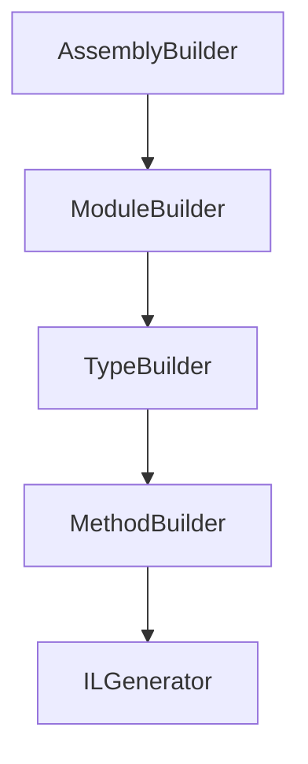

| Componente | Rol |
|---|---|
| **`AssemblyBuilder`** | representa/define un **ensamblado** dinámico (el más externo) |
| **`ModuleBuilder`** | representa un **módulo** dentro del ensamblado |
| **`TypeBuilder`** | representa una **clase** (tipo) dentro del módulo |
| **`MethodBuilder`** | representa un **método** dentro de la clase |
| **`ILGenerator`** | el **generador de instrucciones**: permite emitir el stream de CIL dentro de un método |

**Orden obligatorio de emisión (regla de examen muy insistida en las transcripciones):** para poder emitir una
instrucción dentro de un método, **primero** hace falta tener el ensamblado, **después** el módulo, **después**
la clase, **después** el método, y **recién ahí** se puede emitir instrucciones (incluida la declaración de
variables locales) dentro de ese método.

> **Cita textual del profesor (gener de cod parte 1, `[17:25]`–`[20:34]`):** "yo no puedo decir que almacene
> todo esto en la variable x... si yo no tengo previamente [...] generado [el] `.locals init` [...] Yo no puedo
> emitir esta instrucción del SIL si no tengo previamente el método en donde está metido este `int x` [...]
> Yo no puedo generar la instrucción SIL para el método [si] previamente no he generado la clase a la que
> pertenece este método. Entonces primero la clase, después el método, después este local, y recién puedo
> hablar de este store."

Este orden se refleja directamente en el código real de COMPI, en el método `CreateMetadata` (ver sección 16):
primero `case Symbol.Kinds.Prog` (crea el `AssemblyBuilder`, el `ModuleBuilder` y el `TypeBuilder` del programa
principal), luego `case Symbol.Kinds.Type` / `Meth` (crea la clase/método y su `ILGenerator`), y solo entonces
`case Symbol.Kinds.Local` puede declarar variables locales con `il.DeclareLocal(...)`.

#### 7.3 Sintaxis de emisión: `il.Emit`

Desde C#, para generar una instrucción CIL se usa el método `Emit` de la clase `ILGenerator`. Ejemplo del deck:

```csharp
// Generando ldloc.2:
Code.il.Emit(Code.LDLOC2);
```

La clase `ILGenerator` tiene varias sobrecargas de `Emit`, según el tipo de operando que necesite la
instrucción:

```csharp
class ILGenerator {
    // instrucciones sin operando explícito: ldarg.n, ldloc.n, stloc.n, ldnull,
    // ldc.i4.n, ld.i4.m1, add, sub, mul, div, rem, neg, ldlen, ldelem..., stelem..., dup, pop, ret, throw
    virtual void Emit (OpCode op);

    void Emit (OpCode, byte);          // ldarg.s, starg.s, ldloc.s, stloc.s
    void Emit (OpCode, int);           // ldc.i4
    void Emit (OpCode, FieldInfo);     // ldsfld, stsfld, ldfld, stfld
    void Emit (OpCode, LocalBuilder);  // ldloc.s, stloc.s
    void Emit (OpCode, ConstructorInfo); // newobj
    void Emit (OpCode, Type);          // newarr
    void Emit (OpCode, Label);         // br, beq, bge, bgt, ble, blt, bne.un

    void EmitCall (OpCode, MethodInfo, Type[] varArgs); // call
}
```

Y los *handles* de cada instrucción están definidos como constantes en la clase `Code` con nombres abreviados,
por ejemplo:

```csharp
static readonly OpCode LDARG0 = OpCodes.Ldarg_0, ...
                        LDARG  = OpCodes.Ldarg_S, ...
                        LDC0   = OpCodes.Ldc_I4_0, ...
                        ADD    = OpCodes.Add, ...
                        BEQ    = OpCodes.Beq, ...
```

(Esto se corresponde 1 a 1 con las constantes reales que aparecen en `miCodGen.cs`, ver sección 16.)

---

### 8. Metadatos y `il.DeclareLocal(sym.type.sysType)`

#### 8.1 ¿Qué es un metadato?

Un **metadato** es literalmente "un dato acerca de un dato" (*data about data*). En el contexto del CLR: es la
información estructural sobre tipos, campos, métodos, tamaños de pila, etc. que el CLR necesita para poder
ejecutar el CIL correctamente. Ejemplos concretos vistos en clase:

- El tamaño máximo de la pila de un método (`.maxstack`) es un metadato, y se calcula automáticamente.
- `typeof(int)` (en el deck, escrito como `type of int`) es un metadato: representa el **tipo del sistema del
  CLR** correspondiente al entero de Z#. No se puede usar una sintaxis arbitraria para esto — tiene que ser
  exactamente `typeof(int)` (o `typeof(char)`), porque es la forma en la que .NET expone su propio catálogo de
  tipos vía reflection.
- Cuando el compilador necesita traducir `int x;` a CIL (algo como `.locals init (int32 V_0)`), **no puede
  inventar** esa traducción: tiene que apoyarse en el metadato correcto (`typeof(int)`), que ya viene resuelto
  desde antes por la tabla de símbolos.

En el `Struct` (el nodo de tipo de la tabla de símbolos) se agrega, además de los campos vistos en semanas
anteriores, un campo nuevo: **`sysType`** — "el tipo del sistema del CLR". Este campo cuelga (apunta a)
`typeof(int)` o `typeof(char)` según corresponda, y se llena en el constructor del `Struct` según el `kind`:

```csharp
// (glosado sobre la explicación en video; forma conceptual del constructor real, no textual del repo)
public Struct(Kinds kind) : this(kind, null) { }
public Struct(Kinds kind, Struct elemType) {
    this.kind = kind;
    switch (kind) {
        case Kinds.Int:  sysType = typeof(int);  break;
        case Kinds.Char: sysType = typeof(char); break;
        // ...
    }
}
```

> **Aclaración del profesor:** "conceptualmente lo nuevo son solo dos punteros a metadatos [...] todo lo otro
> es sintaxis. Lo único realmente nuevo es agregar este campito (`sysType`) y que cuelgue de `typeof(int)` /
> `typeof(char)`."

#### 8.2 `il.DeclareLocal(sym.type.sysType)` — regla de examen

Cuando el compilador necesita declarar una variable local en el CIL emitido (por ejemplo al procesar
`Symbol.Kinds.Local` dentro de `Code.CreateMetadata`), llama a:

```csharp
LocalBuilder vbleLocalDin = il.DeclareLocal(sym.type.sysType);
```

Esta línea aparece literalmente en `miCodGen.cs` (método `CreateMetadata`, caso `Symbol.Kinds.Local`). Las dos
piezas clave a explicar (ambas son reglas de examen explícitamente remarcadas):

- **`il`** es el **`ILGenerator`** del método que se está compilando en ese momento (campo estático
  `internal static ILGenerator il;` de la clase `Code`). Llamar `il.DeclareLocal(...)` **asocia el metadato de
  la variable local (apuntada por `sym`) al metadato del método en donde se está definiendo esa variable** —
  es decir, la variable local queda registrada como parte de la tabla de variables locales (`.locals init`)
  **del método actualmente activo**, el que corresponde al `ILGenerator` vigente en `il`. Por eso el orden
  "clase → método → local" (sección 7.2) es obligatorio: sin un método (y su `il`) ya creado, no hay dónde
  colgar la declaración de la variable local.
- **`sym.type.sysType`** es el argumento que se le pasa a `DeclareLocal`, y **apunta al metadato de tipo de la
  variable local cuyo metadato se está definiendo**. `sym` es el `Symbol` de la tabla de símbolos
  correspondiente a esa variable; `sym.type` es su `Struct` (el nodo de tipo); y `sym.type.sysType` es
  precisamente el metadato de tipo del CLR (`typeof(int)` o `typeof(char)`) que corresponde a ese `Struct`. En
  otras palabras: se le dice a `ILGenerator` "declarame una variable local **de este tipo del sistema**", y el
  tipo del sistema es el que ya quedó resuelto en la tabla de símbolos desde que se creó el `Struct`.
- El valor de retorno, un **`LocalBuilder`**, es el metadato concreto de esa variable local recién declarada
  (se puede usar luego para emitir `ldloc`/`stloc` por referencia al objeto, en vez de por índice numérico,
  aunque COMPI en la práctica emite por índice usando `sym.adr`, ver sección 16).

---

### 9. Los `Item` e `Item.Kinds`: cómo el compilador rastrea dónde está cada operando

#### 9.1 El problema que resuelve `Item`

Cuando el compilador procesa una expresión, en cada punto necesita saber **de qué tipo es un operando y dónde
está ubicado** (¿es una constante? ¿un argumento? ¿una variable local? ¿ya está cargado en la pila?), porque
**la instrucción de carga a generar depende de esa ubicación**:

| Tipo de operando | Instrucción a generar |
|---|---|
| constante | `ldc.i4 x` |
| argumento de método | `ldarg.s a` |
| variable local | `ldloc.s a` |
| variable global | `ldsfld Tfld` |
| campo de objeto | `getfield a` (`ldfld`) |
| elemento de arreglo | `ldelem` |
| valor ya cargado en la pila | *(nada — ya está)* |

Para resolver esto de forma unificada, el compilador usa un **descriptor**, el `Item`, que mantiene esa
información durante la generación de código.

#### 9.2 `Item.Kinds`

```csharp
class Item {
    enum Kinds { Const, Arg, Local, Static, Stack, Field, Elem, Meth }
    Kinds kind;    // en qué área de datos está el operando en este momento
    Struct type;   // tipo del operando
    int val;       // Const: el valor de la constante
    int adr;       // Arg, Local: la dirección (índice) dentro de args/locals
    Symbol sym;    // Field, Meth: el nodo de la tabla de símbolos
}
```

| Item kind | Info que guarda | Área de datos |
|---|---|---|
| `Const` | valor constante (`val`) | *(embebido en la instrucción)* |
| `Arg` | dirección (`adr`) | `args` |
| `Local` | dirección (`adr`) | `locals` |
| `Static` | símbolo de campo (`sym`, con `Tfld`) | `statics` |
| `Stack` | *(nada — ya está en la pila)* | `estack` |
| `Field` | símbolo de campo (`sym`, con `Tfld`) | `estack` (dirección base) + heap |
| `Elem` | *(nada extra; usa índice y base ya en pila)* | `estack` (base + índice) + heap |
| `Meth` | símbolo de método (`sym`) | — |

> **Aclaración importante del profesor:** "este `kind` [de `Item`] no tiene nada que ver con el `kind` de la
> tabla de símbolos o con el `kind` del token. Este descriptor lo utilizo únicamente para saber qué instrucción
> tengo que emitir." Es decir, `Item.Kinds` es un **concepto propio de la etapa de generación de código**,
> paralelo (pero distinto) a `Symbol.Kinds` de la tabla de símbolos.

#### 9.3 El `Item` cambia de `kind` a medida que se genera código

Un mismo operando puede pasar por distintos `Item.Kinds` a lo largo de su procesamiento: por ejemplo, una
variable local arranca como `Item.Kinds.Local` (todavía no está cargada), y **después de emitir el `ldloc`
correspondiente**, el compilador actualiza el campo `kind` del `Item` a `Item.Kinds.Stack` (ya está en la
pila). Esto es literal en el código real (ver `Code.Load` en la sección 16): la última línea del método es
`x.kind = Item.Kinds.Stack;`.

#### 9.4 Ejemplo de construcción de `Item`s (slides 28-33 del deck)

- **Constructor a partir de un símbolo de la tabla:**
  ```csharp
  public Item(Symbol sym) {
      type = sym.type; val = sym.val; adr = sym.adr; this.sym = sym;
      switch (sym.kind) {
          case Symbol.Kinds.Const:  kind = Kinds.Const; break;
          case Symbol.Kinds.Arg:    kind = Kinds.Arg;   break;
          case Symbol.Kinds.Local:  kind = Kinds.Local; break;
          case Symbol.Kinds.Global: kind = Kinds.Static; break;
          case Symbol.Kinds.Field:  kind = Kinds.Field;  break;
          case Symbol.Kinds.Meth:   kind = Kinds.Meth;   break;
      }
  }
  ```
- **Constructor a partir de una constante literal:**
  ```csharp
  public Item(int val) { kind = Kinds.Const; type = Tab.intType; this.val = val; }
  ```

**Ejemplo — cargar un número literal (Factor → number):**

```
Factor<Item x> = number
    (. x = new Item(token.val);     // x.kind = Const
       Code.Load(x);                // x.kind = Stack, emite ldc.i4 17
    .)
```

Al leer el número `17`, se construye `x = new Item(17)` (kind = `Const`, val = 17). Luego `Code.Load(x)`
inspecciona `x.kind` y, al ser `Const`, llama a `LoadConst(17)`, que emite `ldc.i4 17`. Finalmente el propio
`Load` deja `x.kind = Stack` (el valor ya está en la pila).

**Ejemplo — cargar un argumento o variable local (Designator → ident):**

```
Designator<Item x> = ident
    (. Symbol sym = Tab.Find(token.str);   // sym.kind = Const | Arg | Local | Global
       x = new Item(sym);                  // x.kind = Const | Arg | Local | Static
       Code.Load(x);                       // x.kind = Stack
    .)
```

Al leer un identificador, primero se busca el `Symbol` en la tabla (`Tab.Find`), se construye el `Item` a partir
de ese símbolo (heredando su `kind` correspondiente), y luego `Code.Load(x)` emite la instrucción adecuada
(`ldarg.n` si era `Arg`, `ldloc.n` si era `Local`, etc.) y deja `x.kind = Stack`.

#### 9.5 `Code.Load(Item x)`: el switch central

```csharp
public static void Load (Item x) {
    switch (x.kind) {
        case Item.Kinds.Const:
            if (x.type == Tab.nullType) il.Emit(LDNULL);
            else LoadConst(x.val);
            break;
        case Item.Kinds.Arg:
            switch (x.adr) {
                case 0: il.Emit(LDARG0); break;
                case 1: il.Emit(LDARG1); break;
                // ...
                default: il.Emit(LDARG, x.adr); break;
            }
            break;
        case Item.Kinds.Local:
            switch (x.adr) {
                case 0: il.Emit(LDLOC0); break;
                // ...
                default: il.Emit(LDLOC, x.adr); break;
            }
            break;
        case Item.Kinds.Static:
            if (x.sym.fld != null) il.Emit(LDSFLD, x.sym.fld);
            break;
        case Item.Kinds.Stack:
            break; // nothing to do (already loaded)
        case Item.Kinds.Field:
            if (x.sym.fld != null) il.Emit(LDFLD, x.sym.fld);
            break;
        case Item.Kinds.Elem:
            if (x.type == Tab.charType) il.Emit(LDELEMCHR);
            else if (x.type == Tab.intType) il.Emit(LDELEMINT);
            else if (x.type.kind == Struct.Kinds.Class) il.Emit(LDELEMREF);
            break;
    }
    x.kind = Item.Kinds.Stack;
}
```

Esto es exactamente lo que hay en `miCodGen.cs` (con algunos agregados de instrumentación de la interfaz
gráfica de COMPI, ver sección 16). El caso `Item.Kinds.Stack` es notable: **si el valor ya está en la pila, no
se emite ninguna instrucción** — `Load` es idempotente sobre un valor ya cargado.

---

### 10. Traducción de expresiones aritméticas: gramática atribuida y ejemplo paso a paso

#### 10.1 El patrón general para sumar/multiplicar dos operandos

```
desired code pattern:
    load operand 1
    load operand 2
    <op>          (add / mul / sub / div)
```

Cargar un operando depende de su clase (constante → `ldc.i4`; argumento → `ldarg.s`; variable local →
`ldloc.s`; variable global → `ldsfld`; campo de objeto → `getfield`; elemento de arreglo → `ldelem`; valor ya
en la pila → nada).

#### 10.2 La gramática atribuida (ATG) pospone el operador hasta el final del subárbol

Idea central, remarcada varias veces en las transcripciones de "Expresiones en CIL": **al analizar un operador
(`+`, `*`), la gramática NO emite inmediatamente la instrucción `add`/`mul`.** En cambio:

1. Primero se traduce (y se cargan en la pila) el operando izquierdo.
2. Luego se traduce (y se carga) el operando derecho.
3. **Recién cuando termina de parsear todo el subárbol** (es decir, cuando ya se sabe con certeza que ambos
   operandos quedaron cargados), se emite la instrucción de la operación.

> **Cita textual:** "cuando se está analizando el más, lo que va a hacer la gramática es, no va a colocar un
> add [...] sino que va a decir: una vez que termine el sumando izquierdo y el sumando derecho, al final va a
> agregar la instrucción de suma add [...] acá está posponiendo esta instrucción add."

Esto se ve reflejado en la ATG real del deck (`Expr`, `Term`, `Factor`):

```
Expr<Item x> (. Item y; OpCode op; .)
=  ( "-" Term<x>            (. if (x.kind == Const) x.val = -x.val;
                                else { Code.Load(x); Code.il.Emit(NEG); } .)
   | Term<x>
   )
   { ( "+" (. op = ADD; .) | "-" (. op = SUB; .) )
     (. Code.Load(x); .)
     Term<y> (. Code.Load(y);
                Code.il.Emit(op);      // recién ACÁ se emite add/sub
             .)
   }
.
```

```
Term<Item x> (. Item y; OpCode op; .)
=  Factor<x>
   { ( "*" (. op = MUL; .) | "/" (. op = DIV; .) | "%" (. op = REM; .) )
     (. Code.Load(x); .)
     Factor<y> (. Code.Load(y);
                  Code.il.Emit(op);    // recién ACÁ se emite mul/div/rem
               .)
   }
.
```

```
Factor<Item x>
=  Designator<x>
|  number    (. x = new Item(token.val); .)
|  charConst (. x = new Item(token.val); x.type = Tab.charType; .)
|  "(" Expr<x> ")"
.
```

#### 10.3 Ejemplo del video "Expresiones en CIL": `7 + 3 * 2`

Traza narrada en las transcripciones (Parte 1, Parte 2 y Parte 3), instrucción por instrucción, para
`x = 7 + 3 * 2;`:

1. Se analiza `7` → se genera `ldc.i4 7` (posterga el `+`).
2. Se analiza `3` → se genera `ldc.i4 3`.
3. Se analiza `2` → se genera `ldc.i4 2` (posterga el `*`).
4. Termina el subárbol de la multiplicación (`3 * 2`) → recién ahora se emite `mul`.
5. Termina el subárbol de la suma (`7 + (3*2)`) → recién ahora se emite `add`.

Estado de la pila durante la ejecución (según la traza explicada por el profesor):

| Paso | Instrucción | Pila (tope a la derecha) |
|---|---|---|
| 1 | `ldc.i4 7` | `7` |
| 2 | `ldc.i4 3` | `7, 3` |
| 3 | `ldc.i4 2` | `7, 3, 2` |
| 4 | `mul` (saca 2 y 3, deja 3×2=6) | `7, 6` |
| 5 | `add` (saca 6 y 7, deja 7+6=13) | `13` |

> **Cita textual sobre `mul`:** "el múl toma los dos elementos a multiplicar del tope de la pila y del
> siguiente al tope [...] toma el 2, toma el 3 [...] y lo que va a hacer es multiplicarlos, entonces el 2 por 3
> es 6, este 6 lo deja en el tope, como nuevo tope de la pila."

> **Cita textual sobre `add`:** "los dos argumentos implícitos son el tope de la pila y el siguiente [...]
> ahora lo que va a hacer es tomar el 6 [...] luego va a tomar el 7 de la pila [...] y luego va a sumar el 6 y
> el 7, y 6 más 7 me va a producir el 13, y el 13 es el nuevo tope de la pila."

Luego, la asignación a `x` (int `x, y, z;` → `x` = `locals[0]`) agrega el patrón completo:

```
.locals init (int32 V_0, int32 V_1, int32 V_2)   ; x=locals[0], y=locals[1], z=locals[2]
ldloc.0        ; carga (innecesariamente) el valor actual de x -> 0 (valor por defecto)
ldc.i4 7
ldc.i4 3
ldc.i4 2
mul            ; 3*2 = 6
add            ; 7+6 = 13
stloc.0        ; saca el 13 y lo guarda en locals[0] (x=13); queda el 0 (del ldloc.0 inicial) como tope
pop            ; descarta ese 0 sobrante -> la pila queda vacía
; luego el write x,3:
ldloc.0        ; copia el valor de x (13) a la pila
ldc.i4 3       ; ancho de impresión (3 lugares)
call write     ; imprime "13" ocupando 3 lugares y saca ambos argumentos de la pila
ret
```

> **Por qué aparece el `ldloc.0` inicial "inútil" (regla de examen):** el compilador genera código de forma
> **uniforme** para el lado izquierdo de una asignación (`Designator`), sin distinguir todavía, en ese punto
> del parsing, si el destino final será una variable simple, un elemento de arreglo (`a[i] = expr`) o un campo
> de objeto (`obj.f = expr`). En esos dos últimos casos hace falta tener la **dirección base** (del arreglo o
> del objeto) cargada en la pila *antes* de evaluar la expresión de la derecha, para que después la instrucción
> de store (`stelem`/`stfld`) pueda tomarla. Para el caso más simple (variable local), ese valor cargado de más
> no tiene ningún uso — es sencillamente el valor que ya tenía la variable (0 por defecto, si no se le asignó
> nada antes) — y por eso, luego de hacer el `stloc.0` con el resultado de la expresión, sobra ese valor viejo
> en el tope de la pila. La instrucción **`pop`** existe exactamente para descartarlo y así **preservar la
> invariante de que la pila queda vacía al final de cada sentencia** (ver la cita del deck en la sección 3).
>
> **Cita textual:** "como el compilador también tiene que funcionar no solamente para el caso de que la parte
> izquierda de la asignación sea una variable, sino que puede ser un elemento de arreglo o puede ser un objeto
> de una clase y un campo, entonces lo que hace es, antes de comenzar con estas instrucciones, hace un load
> local 0 [...] como inicialmente tiene valores cero por defecto [...] por ahora en este caso no va a tener
> ningún efecto, pero va a servir para estos casos [arreglo/campo]."
>
> **Y sobre el `pop`:** "entonces lo que necesitamos es una instrucción que lo único que haga es tirar a la
> basura el tope de la pila [...] esa instrucción es POP. Viene de los términos PUSH (colocar en la pila) y POP
> (sacar de la pila)."

Este mismo patrón (`ldloc.0` antes de evaluar la expresión, `stloc.0` + `pop` después) es visible literalmente
en el archivo real `instrucciones CIL.txt` (ver sección 13.3): cada asignación simple `IL_0000: ldloc.0` /
`IL_0006: stloc.0` / `IL_0007: pop` sigue exactamente esta forma.

---

### 11. Trace completo de pila: `2 + (7 * (3 + 5))`

Este es el ejemplo pedido explícitamente para el parcial. Programa fuente (asumido): declarar una variable
entera `x` y ejecutar `x = 2 + (7 * (3 + 5));`. Instrucciones CIL generadas (el orden surge de recorrer el
árbol de la expresión en **postorden**, aplicando el mismo patrón de la sección 10.2: cargar operandos y
posponer el operador hasta terminar cada subárbol):

```
.locals init (int32 V_0)
ldloc.0
ldc.i4 2
ldc.i4 3
ldc.i4 5
add
ldc.i4 7
mul
add
stloc.0
pop
ret
```

#### 11.1 Por qué el orden de instrucciones es ese (recorrido del árbol de expresión)

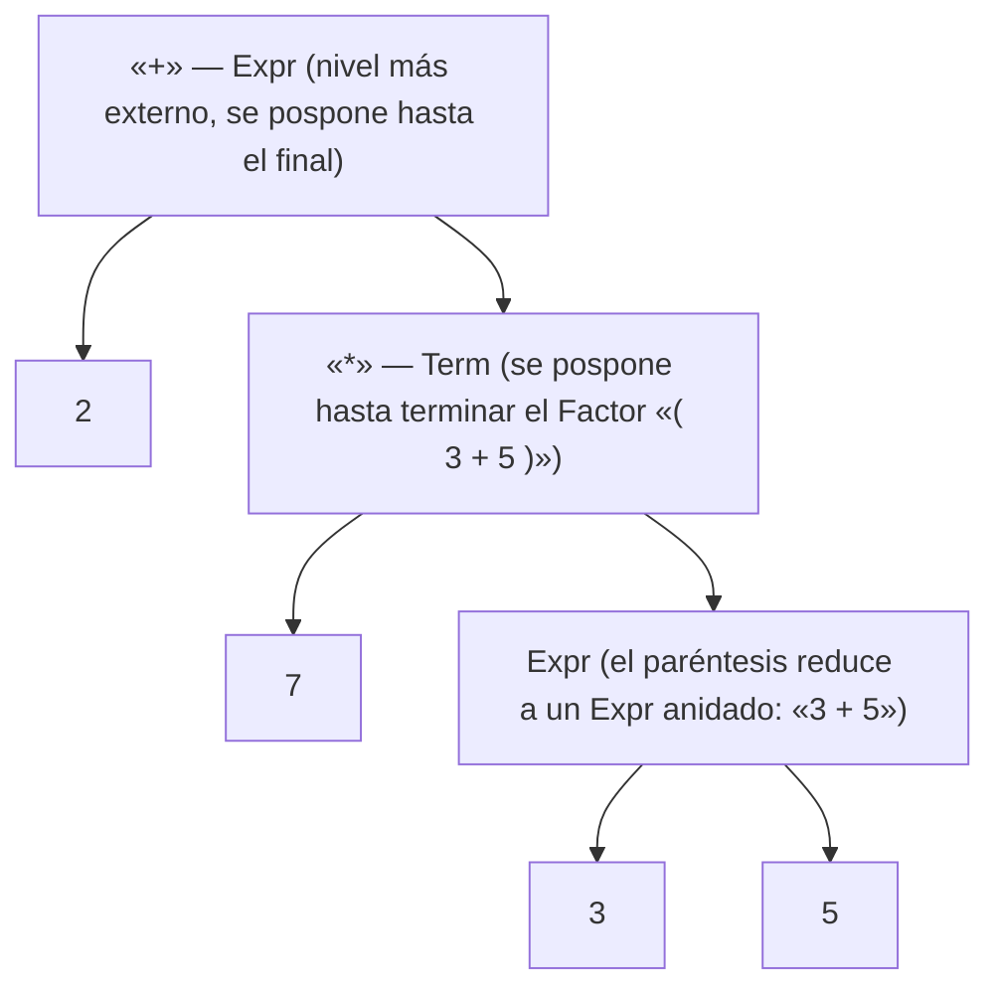

Recorrido (equivalente a un recorrido de postorden, "cargar-cargar-operar" en cada nivel, de adentro hacia
afuera): primero se emite la carga de `2` (operando izquierdo del `+` externo, se pospone el `+`); luego, para
resolver el operando derecho (`7 * (3+5)`), se emite la carga de `7` (se pospone el `*`); para resolver
`(3 + 5)` se cargan `3` y `5` y, al cerrar ese subárbol, se emite `add` (3+5); recién ahí se puede cerrar el
`*` externo, emitiendo `mul` (7 × resultado); y finalmente se cierra el `+` externo, emitiendo el segundo `add`
(2 + resultado).

#### 11.2 Trace instrucción por instrucción

Se asume `x` es la única variable local (`locals[0]`, valor por defecto 0 al no habérsele asignado nada
todavía).

| # | Instrucción | Qué hace | Pila resultante (tope a la derecha) |
|---|---|---|---|
| 0 | `.locals init (int32 V_0)` | declara `locals[0]` (metadato, no es instrucción ejecutable) | `(vacía)` |
| 1 | `ldloc.0` | `push(locals[0])` → carga el valor actual de `x` (0 por defecto). Es el "load inútil" de todo `Designator` (sección 10.3) | `0` |
| 2 | `ldc.i4 2` | `push(2)` | `0, 2` |
| 3 | `ldc.i4 3` | `push(3)` | `0, 2, 3` |
| 4 | `ldc.i4 5` | `push(5)` | `0, 2, 3, 5` |
| 5 | `add` | `push(pop()+pop())` → saca 5 y 3, empuja 3+5=**8** | `0, 2, 8` |
| 6 | `ldc.i4 7` | `push(7)` | `0, 2, 8, 7` |
| 7 | `mul` | `push(pop()*pop())` → saca 7 y 8, empuja 7×8=**56** | `0, 2, 56` |
| 8 | `add` | `push(pop()+pop())` → saca 56 y 2, empuja 2+56=**58** | `0, 58` |
| 9 | `stloc.0` | `locals[0] = pop()` → saca 58 y lo guarda en `x`. **`x` queda en 58** | `0` |
| 10 | `pop` | descarta el tope (el 0 sobrante del `ldloc.0` inicial) | `(vacía)` |
| 11 | `ret` | retorna del método | — |

**Verificación aritmética:** `2 + (7 * (3 + 5)) = 2 + (7 * 8) = 2 + 56 = 58`. Coincide exactamente con el valor
que `stloc.0` guarda en `V_0` (paso 9). Al terminar la sentencia, la pila queda vacía (paso 10), cumpliendo la
invariante de la sección 3.

#### 11.3 Por qué aparecen el `ldloc.0` inicial y el `pop` final (resumen)

- El **`ldloc.0`** inicial es generado uniformemente por el procesamiento del lado izquierdo de la asignación
  (`Designator`), *antes* de conocerse completamente qué forma tendrá el lado derecho, para dejar disponible en
  la pila la información de base que necesitarían los casos de arreglo (`a[i] = expr`, requiere `ldloc a` +
  `ldloc i` antes de la expresión) u objeto (`obj.f = expr`, requiere `ldloc obj` antes de la expresión). Para
  una variable local simple ese valor cargado no tiene ningún uso.
- El **`pop`** final es la contrapartida obligatoria: como `stloc.0` solo consume el resultado de la expresión
  (el 58) y no el valor viejo que había quedado debajo (el 0 del `ldloc.0` inicial), hace falta una instrucción
  extra que lo descarte, para que la pila termine vacía al cierre de la sentencia — la invariante que exige el
  CLR/COMPI para toda sentencia completa.

---

### 12. Patrones de código para asignaciones (5 casos)

El deck lista 5 casos de asignación, según el tipo de designador del lado izquierdo (las instrucciones en
"azul" —aquí en **negrita**— son las que genera el propio `Designator`, antes de conocerse el valor a asignar):

| Caso | Patrón de código |
|---|---|
| `localVar = expr;` | `... load expr ...` `stloc localVar` |
| `globalVar = expr;` | `... load expr ...` `stsfld TglobalVar` |
| `obj.f = expr;` | **`ldloc obj`** `... load expr ...` `stfld Tf` |
| `arg = expr;` | `... load expr ...` `starg arg` |
| `a[i] = expr;` | **`ldloc a`** **`ldloc i`** `... load expr ...` `stelem.<i2/i4/ref>` (según sea `char`, `int` u objeto) |

#### Compatibilidad de asignación (context condition)

`y` es asignment-compatible con `x` si:

- `x` e `y` tienen el mismo tipo (`x.type == y.type`), o
- `x` e `y` son arreglos con el mismo tipo de elemento, o
- `x` tiene tipo referencia (clase o arreglo) e `y` es `null`.

#### ATG de la sentencia de asignación completa

```
Assignment (. Item x, y; .)
= Designator<x>              // esta llamada ya puede generar código (el ldloc "de base")
  "=" Expr<y>
      (. Code.Load(y);
         if (y.type.AssignableTo(x.type)) Code.Assign(x, y);
         else Error("incompatible types in assignment");
      .)
  ";"
.
```

Esto se corresponde exactamente con el método real `Code.Assign(Item izq, Item der, ...)` de `miCodGen.cs`
(ver sección 16.4): según `izq.kind` (y, dentro de `Stack`, según `izq.sym.kind`: `Arg`, `Local` o `Global`),
emite `starg` / `stloc.n` + `pop` / `stsfld` + `pop`.

---

### 13. Otras sentencias: `write`, `if`/`while` y bucle real de ILDASM

#### 13.1 Código generado para `write x, 3`

Según la traza narrada en las transcripciones ("expresiones cil parte 2" y "Expresiones en CIL Parte 3"):

```
ldloc.0     ; copia el valor de x (no lo saca de la variable, lo COPIA a la pila)
ldc.i4 3    ; ancho de campo: cuántos lugares ocupa el valor impreso en pantalla
call write  ; toma los dos argumentos implícitos de la pila e imprime
```

- El primer operando (`ldloc.0`) es el **valor a imprimir**; el segundo (`ldc.i4 3`) es el **ancho de campo**
  (cuántos caracteres/columnas ocupa el valor al imprimirse; viene literalmente de la constante que el
  programador puso en la sentencia fuente `write x, 3;`).
- `call write` saca ambos argumentos de la pila e imprime; deja la pila vacía otra vez.
- Si el ancho es mayor que los dígitos necesarios, se completan con blancos a la izquierda; por eso, con dos
  `write` consecutivos con ancho 3 e imprimiendo un número de 2 dígitos, queda un espacio en blanco entre
  ambos valores impresos.

> **Aclaración remarcada por el profesor sobre compilación vs. ejecución:** "esta es la etapa de compilación...
> la etapa de ejecución, a diferencia de la etapa de compilación, es interpretada. Compilador significa que
> todas estas instrucciones se van a compilar sin ninguna ejecución [...] Ahora, cuando ejecutemos estas
> instrucciones mediante la máquina virtual, esto es interpretado. Eso significa que en el momento que ejecuta,
> por ejemplo, un `write`, en ese mismo momento va a imprimir en la pantalla un valor, no espera a terminar. Por
> eso se dice que la máquina virtual actúa como un intérprete, no como un compilador."

#### 13.2 `if`/`while`: branch sin destino y *patching*

Cuando el compilador tiene que traducir un salto condicional (`if`, `while`), **en el momento en que emite la
instrucción de branch todavía no sabe la dirección de destino** (porque el bloque que sigue aún no fue
compilado, y por lo tanto no se conoce su tamaño en bytes). La solución:

1. Se emite el branch (p.ej. `ble`) con una dirección **indeterminada** (en la implementación del profesor, se
   usa `-1` como marca de "todavía no resuelto").
2. Se sigue compilando el resto del bloque.
3. Cuando el compilador **llega al punto donde sabe cuál es la dirección real de destino** (p.ej. al terminar
   el bloque `then`, o al cerrar el cuerpo del `while`), vuelve a ese lugar y **sobrescribe** ("emparcha",
   *patch*) la dirección indeterminada con la dirección real.

> **Cita textual (con la broma incluida, útil como mnemotecnia):** "Y a dónde bifurca no lo sé, porque todavía
> no sé a dónde va a ir a parar. Entonces se le agrega algo inválido, yo lo pongo menos uno... Y la idea es que
> cuando llega a conocer el lugar [...] lo que hago es emparchar este lugar con este 14, entonces meto el 14,
> por eso se llama **patch** (¿se acuerdan de *Patch Adams*?)."

Este mecanismo se llama **instruction patching** (modificación de código ya emitido) y es exactamente el
`BEQ`/`BGE`/`BGT`/`BLE`/`BLT`/`BNE` en la lista de branches de `miCodGen.cs`, usados junto con `Label` de
`System.Reflection.Emit` (que internamente resuelve el patching por el programador usando `il.DefineLabel()` /
`il.MarkLabel(...)`, en vez de manipular offsets a mano). En el código real de COMPI, los arreglos `brtrue` y
`brfalse` (sección 16.1) seleccionan la instrucción de salto condicional adecuada según el operador relacional
(`==`, `<`, `<=`, ...), y los métodos `TJump`/`FJump` emiten esos saltos.

#### 13.3 Ejemplo real de ILDASM: bucle `while` completo (`instrucciones CIL.txt`)

Este es un volcado real (con ILDASM) del método `Main` generado por COMPI para un programa con variables
`V_0..V_3`, una asignación inicial, una suma, dos `write` y un bucle `while`:

```
.method public instance void  Main() cil managed
{
  .entrypoint
  .maxstack  4
  .locals init (int32 V_0, int32 V_1, int32 V_2, int32 V_3)
  IL_0000:  ldloc.0
  IL_0001:  ldc.i4     0xc          ; 12 (constante en hexa)
  IL_0006:  stloc.0
  IL_0007:  pop
  IL_0008:  ldloc.2
  IL_0009:  ldc.i4.2
  IL_000a:  stloc.2
  IL_000b:  pop
  IL_000c:  ldloc.1
  IL_000d:  ldloc.0
  IL_000e:  ldloc.2
  IL_000f:  add
  IL_0010:  stloc.1
  IL_0011:  pop
  IL_0012:  ldloc.1
  IL_0013:  ldc.i4     0x7
  IL_0018:  call       void ProgPpal::write(int32, int32)
  IL_001d:  ldstr      ""
  IL_0022:  call       void [mscorlib]System.Console::WriteLine(string)
  IL_0027:  ldstr      "Primer while"
  IL_002c:  call       void [mscorlib]System.Console::WriteLine(string)
  IL_0031:  ldloc.2                  ; <- inicio del while (destino del br al final)
  IL_0032:  ldc.i4     0x5
  IL_0037:  bge        IL_0052       ; si locals[2] >= 5, salta AL FINAL del while
  IL_003c:  ldloc.2
  IL_003d:  ldc.i4     0x7
  IL_0042:  call       void ProgPpal::write(int32, int32)
  IL_0047:  ldloc.2
  IL_0048:  ldloc.2
  IL_0049:  ldc.i4.1
  IL_004a:  add
  IL_004b:  stloc.2
  IL_004c:  pop
  IL_004d:  br         IL_0031       ; vuelve al inicio del while
  IL_0052:  ldstr      ""
  IL_0057:  call       void [mscorlib]System.Console::WriteLine(string)
  IL_005c:  ldstr      ""
  IL_0061:  call       void [mscorlib]System.Console::WriteLine(string)
  IL_0066:  ret
} // end of method ProgPpal::Main
```

Puntos a destacar de este ejemplo real (todos coinciden con la teoría de las secciones anteriores):

- Cada asignación simple sigue el patrón exacto: `ldloc.n` (de base, "inútil") → `... expr ...` → `stloc.n` →
  `pop`. Se ve tres veces: `IL_0000..0007` (asignación a `V_0`), `IL_0008..000b` (a `V_2`), `IL_000c..0011` (a
  `V_1`, con una suma `ldloc.0 + ldloc.2 → add` en el medio).
- `write` real emite dos argumentos y un `call` a un método `write` sintetizado por el propio COMPI
  (`ProgPpal::write(int32, int32)`), tal como se explicó en la sección 13.1.
- `ldstr` + `call ... Console::WriteLine(string)` se usa para imprimir literales de texto (saltos de línea,
  el string `"Primer while"`), algo no cubierto en detalle por las transcripciones pero coherente con la
  categoría "carga de constantes" (aquí, de tipo string) de la sección 5.
- El **patching** del `while` es visible en los propios números de las etiquetas: `IL_0037: bge IL_0052` salta
  hacia adelante (fuera del cuerpo del bucle, una vez resuelto su tamaño real) y `IL_004d: br IL_0031` salta
  hacia atrás (al inicio de la condición) — ambos destinos ya están resueltos en el volcado final, pero durante
  la compilación habrían pasado primero por el estado "indeterminado" (`-1`) descrito en 13.2.

---

### 14. El grafo Parser ↔ CodeGen: cómo cada no terminal dispara generación de código

COMPI es un compilador de **una sola pasada** (*single-pass*): no construye primero un árbol de derivación
completo para recorrerlo después, sino que **a medida que el `Parser` reconoce cada producción de la
gramática, invoca directamente las rutinas de generación de código** (mezclando, como dice el profesor, "el
árbol de derivación con las instrucciones CIL", aunque formalmente eso no sería parte de la gramática, se
agrega para dar intuición de en qué momento se emite cada instrucción).

Esquema general (para cualquier no terminal con acción semántica de código):

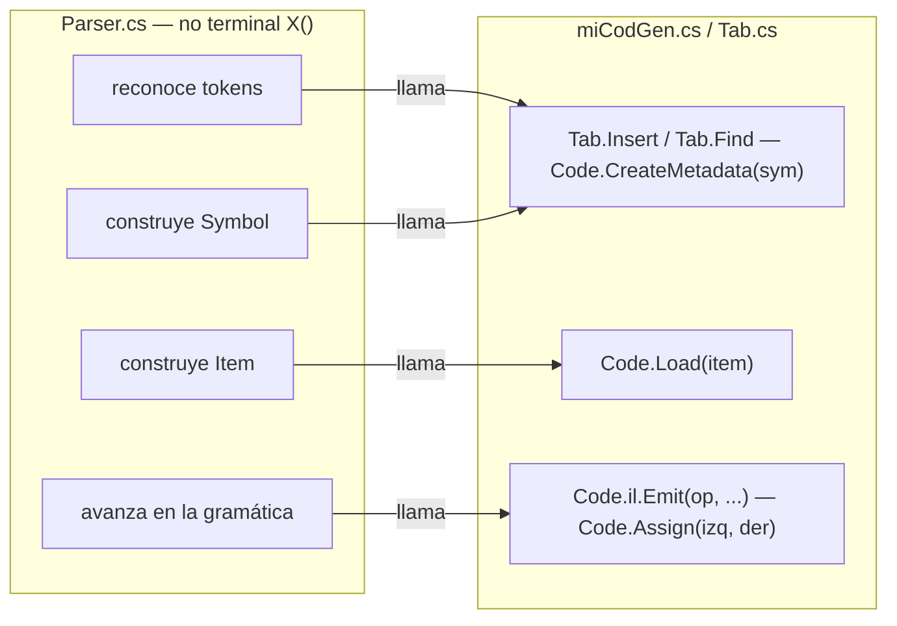

Ejemplos concretos de la relación no terminal ↔ acción de generación de código (vistos en las transcripciones y
en el deck):

| No terminal (gramática) | Acción semántica de generación de código |
|---|---|
| `Declaration` (p. ej. `VarDecl`, `int x;`) | `Tab.Insert(...)` (crea el `Symbol`) seguido de `Code.CreateMetadata(sym)` → emite `.locals init` (vía `il.DeclareLocal`) |
| `Factor = number` | `x = new Item(token.val)` + `Code.Load(x)` → emite `ldc.i4` |
| `Designator = ident` | `sym = Tab.Find(...)` + `x = new Item(sym)` + `Code.Load(x)` → emite `ldarg`/`ldloc`/`ldsfld` según corresponda |
| `Term = Term "*" Factor` | tras `Factor<y>`: `Code.Load(x); Code.Load(y); il.Emit(MUL)` |
| `Expr = Expr "+" Term` | tras `Term<y>`: `Code.Load(x); Code.Load(y); il.Emit(ADD)` |
| `Assignment = Designator "=" Expr ";"` | `Code.Load(y); Code.Assign(x, y)` → emite `stloc`/`stsfld`/`stfld` + `pop` |
| `class`/programa principal (`Symbol.Kinds.Prog`) | `Code.CreateMetadata(sym)` con `case Symbol.Kinds.Prog` → crea `AssemblyBuilder`, `ModuleBuilder`, `TypeBuilder` |
| método (`Symbol.Kinds.Meth`) | `Code.CreateMetadata(sym)` con `case Symbol.Kinds.Meth` → `program.DefineMethod(...)`, obtiene el `ILGenerator` (`il`) |

Este acoplamiento explica por qué, en la sección 7.2, el orden de emisión es obligatorio: como cada no terminal
dispara su propia porción de generación de código en el momento en que se reconoce, y el parser procesa la
gramática de afuera hacia adentro (`Prog` → clase → método → declaraciones → sentencias), el generador de
código **siempre tiene ya disponibles** el ensamblado, el módulo, la clase y el método antes de tener que
emitir instrucciones dentro de ese método.

---

### 15. Errores comunes y aclaraciones remarcadas por el profesor

- **CIL ≠ los nombres de variables del código fuente.** Al bajar a CIL, los nombres (`i`, `j`, `x`, `y`, `z`)
  desaparecen; solo quedan **índices dentro del arreglo `locals`** (o `args`). Confundir "la variable `x`" con
  "`locals[0]`" en un examen es un error común: son la misma entidad, vista desde dos niveles distintos
  (tabla de símbolos vs. CIL).
- **No confundir `Item.Kinds` con `Symbol.Kinds`.** Son dos enumeraciones distintas con nombres parecidos
  (`Const`, `Arg`, `Local`, ...), pero *significan cosas distintas*: `Symbol.Kinds` es la clasificación de un
  identificador en la tabla de símbolos; `Item.Kinds` es la clasificación de **dónde está en este instante** un
  operando durante la generación de código (que puede cambiar dinámicamente, p.ej. de `Local` a `Stack` tras un
  `Load`).
- **El orden clase → método → local → store es obligatorio.** No se puede emitir una instrucción de un método
  si antes no existe la clase que lo contiene; no se puede declarar una variable local (ni referenciarla) si
  antes no existe el método donde vive.
- **`typeof(int)` / `typeof(char)` deben escribirse exactamente así.** No es una convención arbitraria: son la
  sintaxis precisa de C# para obtener el metadato de tipo (`System.Type`) que `System.Reflection.Emit` necesita.
- **Compilar ≠ ejecutar.** El profesor insiste mucho en esta distinción: mientras se compila (fase de
  generación de código) **no se ejecuta nada**, solo se traduce; recién cuando la máquina virtual (real o
  simulada) ejecuta el CIL generado ocurre la interpretación instrucción por instrucción (por eso un `write`
  imprime "en el momento", como un intérprete).
- **La pila de expresiones siempre queda vacía al final de cada sentencia.** Cualquier traza de ejecución que
  no cumpla esto (para una sentencia ya completa) indica un error de generación de código.
- **El `ldloc` "inútil" al principio de una asignación NO es un error ni un bug**: es una consecuencia necesaria
  de generar código de forma uniforme para los 5 casos de asignación (variable, global, campo, argumento,
  elemento de arreglo), y por eso requiere el `pop` de limpieza al final.
- **Distinción `pop` vs `push`**: `push` es meter en la pila (lo hacen los `ld*`); `pop` es sacar de la pila
  (los `st*` lo hacen implícitamente al leer su operando, y la instrucción explícita `pop` simplemente descarta
  el tope sin usarlo para nada).
- **COMPI no implementa clases, arreglos, ni heap.** Los `newobj`/`newarr`/`ldfld`/`stfld`/`ldelem`/`stelem`
  se explican a nivel teórico (deck y transcripciones) pero **no están presentes** en el flujo funcional real de
  `miCodGen.cs` para el subconjunto de Z# que COMPI compila hoy; el profesor los deja explícitamente como
  posible ampliación para un trabajo final.
- **La cátedra no reprueba** (aclaración cultural del profesor, sin relación técnica, pero mencionada
  explícitamente en la transcripción de "generación de código en COMPI").

---

### 16. Cómo se ve en el compilador real (COMPI)

Fragmentos reales de `miCodGen.cs` (clase `Code`) y `Pila.cs`, para anclar la teoría en código concreto.

#### 16.1 Las constantes `OpCode` (equivalentes reales a `LDLOC2`, `ADD`, etc. del deck)

```csharp
public static readonly OpCode
    LDARG0 = OpCodes.Ldarg_0, LDARG1 = OpCodes.Ldarg_1, LDARG2 = OpCodes.Ldarg_2,
    LDARG3 = OpCodes.Ldarg_3, LDARG = OpCodes.Ldarg_S,
    STARG = OpCodes.Starg_S,
    LDLOC0 = OpCodes.Ldloc_0, LDLOC1 = OpCodes.Ldloc_1, LDLOC2 = OpCodes.Ldloc_2,
    LDLOC3 = OpCodes.Ldloc_3, LDLOC = OpCodes.Ldloc_S,
    STLOC0 = OpCodes.Stloc_0, STLOC1 = OpCodes.Stloc_1, STLOC2 = OpCodes.Stloc_2,
    STLOC3 = OpCodes.Stloc_3, STLOC = OpCodes.Stloc_S,
    LDNULL = OpCodes.Ldnull, LDCM1 = OpCodes.Ldc_I4_M1,
    LDC0 = OpCodes.Ldc_I4_0, /* ... */ LDC8 = OpCodes.Ldc_I4_8, LDC = OpCodes.Ldc_I4,
    DUP = OpCodes.Dup, POP = OpCodes.Pop,
    CALL = OpCodes.Call, RET = OpCodes.Ret,
    BR = OpCodes.Br, BEQ = OpCodes.Beq, BGE = OpCodes.Bge, BGT = OpCodes.Bgt,
    BLE = OpCodes.Ble, BLT = OpCodes.Blt, BNE = OpCodes.Bne_Un,
    ADD = OpCodes.Add, SUB = OpCodes.Sub, MUL = OpCodes.Mul, DIV = OpCodes.Div,
    REM = OpCodes.Rem, NEG = OpCodes.Neg,
    LDFLD = OpCodes.Ldfld, STFLD = OpCodes.Stfld, LDSFLD = OpCodes.Ldsfld, STSFLD = OpCodes.Stsfld,
    NEWOBJ = OpCodes.Newobj, NEWARR = OpCodes.Newarr,
    LDLEN = OpCodes.Ldlen, LDELEMCHR = OpCodes.Ldelem_U2, LDELEMINT = OpCodes.Ldelem_I4,
    LDELEMREF = OpCodes.Ldelem_Ref, STELEMCHR = OpCodes.Stelem_I2,
    STELEMINT = OpCodes.Stelem_I4, STELEMREF = OpCodes.Stelem_Ref,
    THROW = OpCodes.Throw;
```

Campos estáticos de metadatos que gestiona la clase `Code` (equivalentes exactos a los "5 componentes" de la
sección 7.2):

```csharp
public static AssemblyBuilder assembly;  // metadata builder for the program assembly
static ModuleBuilder module;             // metadata builder for the program module
public static TypeBuilder program;       // metadata builder for the main class P
static TypeBuilder inner;                // metadata builder for the currently compiled inner class
internal static ILGenerator il;          // IL stream of currently compiled method
```

#### 16.2 `CreateMetadata`: el switch que crea ensamblado, módulo, clase, método y variables locales

```csharp
internal static void CreateMetadata(Symbol sym)
{
    switch (sym.kind)
    {
        case Symbol.Kinds.Global:
            if (sym.type != Tab.noType)
                sym.fld = program.DefineField(sym.name, sym.type.sysType, GLOBALATTR);
            break;

        case Symbol.Kinds.Field:
            if (sym.type != Tab.noType)
                sym.fld = inner.DefineField(sym.name, sym.type.sysType, FIELDATTR);
            break;

        case Symbol.Kinds.Local:
            {
                LocalBuilder vbleLocalDin = il.DeclareLocal(sym.type.sysType);   // <- sección 8.2
                if (primeraVez) { ultimaVbleLocalDin = vbleLocalDin; primeraVez = false; }
                break;
            }

        case Symbol.Kinds.Type:
            inner = module.DefineType(sym.name, INNERATTR);
            sym.type.sysType = inner;
            sym.ctor = inner.DefineConstructor(MethodAttributes.Public, CallingConventions.Standard, new Type[0]);
            il = sym.ctor.GetILGenerator();
            il.Emit(LDARG0);
            il.Emit(CALL, typeof(object).GetConstructor(new Type[0]));
            il.Emit(RET);
            break;

        case Symbol.Kinds.Meth:
            sym.meth = program.DefineMethod(sym.name, MethodAttributes.Public, typeof(void), null);
            il = sym.meth.GetILGenerator();
            if (sym.name == "Main") assembly.SetEntryPoint(sym.meth);
            break;

        case Symbol.Kinds.Prog:
            {
                AssemblyName assemblyName = new AssemblyName();
                assemblyName.Name = sym.name;
                assembly = AppDomain.CurrentDomain.DefineDynamicAssembly(assemblyName, AssemblyBuilderAccess.RunAndSave);
                module = assembly.DefineDynamicModule(sym.name + "Module", sym.name + ".exe");
                program = module.DefineType(sym.name, PROGATTR);
                // ... define constructor de la clase principal ...
                inner = null;
                BuildReadChar(); BuildReadInt(); BuildWriteChar(); BuildWriteInt();
                break;
            }
    }
}
```

Nótese la correspondencia exacta con la sección 7.2: `Symbol.Kinds.Prog` crea `AssemblyBuilder` +
`ModuleBuilder` + `TypeBuilder` (y ya arma los métodos auxiliares `write`/`read` con `BuildWriteInt` /
`BuildWriteChar`, que son los que emiten el `call` con `Ldstr "{{0,{0}}}"` + `String.Format` +
`Console.Write` vistos en el volcado real de la sección 13.3); `Symbol.Kinds.Meth` crea el `MethodBuilder` y
obtiene su `ILGenerator` (`il`); y solo entonces `Symbol.Kinds.Local` puede llamar a `il.DeclareLocal(...)`.

#### 16.3 `Load`: el switch de carga de operandos según `Item.Kinds` (con instrumentación real de UI)

```csharp
internal static void Load(Item x)
{
    switch (x.kind)
    {
        case Item.Kinds.Const:
            if (x.type == Tab.nullType) il.Emit(LDNULL);
            else LoadConst(x.val);
            break;
        case Item.Kinds.Arg:
            switch (x.adr) {
                case 0: il.Emit(LDARG0); break;
                case 1: il.Emit(LDARG1); break;
                case 2: il.Emit(LDARG2); break;
                case 3: il.Emit(LDARG3); break;
                default: il.Emit(LDARG, x.adr); break;
            }
            break;
        case Item.Kinds.Local:
            switch (x.adr) {
                case 0: il.Emit(LDLOC0); cargaInstr("ldloc.0   "); break;
                case 1: il.Emit(LDLOC1); cargaInstr("ldloc.1   "); break;
                case 2: il.Emit(LDLOC2); cargaInstr("ldloc.2   "); break;
                case 3: il.Emit(LDLOC3); cargaInstr("ldloc.3   "); break;
                default:
                    il.Emit(LDLOC, x.adr); cargaInstr("ldloc." + x.adr.ToString()); break;
            }
            break;
        case Item.Kinds.Static:
            if (x.sym.fld != null) il.Emit(LDSFLD, x.sym.fld);
            break;
        case Item.Kinds.Stack:
            break; // nothing to do (already loaded)
        case Item.Kinds.Field:
            if (x.sym.fld != null) il.Emit(LDFLD, x.sym.fld);
            break;
        case Item.Kinds.Elem:
            if (x.type == Tab.charType) il.Emit(LDELEMCHR);
            else if (x.type == Tab.intType) il.Emit(LDELEMINT);
            else if (x.type.kind == Struct.Kinds.Class) il.Emit(LDELEMREF);
            break;
    }
    x.kind = Item.Kinds.Stack;     // <- el item queda marcado "ya en la pila"
}
```

`cargaInstr(...)` es una rutina propia de COMPI (no del CLR) que **además** de emitir la instrucción real vía
`il.Emit(...)`, la registra como texto en la interfaz gráfica (`richTextBox3`) y en un árbol visual
(`treeView1`), para que el estudiante vea, en tiempo real, el CIL que se va generando mientras el parser
avanza. Es la parte "pedagógica" de COMPI, separada de la generación de CIL "real" (que hace el propio
`il.Emit`).

#### 16.4 `Assign`: los 5 casos de asignación en código real

```csharp
internal static void Assign(Item izq, Item der, System.Windows.Forms.TreeNode padrecito)
{
    switch (izq.kind)
    {
        case Item.Kinds.Stack:
            switch (izq.sym.kind)
            {
                case Symbol.Kinds.Arg:
                    il.Emit(STARG, izq.adr);
                    break;
                case Symbol.Kinds.Local:
                    switch (izq.adr) {
                        case 0: il.Emit(STLOC0); cargaInstr("stloc.0   "); break;
                        case 1: il.Emit(STLOC1); cargaInstr("stloc.1   "); break;
                        case 2: il.Emit(STLOC2); cargaInstr("stloc.2   "); break;
                        case 3: il.Emit(STLOC3); cargaInstr("stloc.3   "); break;
                        default: il.Emit(STLOC, izq.adr); cargaInstr("stloc." + izq.adr); break;
                    }
                    il.Emit(POP); cargaInstr("pop      ");   // <- el pop de limpieza (secciones 10.3 y 11.3)
                    break;
                case Symbol.Kinds.Global:
                    il.Emit(STSFLD, izq.sym.fld); cargaInstr(".field static assembly int32 " + izq.sym.name);
                    il.Emit(POP); cargaInstr("pop");
                    break;
            }
            break;
        case Item.Kinds.Field:
            il.Emit(STFLD, izq.sym.fld);
            break;
        case Item.Kinds.Elem:
            if (izq.type == Tab.intType) il.Emit(STELEMINT);
            else if (izq.type == Tab.charType) il.Emit(STELEMCHR);
            else il.Emit(STELEMREF);
            break;
    }
}
```

Aquí se ve, línea por línea, exactamente el patrón explicado en la sección 12: para `Symbol.Kinds.Local`,
`il.Emit(STLOC0)` (o el índice que corresponda) seguido siempre de `il.Emit(POP)` — el `pop` de limpieza es
**parte fija e incondicional** del caso `Local` en el código real, confirmando que no es un detalle opcional
sino una regla del generador de código.

#### 16.5 `LoadConst`: constantes chicas vs. constantes generales

```csharp
internal static void LoadConst(int n)
{
    switch (n)
    {
        case -1: il.Emit(LDCM1); cargaInstr("ldc.i4 -1"); break;
        case 0:  il.Emit(LDC0);  cargaInstr("ldc.i4 0  "); break;
        case 1:  il.Emit(LDC1);  cargaInstr("ldc.i4 1  "); break;
        case 2:  il.Emit(LDC2);  cargaInstr("ldc.i4 2  "); break;
        case 3:  il.Emit(LDC3);  cargaInstr("ldc.i4 3  "); break;
        default: il.Emit(LDC, n); cargaInstr("ldc.i4 " + n); break;
    }
}
```

Esto es la contraparte real de la distinción del deck entre `ldc.i4.n` (formas cortas de 1 byte, para
constantes 0..8) y `ldc.i4 i` (forma general, para cualquier entero de 32 bits): COMPI mapea directamente a
`LDC0`..`LDC3` (formas cortas) para los valores más chicos, y usa `LDC` (`Ldc_I4`, forma general con operando
explícito) para el resto.

#### 16.6 La clase `Item` (idéntica en estructura a la de los slides)

```csharp
class Item
{
    public enum Kinds { Const, Arg, Local, Static, Field, Stack, Elem, Meth, Cond }
    public Kinds kind;
    public Struct type;
    public int val;               // Const: value
    public int adr;               // Arg, Local: offset
    public int relop;             // Cond: token code of relational operator
    public Symbol sym;            // Field, Meth: node from symbol table
    public Label tLabel, fLabel;  // Cond: true jumps, false jumps

    public Item(Symbol sym) {
        type = sym.type; this.sym = sym;
        switch (sym.kind) {
            case Symbol.Kinds.Const:  kind = Kinds.Const;  val = sym.val; break;
            case Symbol.Kinds.Arg:    kind = Kinds.Arg;    adr = sym.adr; break;
            case Symbol.Kinds.Local:  kind = Kinds.Local;  adr = sym.adr; break;
            case Symbol.Kinds.Global: kind = Kinds.Static; break;
            case Symbol.Kinds.Field:  kind = Kinds.Field;  break;
            case Symbol.Kinds.Meth:   kind = Kinds.Meth;   break;
        }
    }

    public Item(int val) { kind = Kinds.Const; type = Tab.intType; this.val = val; }          // constante

    public Item(int relop, Struct type) {                                                      // condición (if/while)
        kind = Kinds.Cond; this.type = type; this.relop = relop;
        tLabel = Code.il.DefineLabel(); fLabel = Code.il.DefineLabel();
    }

    internal Item(Struct type) { kind = Kinds.Stack; this.type = type; }                        // valor ya en pila
}
```

Nótese el `Kinds.Cond`, no mencionado en el deck de expresiones pero necesario en la implementación real para
soportar condiciones de `if`/`while`: guarda directamente los dos `Label` (`tLabel`/`fLabel`, destino si la
condición es verdadera/falsa) que usan `TJump`/`FJump` (sección 13.2) — es la forma en que COMPI, apoyándose en
`System.Reflection.Emit.Label`, resuelve el *patching* sin manipular offsets de bytes a mano (el propio
`ILGenerator` se encarga de eso al llamar `il.MarkLabel(...)`).

#### 16.7 `Pila.cs`: una pila auxiliar genérica de COMPI (no es el `estack` del CLR)

`Pila.cs` implementa una **pila propia de la aplicación COMPI** (con `push`, `pop`, `verElementoTope`,
`estaVacia`), usada como estructura de apoyo genérica dentro del compilador (por ejemplo, para llevar control
de anidamiento o de estados durante el parseo/generación), **no** para representar directamente el `estack` del
CLR (ese lo gestiona el propio CLR en tiempo de ejecución del programa compilado; COMPI solo lo *simula*
visualmente en su interfaz para fines pedagógicos, ver nota en el deck: "la idea aquí es olvidarse de los
metadatos... y hacer un código a mano para ver cómo es el funcionamiento del stack en un modo muy elemental").

```csharp
public class Pila
{
    protected int cantMaxDeElem;
    public int tope;
    protected object[] elementos;

    public Pila(int espacio) { cantMaxDeElem = espacio; elementos = new object[espacio]; tope = -1; }

    public bool estaVacia() { return tope == -1; }

    public void push(object elemento) {
        if (tope == elementos.Length) Console.WriteLine("Nos quedamos sin espacio");
        else { tope++; elementos[tope] = elemento; }
    }

    public object pop() {
        object retorno;
        if (!estaVacia()) { retorno = elementos[tope]; elementos[tope] = null; tope--; }
        else retorno = null;
        return retorno;
    }

    public object verElementoTope() {
        return !estaVacia() ? elementos[tope] : null;
    }
}
```

Implementación simple de pila con arreglo (`tope = -1` indica pila vacía, `push` incrementa `tope` antes de
escribir, `pop` lee y decrementa `tope`) — el mismo patrón conceptual que un `estack` real, pero a nivel de
"pila de propósito general en C#", no la representación interna del CLR.

---

### Resumen ejecutivo (para repaso rápido antes del parcial)

1. **CIL** es el código intermedio de .NET: compacto, mayormente sin tipo, basado en una **máquina de pila**.
2. El **CLR** es esa máquina de pila (sin registros, con `estack`), gestiona **method state** (args + locals +
   estack, uno por llamada, apilados como **stack frames**) y el **heap** (objetos/arreglos + garbage
   collector).
3. Las instrucciones clave: `ldc.i4.n`/`ldc.i4` (constantes), `ldloc`/`stloc` (locales), `ldarg`/`starg`
   (argumentos), `add`/`sub`/`mul`/`div`/`rem`/`neg` (aritmética), `pop`/`dup`, `call`/`ret`, `br*` (saltos),
   `ldsfld`/`stsfld`/`ldfld`/`stfld` (campos), `newobj`/`newarr`/`ldelem`/`stelem` (heap).
4. Una expresión se traduce recorriendo su árbol y **posponiendo cada operador hasta cerrar su subárbol**;
   siempre "cargar operandos, luego operar", y **la pila debe quedar vacía al final de cada sentencia**.
5. Toda asignación simple genera el patrón `ldloc` (base, potencialmente inútil) → `...expr...` → `stloc` →
   `pop`, porque el mismo esquema debe servir también para arreglos y campos de objeto.
6. `il.DeclareLocal(sym.type.sysType)`: `il` ata el metadato de la variable local al método activo;
   `sym.type.sysType` es el metadato de tipo (`typeof(int)`/`typeof(char)`) de esa variable.
7. Cada no terminal de la gramática dispara, en su propia acción semántica, la generación de código
   correspondiente (COMPI es de una sola pasada: parseo y generación de código ocurren simultáneamente).
8. El workflow de `System.Reflection.Emit` (**AssemblyBuilder → ModuleBuilder → TypeBuilder → MethodBuilder →
   ILGenerator**) impone un orden obligatorio de creación: **ensamblado → módulo → clase → método → local**.
9. Los `Item`/`Item.Kinds` (`Const, Arg, Local, Static, Stack, Field, Elem, Meth[, Cond]`) son el mecanismo que
   usa el compilador para saber, en cada instante, **dónde está** un operando y qué instrucción de carga
   generar — no deben confundirse con `Symbol.Kinds` de la tabla de símbolos.
10. El `if`/`while` usa **branch con destino indeterminado + patching** posterior, una vez que se conoce el
    tamaño real del bloque saltado.


---

## 8. Glosario general

Glosario consolidado de los términos técnicos clave usados en todo el apunte (semanas 1 a 7), ordenado alfabéticamente. Cada entrada da una definición corta; para el desarrollo completo, ver la sección semanal indicada entre paréntesis.

- **AFD (Autómata Finito Determinístico)**: quíntupla `(Q, Σ, δ, q0, F)` con función de transición única por par estado/símbolo; modelo formal del scanner (Semana 1, Semana 3).
- **AFND (Autómata Finito No Determinístico)**: variante del AFD con transiciones múltiples o espontáneas (`ε`); equivalente en poder al AFD, teorema de Rabin-Scott (Semana 1).
- **`adr`**: campo de `Symbol`/`Item` que guarda la dirección relativa (índice 0, 1, 2, …) de un argumento o variable local dentro de su scope/method state (Semana 6, Semana 7).
- **Alcance**: ver **Scope**.
- **Análisis semántico**: fase que verifica reglas de significado (declaración previa, compatibilidad de tipos) apoyándose en la tabla de símbolos; en COMPI está embebida en `Parser.cs`, sin archivo propio (Semana 2, Semana 5).
- **Análisis léxico**: ver **Scanner**.
- **Análisis sintáctico**: ver **Parser**.
- **args**: área del *method state* que contiene los argumentos de un método (`args[0]`, `args[1]`, …); se accede con `ldarg`/`starg` (Semana 7).
- **Atributo (de una gramática con atributos)**: información asociada a un no terminal, que viaja como parámetro de su función de parsing; puede ser de **entrada** (heredado) o de **salida** (sintetizado) (Semana 5).
- **Atributo de entrada / heredado**: información que "baja" en el árbol de derivación, de padre a hijo (parámetro normal en C#) (Semana 5).
- **Atributo de salida / sintetizado**: información que "sube" en el árbol de derivación, de hijo a padre (parámetro `out` en C#) (Semana 5).
- **BNF (Backus-Naur Form)**: notación de gramáticas sin construcciones de repetición (`{ }`); es la que realmente usa/genera el compilador COMPI, a diferencia de la EBNF de las slides (Semana 5).
- **`Check(expected)`**: método del parser que compara `la` contra el token esperado; si coincide llama a `Scan()`, si no dispara un error. Es la forma exclusiva de "parsear" un símbolo terminal (Semana 4, Semana 5).
- **CIL (Common Intermediate Language)**: lenguaje intermedio de .NET, basado en una máquina de pila, compacto y mayormente sin tipo; código de salida de COMPI (Semana 7).
- **CLR (Common Language Runtime)**: máquina virtual de .NET; ejecuta CIL como una *stack machine* (sin registros, con `estack`), gestiona *method state*, *stack frames*, heap y garbage collector (Semana 7).
- **Coco/R**: generador de compiladores (ETH Zúrich, tradición Mössenböck) del que COMPI toma la notación `(. ... .)` de acciones semánticas embebidas (Semana 3, Semana 5).
- **`Code.Assign`**: rutina de `miCodGen.cs` que emite el código de los 5 casos de asignación (`stloc`/`starg`/`stsfld`/`stfld`/`stelem`), con el `pop` de limpieza cuando corresponde (Semana 7).
- **`Code.Load`**: rutina de `miCodGen.cs` que, según el `Item.Kinds` de un operando, emite la instrucción de carga correcta (`ldc.i4`, `ldarg`, `ldloc`, `ldsfld`, `ldfld`, `ldelem`) y deja el `Item` marcado como `Stack` (Semana 7).
- **Comentario**: secuencia de caracteres que el scanner reconoce y descarta sin generar token; en COMPI real, los comentarios de bloque `/* ... */` son anidables mediante una pila (Semana 3).
- **Descenso recursivo (recursive descent)**: técnica de implementación de un parser en la que cada no terminal es un método que reconoce esa producción llamando a otros métodos/`Check`; equivale formalmente a un autómata a pila, ya que la pila de llamadas hace de pila del autómata (Semana 1, Semana 4).
- **Designator**: no terminal que representa el acceso a una variable, campo o elemento de arreglo (`ident`, `ident.campo`, `ident[expr]`) (Semana 4, Semana 5, Semana 7).
- **EBNF (Extended BNF)**: notación de gramáticas con `{ }` (iteración) y `[ ]` (opción); se usa en las slides "para la parte teórica", más fácil de leer que la BNF real del compilador (Semana 4, Semana 5).
- **`EOF`**: token especial de fin de archivo; el único caso en el que el scanner no vuelve a pedir un carácter nuevo (Semana 3).
- **`estack` (expression stack)**: pila de evaluación del CLR, donde se cargan y sacan los operandos de las instrucciones; debe quedar vacía al final de cada sentencia (Semana 7).
- **`FIRST(X)`**: conjunto de símbolos terminales que pueden aparecer como primer símbolo de alguna cadena derivada de `X`; se usa para decidir qué alternativa de una producción tomar según el lookahead (Semana 4).
- **Gramática atribuida / con atributos**: gramática (EBNF/BNF) más atributos (parámetros in/out) más acciones semánticas `(. ... .)` (Semana 5).
- **Gramática libre de contexto (Tipo 2)**: gramática cuyas producciones tienen la forma `A → γ` (un único no terminal a la izquierda); equivalente a un autómata a pila (Semana 1, Semana 4).
- **Gramática regular (Tipo 3)**: gramática cuyas producciones son `A → a` o `A → aB`; equivalente a un autómata finito (Semana 1, Semana 3).
- **Gramática sensible al contexto (Tipo 1)**: producciones `αAβ → αγβ`; equivalente a un autómata linealmente acotado (Semana 1).
- **Gramática irrestricta (Tipo 0)**: sin restricciones de forma; equivalente a una máquina de Turing (Semana 1).
- **Heap**: área de memoria del CLR donde se almacenan los objetos de clase y de arreglo, gestionada por el garbage collector; independiente de los stack frames (Semana 7).
- **`ILGenerator`**: componente de `System.Reflection.Emit` que emite el stream de instrucciones CIL dentro de un método (`il.Emit(...)`, `il.DeclareLocal(...)`) (Semana 7).
- **`il.DeclareLocal(sym.type.sysType)`**: llamada que declara una variable local en el método CIL activo, asociando su metadato de tipo (`sysType`) al `ILGenerator` (`il`) vigente (Semana 7).
- **`Item`**: descriptor usado durante la generación de código para saber en qué área de datos está un operando (`Const`, `Arg`, `Local`, `Static`, `Stack`, `Field`, `Elem`, `Meth`) y qué instrucción de carga generar; distinto de `Symbol.Kinds` (Semana 7).
- **`kind` (de `Token`)**: código numérico de la clase de un token (`IDENT=1`, `NUMBER=2`, `TIMES=6`, …), indexa el arreglo `names[]` de mensajes de error (Semana 3).
- **`kind` (de `Symbol`)**: clasificación de un identificador en la tabla de símbolos (`Const, Global, Field, Arg, Local, Type, Meth, Prog`) (Semana 6).
- **`kind` (de `Item`)**: clasificación de dónde está, en este instante, un operando durante la generación de código; no debe confundirse con `Symbol.Kinds` (Semana 7).
- **`la`**: variable atajo que guarda `laToken.kind` (el tipo del token de lookahead), usada en todas las comparaciones del parser (`if (la == Token.PLUS)`) (Semana 4).
- **`laToken` (lookahead token)**: el token siguiente, todavía no consumido/reconocido por el parser; junto con `token` forma la "ventana doble". Vive en `Parser.cs`, no en `Scanner.cs` (Semana 3, Semana 4).
- **Lexema**: la secuencia concreta de caracteres del código fuente que forma una instancia de un token (p. ej. el texto `max`) (Semana 3).
- **`locals` (de `Symbol`)**: puntero a la lista de símbolos (argumentos + variables locales) que cuelga de un método/clase/programa una vez cerrado su scope (Semana 6).
- **`locals` (área del *method state*)**: variables locales de un método; se accede con `ldloc`/`stloc` (Semana 7).
- **Method state (MS)**: registro de activación de un método en el CLR, compuesto por `args`, `locals` y `estack`; el conjunto de MS apilados forma los *stack frames* (Semana 7).
- **Metadato**: "dato acerca de un dato"; información estructural (tipos, campos, métodos, `.maxstack`) que el CLR necesita para ejecutar el CIL (Semana 7).
- **No terminal**: símbolo de la gramática que se expande mediante una producción; en el parser de COMPI, cada no terminal se implementa como un método con su mismo nombre (Semana 1, Semana 4).
- **`Next()`**: método central del scanner (`Scanner.cs`); a partir del carácter actual decide si llamar a `ReadName`, `ReadNumber`, resolver un token simple/compuesto, saltar un comentario, o reportar error (Semana 3).
- **`NextCh()`**: método del scanner que lee el siguiente carácter de la entrada hacia la variable `ch`, actualizando línea y columna (Semana 3).
- **`noSym`**: símbolo centinela devuelto por `Tab.Find` cuando el nombre buscado no existe en ningún scope, para evitar referencias nulas (Semana 6).
- **`Pila` (clase `Pila.cs`)**: pila genérica de propósito general por arreglo (`push`/`pop`/`verElementoTope`/`estaVacia`), usada en distintas partes del compilador; **no** es la pila de scopes de `Tab` ni el `estack` del CLR (Semana 3, Semana 6, Semana 7).
- **Parser (analizador sintáctico)**: módulo que verifica que el stream de tokens respete la gramática (Tipo 2) del lenguaje y reconoce su estructura; en COMPI, `Parser.cs`, implementado por descenso recursivo (Semana 4).
- **Patrón (de un token)**: la regla (expresión regular/autómata) que describe qué lexemas acepta cierta clase de token (Semana 3).
- **Patching (de saltos)**: técnica para resolver instrucciones de salto (`br`/`beq`/…) cuya dirección de destino aún no se conoce al emitirlas: se emite con una marca indeterminada y se sobrescribe después, cuando se conoce el destino real (Semana 7).
- **PDA (Pushdown Automaton / Autómata a Pila)**: séptupla `(Q, Σ, Γ, δ, q0, Z0, F)`; modelo formal equivalente a una gramática libre de contexto; el parser por descenso recursivo lo implementa vía la pila de llamadas (Semana 1, Semana 4).
- **`Scan()`**: método del parser que desliza la ventana doble: `token = laToken; laToken = Scanner.Next(); la = laToken.kind;` (Semana 3, Semana 4).
- **Scanner (analizador léxico)**: módulo que transforma el stream de caracteres en stream de tokens, descartando blancos/tabs/EOL/comentarios; implementado como AFD. En COMPI, `Scanner.cs` (Semana 3).
- **Scope (alcance)**: rango en el que un nombre es válido; en COMPI se abre uno nuevo únicamente al insertar un método o una clase/programa (nunca por un bloque `{ }` suelto) (Semana 6).
- **Single-pass compiler (compilador de una sola pasada)**: arquitectura en la que escaneo, parseo, chequeo semántico y generación de código están entrelazados token a token, sin fases separadas secuenciales; es el enfoque de COMPI (Semana 0/visión general, Semana 2, Semana 3).
- **Stack frame**: marco de pila/registro de activación de un método, compuesto por *method state* (args + locals) más el mecanismo de retorno; a nivel de tabla de símbolos corresponde al scope temporal abierto para ese método (Semana 6, Semana 7).
- **`Struct` (clase del compilador)**: representa el sistema de tipos (no es un `struct` de C#); tiene `kind` (`Int, Char, String, Arr, Class, None`), `elemType` (para arreglos) y `fields` (para clases) (Semana 6).
- **`Symbol`**: nodo de la tabla de símbolos que representa un identificador declarado, con `kind`, `name`, `type`, `next`, `val`, `adr`, `nArgs`, `nLocs`, `locals` (Semana 6).
- **`sysType`**: campo de `Struct` que apunta al metadato de tipo del CLR (`typeof(int)`, `typeof(char)`) correspondiente a ese tipo del lenguaje fuente (Semana 7).
- **Tabla de símbolos (`Tab`/`SymTab.cs`)**: estructura de datos que registra todos los nombres declarados del programa, con operaciones `Insert` (declarar) y `Find` (buscar/usar), organizada en scopes anidados (universo → programa → método) (Semana 6).
- **`Tab.Find`**: busca un nombre recorriendo scopes desde `topScope` hacia afuera; devuelve el objeto `Symbol` completo (nunca un booleano ni el `Struct` directamente), o `noSym`/error si no lo encuentra (Semana 6).
- **`Tab.Insert`**: crea un nuevo `Symbol` y lo agrega al final de la lista de símbolos del `topScope` vigente, asignando `adr` si es `Arg`/`Local` y detectando redeclaraciones (Semana 6).
- **Terminal**: símbolo de la gramática que corresponde directamente a un token; se "parsea" siempre llamando a `Check(esperado)`, nunca con un método propio (Semana 4, Semana 5).
- **Token**: par (clase de token, atributos) que el scanner entrega al parser; representa la categoría de un lexema junto con información adicional (`kind`, `line`, `col`, `val`, `str`) (Semana 3).
- **`token`**: variable del parser que guarda el último token reconocido/consumido (el "actual"); junto con `laToken` forma la ventana doble (Semana 3, Semana 4).
- **`topScope`**: puntero al scope más interno actualmente abierto en la tabla de símbolos; `Find` y `Insert` siempre operan relativo a él (Semana 6).
- **Universo (*universe*)**: scope preexistente, creado una sola vez por `Tab.Init()` antes de compilar cualquier programa, que contiene los nombres predeclarados (`int`, `char`, `null`, `chr`, `ord`, `len`, `writeln`, …); no cuenta como scope "generado" por el programa del usuario (Semana 6).
- **Ventana doble (`token`/`laToken`)**: mecanismo mediante el cual el parser recuerda simultáneamente el último token reconocido y el próximo (lookahead), para poder decidir alternativas de la gramática antes de consumir el token. Vive en `Parser.cs` (Semana 3, Semana 4).
- **`yaPintada`**: bandera booleana del `Parser.cs` real de COMPI que evita repintar de rojo, en la vista "Paso a paso", un token que ya fue destacado de verde por haber servido para resolver una alternativa (Semana 4).

---

## 9. Checklist de reglas clave para el parcial

Resumen ejecutivo de las reglas marcadas explícitamente como "de examen" en el material de las cinco semanas condensadas. Para el desarrollo completo de cada una, ver la semana indicada.

1. **La gramática de las slides no está 100% implementada en COMPI.** No asumir equivalencia 1:1 entre teoría y código real: puede haber construcciones gramaticalmente válidas que el compilador todavía no reconoce (Semana 3, Semana 6).
2. **El compilador no ve el programa como lo ve el humano** ("metáfora del rollo de papel higiénico"): recibe una tira lineal de caracteres, sin indentación ni estructura visual; el scanner es quien reconstruye la estructura en tokens (Semana 3).
3. **Blancos, tabs, fin de línea y comentarios NO generan token**: el scanner los reconoce y los descarta silenciosamente, nunca llegan al parser (Semana 3).
4. **`token` es el último reconocido; `laToken` es el lookahead, todavía no consumido.** `Scan()` desliza la ventana: `token = laToken; laToken = Scanner.Next();`. La ventana doble vive en `Parser.cs`, **no** en `Scanner.cs` (`Scanner.Next()` solo entrega un token por llamada) (Semana 3, Semana 4).
5. **Distinguir identificador de palabra reservada es posterior a leer el lexema completo**: primero se junta todo el string (`ReadName`), y recién después se compara contra la tabla hash de palabras clave (Semana 3).
6. **Después de reconocer cada token, el autómata del scanner vuelve siempre a `s0`.** Cada token se reconoce de forma independiente (Semana 3).
7. **No terminal → método con el mismo nombre; terminal → `Check(esperado)`, nunca un método propio.** Es la regla central del parser por descenso recursivo (Semana 4, Semana 5).
8. **El árbol de sintaxis no existe como estructura real en el parser puro**: internamente el compilador usa la **pila de llamadas** (call stack); COMPI construye un `TreeView` real solo para fines de visualización didáctica en la vista "Paso a paso" (Semana 1, Semana 4).
9. **Verde vs. rojo en la vista "Paso a paso":** se pinta de **verde** el `laToken` cuando la producción actual tiene más de una alternativa y hay que mirar hacia adelante para decidir; se pinta de **rojo** un terminal ya reconocido (`Check` exitoso) en un tramo secuencial sin ambigüedad. La bandera `yaPintada` evita repintar de rojo lo que ya se pintó de verde (Semana 4).
10. **Un atributo (de entrada o de salida) se agrega solo cuando la información necesita cruzar el límite de la función** (entrar desde afuera o salir hacia afuera); si la variable nace y muere dentro de la misma activación (p. ej. un contador local), no hace falta ningún atributo (Semana 5).
11. **Un intérprete calcula; un compilador solo emite instrucciones** que la máquina virtual va a ejecutar después. Nunca confundir ambos momentos: en tiempo de compilación no se calcula ningún valor aritmético real (Semana 2, Semana 5).
12. **Dos llamadas al mismo no terminal son activaciones distintas** (registros de activación diferentes), aunque compartan el mismo método; no confundirlas entre sí (Semana 5).
13. **El scope se abre únicamente al insertar un método o una clase/programa**, nunca por un bloque `{ }` suelto ni por cada declaración de variable (Semana 6).
14. **Contar scopes de un programa**: el scope del universo no cuenta (preexiste, no lo genera "este" programa); un bloque `{ }` no abre scope propio. Ejemplo canónico: `class P { void Main() { ... } }` → 2 scopes (uno para la clase/programa, uno para el método) (Semana 6).
15. **`Tab.Find` siempre devuelve un objeto `Symbol` completo** (o `noSym`), nunca directamente un booleano ni el `Struct`/tipo; hay que leer `sym.type` en un segundo paso si se necesita el tipo (Semana 6).
16. **Un programa puede ser 100% sintácticamente correcto y aun así fallar**: esto ocurre cuando una variable no fue declarada en ningún scope alcanzable — es un error semántico detectado por `Tab.Find`, no un error de la gramática (Semana 6).
17. **La tabla de símbolos se expande y se contrae dinámicamente** a medida que el parser avanza; la "foto" correcta de la tabla en un examen depende exactamente de en qué punto del parseo se encuentra el compilador (Semana 6).
18. **La pila de expresiones (`estack`) del CLR debe quedar vacía al final de cada sentencia.** Cualquier traza de ejecución que no cumpla esto para una sentencia completa indica un error de generación de código (Semana 7).
19. **Orden obligatorio de `System.Reflection.Emit`: Assembly → Module → Type → Method → Local.** No se puede declarar/emitir una variable local sin que exista antes el método, ni un método sin que exista antes la clase (Semana 7).
20. **`Item.Kinds` no es lo mismo que `Symbol.Kinds`.** `Symbol.Kinds` clasifica un identificador en la tabla de símbolos; `Item.Kinds` clasifica dónde está, en este instante, un operando durante la generación de código (puede cambiar dinámicamente, p. ej. de `Local` a `Stack` tras un `Load`) (Semana 7).
21. **En CIL desaparecen los nombres de variables del código fuente**: solo quedan índices dentro del arreglo `locals`/`args`; `x`, `i`, `j` se convierten en `locals[0]`, `locals[1]`, etc. (Semana 7).
22. **Toda asignación simple genera el patrón `ldloc` (base, potencialmente "inútil") → `...expr...` → `stloc` → `pop`**, porque el mismo esquema de generación debe servir también para arreglos y campos de objeto (Semana 7).
23. **`if`/`while` se traducen con branch de destino indeterminado + patching posterior**, una vez que se conoce el tamaño real del bloque saltado (Semana 7).
24. **Un no terminal (Tipo 2) se implementa formalmente como un autómata a pila** (la pila de llamadas hace de pila); un token (Tipo 3) se implementa como un autómata finito determinístico — es la base formal detrás de por qué el scanner usa un AFD y el parser un descenso recursivo (Semana 1).
